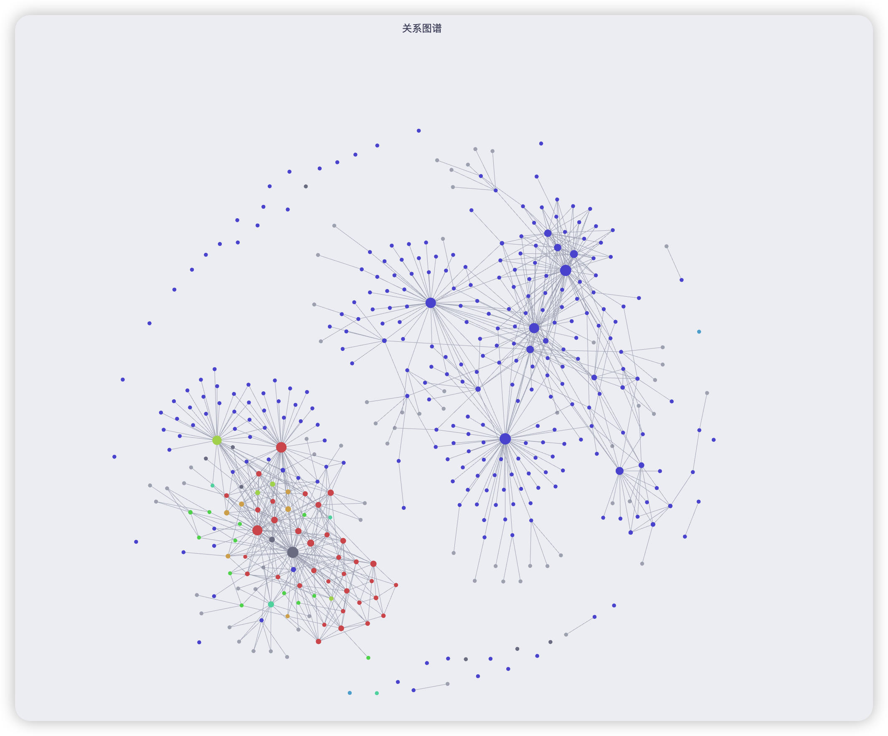
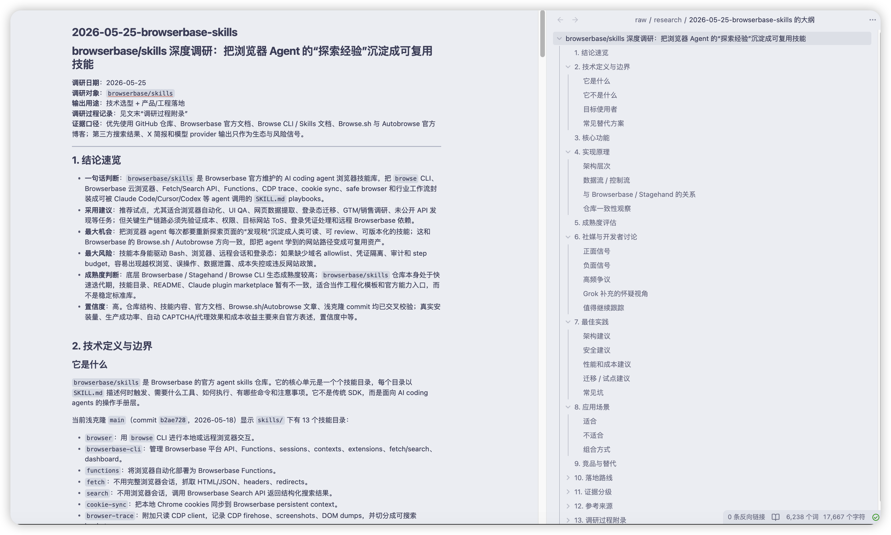
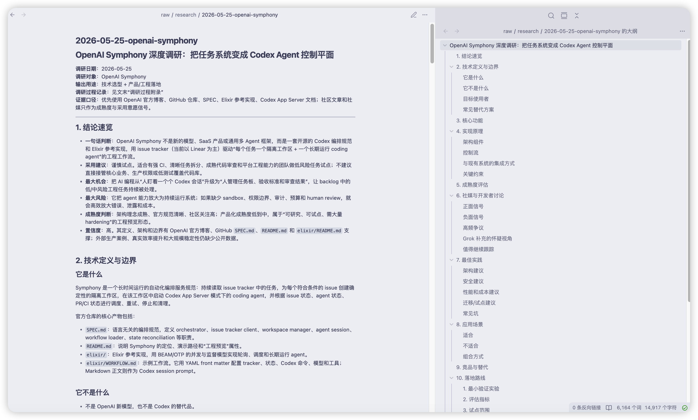
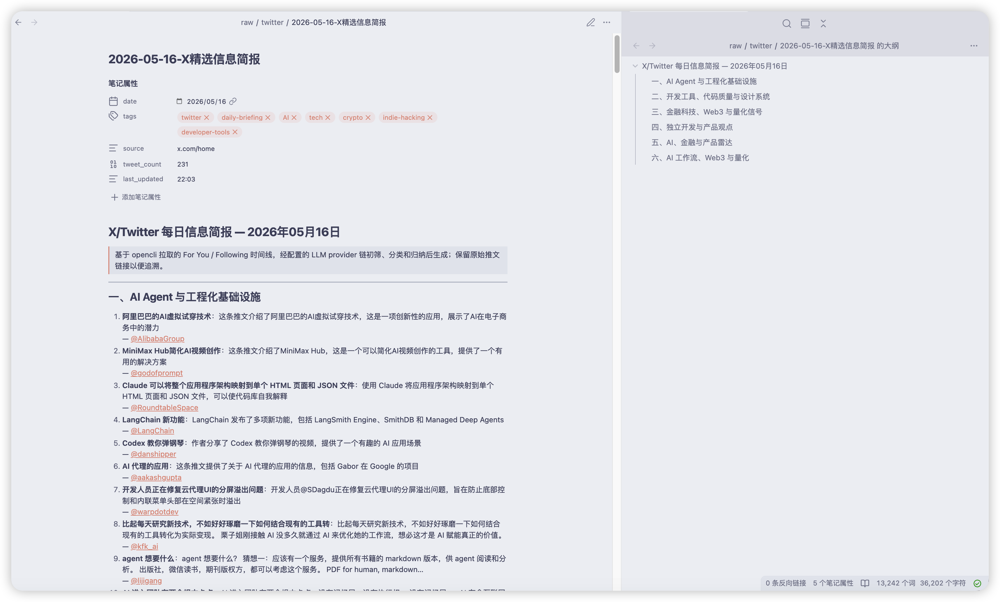
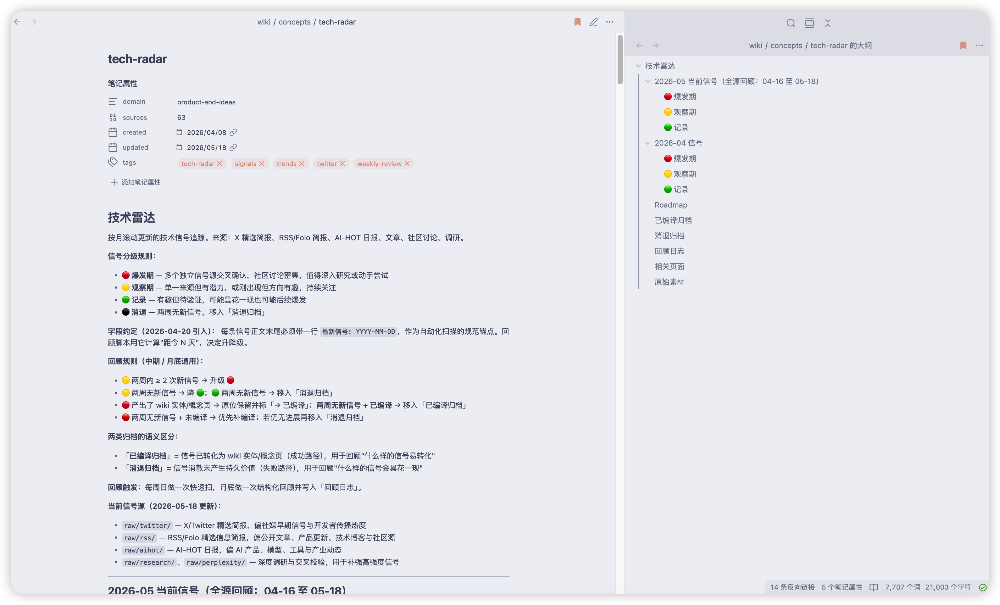
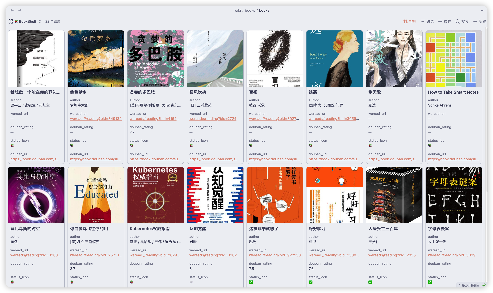

# 从 LLM Wiki 到个人 Harness——一个开发者的私域知识沉淀实践

Harness Engineering 是 2026 年最热的 AI 工程话题，但争论焦点几乎都集中在"该上多大的模型"和"该搭多复杂的工作流"上。

经过两个月个人知识库实践，我的理解是：**Harness 是工具，知识才是资产——工具会迭代，资产能复利**。

本文分享如何把 Karpathy LLM Wiki 的极简骨架扩展成「采集 → 编译 → 蒸馏」三层个人 Harness——**读完应带走的是 wiki 语义图谱与 insights 判断层，不是某个 Dagster 仓库**。

---

## 一、从 Karpathy 的 LLM Wiki 说起

2026 年 4 月初，Andrej Karpathy 在 GitHub 上挂了一条 gist，记录他自己如何用 LLM 把多年笔记编译成可读的 Markdown 维基。核心论断只有两句：

> "AI made you faster. Your brain didn't get bigger."
>
> "我以为要用 fancy RAG，但 LLM 自动维护 index 文件就够了。"

这两句话很快在中文社区点燃了一轮"本地 AI 知识库浪潮"——社区明显分属 **LLM Wiki 实现派**（可读 Markdown + wikilinks + index）和 **AI-native 思考空间派**（活线程 + 主动 AI Agent）两条正交路线。

我也在 4 月加入，按 Karpathy 的思路搭起了自己的 vault。骨架跑了几周后我发现：

**Karpathy 给的是骨架，但骨架不长肉。** 只有骨架时，我很快撞上三类缺口：外部信号没有稳定入口（`raw/` 靠手塞）；日记里的半成型想法没法逐条 ingest；读书笔记没有强制把触动点转成行动。真正能让知识复利的，是骨架之上的三层扩展。

### 1.1 个人 Harness 从哪借来

本文不综述 Harness Engineering。**Harness（马具）** 借自 Codex、Claude Code、Cursor 等 Agent 工具的共同隐喻——给 LLM 配一组可演化、可累积的工具，让它驮着你走得更远；缩到「一个人 + 一个 Obsidian vault」，就是 **个人 Harness**。

### 1.2 我的扩展点：从 50 行 gist 到三层结构

把 Karpathy 的 LLM Wiki 当作**编译层**（下文第二章亦称「骨架」）放在中间，前后两端各延伸一层，就是 Mind-OS 的整体形态：

| ① 采集层 | ② 编译层 | ③ 知识蒸馏层 |
| --- | --- | --- |
| **让活水有源** | **LLM Wiki 静态骨架** | **让知识不死水** |
| · Dagster 编排 | · raw / wiki 双层 | · 日记 + 活线程 |
| · 多源摄入（Twitter / RSS / 调研 / Hermes 抓取） | · schema.md 约定 | · 5 代理 Distill 体系 |
| · tech-radar 信号分级 | · YAML frontmatter | （Lumina / Prism / Vector / Nexus / Ember） |
| · `/radar-review` 自动回顾 | · wikilinks + 红链 | · 跨书共现密度追踪 → 委托 Nexus 结晶 |
|  | · ingest / query / lint 三工作流 |  |
|  | · qmd 语义搜索 |  |
|  | · RIA 读书 + weread-skills（直连 `wiki/books/`，不经 `raw/`） |  |

三层之间的信息流向：

```
   ① 采集层  ──── ingest ────▶  ② 编译层  ◀──── 结晶回流 ────  ③ 知识蒸馏层
                                    │
                                    │ query 回流
                                    ▼
                            新连接 / 更新交叉引用
```

①采集层把外部信号过滤进 `raw/`；②编译层把 `raw/` 综合为 `wiki/`；③知识蒸馏层在日记里捕捉碎片输入，达到一定密度后**委托回编译层结晶**为正式概念页。Query 回答时还会有一条额外的回流——把对话中产生的新洞察沉淀回 wiki（详见 2.4）。**这是一条闭环，而不是直线管道。**

下文按「骨架 → 采集 → 阅读 → 蒸馏 → 总结」五章正文 + 一节总结展开。

---

## 二、骨架：LLM Wiki 的极简静态编译

任何 Harness 都需要一个可信赖的底座。我的底座就是 Karpathy LLM Wiki 模式——没有任何魔改、最朴素的形态。

### 2.1 为什么不上 RAG

在动手前我认真考虑过 RAG。结论是：**对个人知识库的体量（几百到上千页）来说，RAG 的复杂度溢价不划算。** 向量库要维护、chunk 策略要调、检索质量靠 embedding 模型决定、可审查性几乎为零。

LLM Wiki 把"理解"的时间点从查询时挪到了编译时：

> **RAG 把"理解"放在查询时；LLM Wiki 把"理解"前置到编译时。**

这一挪之后，存下来的不再是孤立的 chunks，而是被 LLM 一次性深度综合过的领域语义图谱。下次查询直接读图谱，不再每次现拼。两者并非互斥（LLM Wiki 完全可以作为 RAG 的语料源），但在目前的体量上叠加 RAG 是负向 ROI。完整对比沉淀在了 rag-vs-llm-wiki。

### 2.2 双层目录：raw 与 wiki 的边界

在编译层内部，数据目录以 raw/wiki 两层划分：

```
mind-os/
├── raw/                   # 人类筛选的原始素材，LLM 只读
│   ├── twitter/           # X/Twitter 精选简报（每日）
│   ├── rss/               # Folo 精选信息简报
│   ├── aihot/             # AI-HOT 日报
│   ├── research/          # 深度调研报告
│   ├── perplexity/        # Perplexity Deep Research
│   └── articles/          # Web 剪藏文章
├── wiki/                  # LLM 维护的知识维基
│   ├── index.md           # 全局目录（LLM 导航起点）
│   ├── concepts/          # 概念页（一个主题一个文件）
│   ├── entities/          # 实体页（人物、工具、项目、公司）
│   ├── connections/       # 交叉比较、关系图谱
│   ├── insights/          # 人类洞察（LLM 只读，人类独占写入）
│   ├── books/             # 读书笔记（详见第四章）
│   └── log.md             # 变更日志（带时间戳）
├── journals/              # 日记（按日自动生成）
├── schema.md              # 结构约定（人类拥有）
└── AGENTS.md              # LLM Agent 操作指令
```

两层之间的边界用一张小表固化：

| 边界 | 谁可以写 | 谁可以读 |
| --- | --- | --- |
| `raw/` | 人类（事实来源） | 人类 + LLM |
| `wiki/`（除 insights） | LLM（人类审阅） | 人类 + LLM |
| `wiki/insights/` | **人类独占** | 人类 + LLM（仅引用） |

**为什么 `wiki/insights/` 要人类独占？** 因为它存放的是**判断**——贵在哪、错在哪、为什么重要——而非事实罗列。AI 综合大量素材后往往只能给出还不错的回答，但很难给出锋利的判断。我一开始让 LLM 也写洞察，一周后回看都像维基百科条目：准确、平庸、缺一击。从那以后把这一层物理隔离——**不是因为 AI 写不了，是因为这一层不应该是 AI 写的**。

### 2.3 Frontmatter + Wikilinks：互联的最小约定

每个 wiki 页都以 YAML frontmatter 开头：

```yaml
---
domain: ai-and-llm
sources: 6
created: 2026-04-13
updated: 2026-04-15
tags: [llm-wiki, karpathy, knowledge-management, markdown, obsidian]
---
```

字段不多但都有用：`domain` 按领域分类（7 大领域枚举在 schema.md 固定）；`sources` 记录这页综合了多少素材；`created/updated` 给 lint 识别过时；`tags` 喂给 qmd 搜索和 Bases 数据视图。

正文里所有内部引用都用 Obsidian 风格的 `wikilinks`：`distributed-consensus` 链向概念页、`wiki/entities/cathedral-and-bazaar` 链向实体页、`raw/twitter/2026-04-15-X精选信息简报.md` 链向原始素材。

特别要说**红链**——指向尚不存在页面的链接。我故意允许它们存在。

**为什么允许红链？** 因为当 LLM 写到某个值得独立成页但当前未编译的概念时，直接打 `wikilink` 留一个洞，比省略不写更有价值。红链在 Obsidian 图视图里显示为"未创建节点"，**它就是知识缺口的可视化**。lint 时按被引用次数排序得到"红链清单"——本月哪些概念被引用最多但还没编译？优先编它们。

> **红链 = 图谱里的待编译信号。** 这一招简单到几乎不值得说，但效果出奇好——知识缺口主动呼叫被编译，而不是等人想起来。



*Obsidian Graph view 局部视图。节点是 wiki 页面，连线是 wikilinks；颜色不同的高密度节点是当前活跃的领域聚类（AI 与 LLM、分布式系统、Web3、产品想法等）。红链节点会显示为镂空圆圈。*

### 2.4 三大工作流：Ingest / Query / Lint

LLM 在 vault 里只做三件事，全部写在 `AGENTS.md` 里作为"宪法"：

| 工作流 | 触发方式 | 关键动作 |
| --- | --- | --- |
| **Ingest（摄入）** | 人类把素材塞进 `raw/`，下指令 | 读素材 → 写/更新 concept/entity 页 → 更新 `wiki/index.md` → 建交叉链接 → 追加 `wiki/log.md` |
| **Query（查询）** | 人类提问 | 读 `wiki/index.md` 定位（>50 页时用 qmd 辅助）→ 综合回答 → **回流判断**（新对比写 connections / 新关联更新交叉引用 / 新洞察追加段落 / 简单事实不回流） |
| **Lint（健康检查）** | 定期 / 人类下指令 | 扫孤页、过时内容、断链、红链清单、frontmatter 缺失、矛盾 |

**Query 的回流机制**是这套工作流最被低估的部分。每次回答完成后，LLM 都要判断"这次问答是否值得沉淀回 wiki"。原则只有一条：

> **有价值的问答不能消失在对话历史里，必须复合增长到 wiki。**

这是把"对话"沉淀为"资产"的关键开关。

关键不在工作流本身（每条都很朴素），而在**它们写进了 AGENTS.md 作为 Agent 进 vault 第一眼读的文件**。把规则前置成"宪法"，比靠每次 prompt 手动提醒稳得多。

### 2.5 当页面超过 50 个：qmd 搜索的引入时机

与 §2.1 同理：**未到阈值，不加层。**

刚开始几十页时，靠 `wiki/index.md` 全局目录足够导航。但 wiki 长到约 50 页以后，索引就不够细——LLM 开始读错页或漏掉相关页（例如问 Raft vs Paxos，index 导向了分布式共识页，却漏掉了 tech-radar 里相关信号）。**50 页是我的临界点，不是普适阈值。**

我装了 [qmd](https://github.com/tobi/qmd)——本地 Markdown 搜索引擎，BM25 + 向量语义 + LLM 重排（需 Node.js ≥ 22；首次 `qmd embed` 会拉取约 4.3GB 量化嵌入模型）。crontab 每小时跑 `qmd update && qmd embed` 增量更新，整个搜索栈完全本地，并通过 MCP 接入让 Claude Code / Cursor 里的 Agent 直接调用。

引入 qmd 之后，LLM 不再瞎读 index——而是先 `qmd query "Raft vs Paxos 在 Mind-OS 里讨论过什么"` 拿到 hybrid 搜索 + 重排后的前几篇相关页，再读那几篇综合回答。

### 2.6 log.md：变更日志比想象中更重要

每次 LLM 改完 vault 必须在 `wiki/log.md` 顶部追加一段，格式大致是 `[update] 概念页 + sources 计数 + 交叉链接变更`。

**为什么坚持写日志？** 两个理由：第一，**它让 LLM 可以审计自己**——下一次 LLM 进来读 log.md 就能知道"上次跑了什么、改了什么、为什么改"，没有这层每次 Agent 都是失忆的；第二，**它是我们复盘 LLM 的抓手**——哪一次 ingest 漏了交叉引用、哪一次 lint 把红链处理错了，翻 log 就能找到，这些复盘后来都沉淀成了 schema.md 的新规则。

---

> **写 frontmatter、打 wikilinks、跑三大工作流——这些都是骨架的搭建动作。骨架真正承载的，是那张领域语义图谱：哪些概念互相咬合、哪些是另一个的反例、哪些是哪段经历的结晶。**
>
> **这两个月里工具栈我换过几轮，但图谱里"想清楚过的部分"一条没失效。**

骨架到这里讲完。下一章讲采集：让活水有源。

---

## 三、采集：让活水有源

骨架解决了"知识怎么沉淀"，但回答不了"知识从哪来"。

**真正决定一个知识库长期价值的，不是工作流的复杂度，而是上游信号的质量。** 一个 prompt 工程做得再精巧的 Agent，喂的素材如果是过期的、稀释的、被推荐算法污染过的，长期产出的知识不会有沉淀。

这一章讲三件事：**真实信号源分层、Dagster 自动化管线、tech-radar 信号分级 + 自动回顾**。

### 3.1 信号源分层：两条 Dagster 管线 + 三条非 Dagster 通道

raw/ 目录下其实有 6 类信号通道，每个通道对应的"采集成本"和"信号密度"差异很大。我想说清楚一件事：

> **不是所有通道都值得用 Dagster 编排。** 频率稳定、来源结构化、需要 LLM 多步加工的通道，才适合 Dagster；只需要"定时抓一份原文落地"的通道，用 Hermes 抓取脚本就够；按需触发的深度调研，交给 **Agent Skills**（如 `tech-research`）；剪藏走 Obsidian 原生工具最省心。

我的真实分层：

| 通道 | 形态 | 落地路径 | 触发方式 |
| --- | --- | --- | --- |
| X/Twitter 精选简报 | Dagster 编排 | `raw/twitter/` | hourly schedule |
| RSS/Folo 精选简报 | Dagster 编排 | `raw/rss/` | daily schedule |
| AI-HOT 日报 | Hermes 自动抓取 | `raw/aihot/` | 每天定时 |
| 深度调研报告 | Agent Skill | `raw/research/` | Cursor / Codex 调用 `tech-research` Skill 按需触发 |
| Perplexity Deep Research | 在线 Agent | `raw/perplexity/` | 人工导出 / 网页 Deep Research 落地 |
| Web 剪藏 | Obsidian Web Clipper | `raw/articles/` | 人工剪藏 |

> **踩坑诚实记录**：我一开始确实想把 6 类通道都塞进 Dagster 编排。设计了几条 asset、跑了一周后发现：AI-HOT 只是把网页内容拉下来落地，不需要 LLM 加工，用 Hermes 一个抓取脚本就够；research 和 perplexity 本质上是"按需触发的深度调研"而不是"周期性增量信号"——硬塞进 Dagster 反而把简单问题搞复杂了。
>
> 最后回退到现在的形态：**只在需要"周期 schedule + 多 asset 加工链 + 状态化"的两条线上用 Dagster；只需要定时抓取的通道交给 Hermes 脚本；按需深度调研交给 Agent Skills。** 这条选型经验值得贴出来。

#### 深度调研：`tech-research` Agent Skill

深度调研不走周期 schedule。在 Cursor / Codex 里调用项目内的 **`tech-research` Skill**（`.agents/skills/tech-research/`）——给定技术主题，脚本按模式（`quick` / `standard` / `deep`）拉多源证据，按模板产出中文研报，默认落地 `raw/research/YYYY-MM-DD-<slug>.md`：



*研报正文示例：结论速览、技术定义与边界、成熟度与社媒信号等结构化章节（`raw/research/2026-05-25-browserbase-skills.md`）。*



*同一报告的大纲视图——长研报在 Obsidian 里靠目录导航，便于跳读「社媒讨论」「落地路线」等章节（`raw/research/2026-05-25-openai-symphony.md`）。*

### 3.2 Dagster 编排：两条管线的真实形态

采集编排维护在**独立仓库** `mind-os-orchestration`（不在 mind-os vault 内），依赖 OpenCLI、Folo CLI、LLM API 与 `.env.local`。本地可用 `scripts/run_once.sh` 单次跑通。

两条管线：**X/Twitter 五段降噪**（raw → candidates → llm_summary → brief_draft → raw_brief，hourly），**RSS/Folo 两段验证**（brief → brief_validation，daily）。业务参数抽到 `config/*.yaml`，schedule 每次重读 yaml——**改 yaml 下次调度即生效**；API key 与路径放 `.env.local`，改后需重启。

X 链路重是因为社媒噪声大；Folo 轻是因为 RSS 本身已结构化，**只需要「生成 + 验证」两步**。

Dagster 跑完后，信号以 Markdown 简报形式落在 `raw/twitter/`、`raw/rss/`。一篇 X 精选简报长这样——frontmatter 记录日期与 tweet 数，正文按主题分段归纳，保留原帖链接：



*X/Twitter 精选简报示例（`raw/twitter/2026-05-16-X精选信息简报.md`）。右侧大纲即 LLM 归纳后的主题目录，是 ingest 进 wiki 前的「半结构化活水」。*

### 3.3 tech-radar：四档信号分级 + 自动升降级

数据流过 Dagster 落到 `raw/twitter/` 和 `raw/rss/` 后，问题来了——**每天几十条信号涌进来，怎么判断哪些值得编译进 wiki、哪些只是噪音？**

我的答案是 `wiki/concepts/tech-radar.md`——一个按月滚动更新的技术信号雷达。每条信号按四档分级：

| 分级 | 含义 | 升降级规则 |
| --- | --- | --- |
| 🔴 **爆发期** | 多个独立信号源交叉确认，社区讨论密集，值得深入研究或动手尝试 | 🟡 两周内 ≥ 2 次新信号 → 升级 🔴；🔴 两周无新信号 + 已编译 → 移入「已编译归档」 |
| 🟡 **观察期** | 单一来源但有潜力，或方向有趣，持续关注 | 两周无新信号 → 降 🟢 |
| 🟢 **记录** | 有趣但待验证，可能昙花一现也可能后续爆发 | 两周无新信号 → 移入「消退归档」 |
| ⚫ **消退** | 两周无新信号，已移入归档 | — |

每条信号正文末尾**必须**带一行规范字段：

```
最新信号: YYYY-MM-DD
```

这个字段是 2026-04-20 引入的硬约束。**为什么需要它？** 因为升降级规则全部依赖"距今 N 天"的判断，没有规范化的日期锚点，自动化扫描脚本就没法跑。当时引入这个字段是因为我发现：靠人脑判断"这条信号上次更新是什么时候"，到了第三周就会忘——人不靠谱，规范字段靠谱。

更关键的是**双归档**机制——同样是"两周无新信号"，按是否成功转化为 wiki 页面分两类归档：

| 归档类型 | 触发条件 | 路径性质 | 回顾价值 |
| --- | --- | --- | --- |
| **已编译归档** | 🔴 已转化为 wiki 实体/概念页 + 两周无新信号 | 成功路径 | 复盘"什么样的信号易转化为持久知识" |
| **消退归档** | 信号两周无新动态、未转化为 wiki 页 | 失败路径 | 复盘"什么样的信号会昙花一现" |

**前者是成功路径的复盘，后者是失败路径的复盘——两个都有教学价值，不能混在一起。** 把"失败的归档"也存下来，是为了下次看见同形态的信号时能更快判断"这种是不是又一个昙花"。

`wiki/concepts/tech-radar.md` 把规则、当前信号、双归档和回顾日志收在同一页——四档 emoji、每条末尾的 `最新信号:` 字段、以及底部的「已编译归档 / 消退归档」区块都在这一屏：



*tech-radar 概念页局部。左侧正文是分级规则与 2026-05 信号列表；右侧大纲可见 🔴🟡🟢 分档与两类归档区。*

### 3.4 /radar-review：机器建议，人类搬运

有了 `最新信号: YYYY-MM-DD` 规范字段，自动化回顾就有了基础。我写了一个斜杠命令 `/radar-review`，每周日跑一次。

它做两件事：

1. **扫描** `wiki/concepts/tech-radar.md` 里所有"最新信号"字段，对比今天，按规则分组——**满阈值的（升降级触发）、临近阈值的、活跃中的**。
2. **报告**当前所有信号的状态：哪些该升级 🔴、哪些该降 🟢、哪些该归档。

但这里有一条故意保留的约束：

> **机器建议，人类搬运。**

`/radar-review` 默认是 dry-run 模式——只**报告**应该升降级哪些信号，**不自动改文件**。如果想真的应用，得显式带 `apply` 参数；即使带了 `apply`，也只在原位打标（在条目末尾追加 `⏳ 临近归档` / `⬆️ 升级` 之类的标记），**不物理搬运段落**。

**为什么不全自动？** 因为信号分级带有判断成分。一条 🟡 信号两周无新信号，机器判定降 🟢——但人类可能知道"这条是上周才在某个圈子里开始发酵，主流社交平台还没跟"，应该保留 🟡。这种背景判断，机器抓不到。

更朴素的理由是：**全自动归档容易让人对自己的雷达失去手感**。每周日花 5 分钟手动搬运几条信号，反而是一种"重新感受信号脉搏"的仪式。

采集讲完。下一章讲阅读：把书读成可复利资产。

---

## 四、阅读：把书读成可复利资产

但有一类输入比信号更挑工程——**读书**。

当我们讨论 AI + 知识管理时，几乎所有方案都集中在"如何用 LLM 总结一本书"。但读书的本质问题从来不是"总结"——读完就忘的人，不缺总结；缺的是**让书里那一两句击中你的话，长在你身上不掉下来**。

我花了相当大力气专门为读书设计了一套工作流，核心是三件事：**RIA 三段法**（沉淀结构）+ **Bases 数据视图**（管理界面）+ **weread-skills**（导入通道）。

### 4.1 普遍的"读完即忘"困境

常见做法——Markdown 摘录、卡片笔记、AI 全书总结——共同缺的是「**触动点 → 行动**」闭环：既没有固定方式捕捉触动点，也没有强制结构把触动点转成行动。

我的回答是借鉴赵周《这样读书就够了》里的 **RIA 三段法**，并把它做成一套硬约束。

### 4.2 RIA 三段法：触动 → 重述 → 行动

每本书在 wiki 里都是一个固定结构的页面，正文只能有三段，依次填写：

| 段 | 含义 | 关键要求 |
| --- | --- | --- |
| **R — Reading** | 触动点 | 抓住读到时"心里一震"的原文。引用 + 截图 + 原句。只记击中你的那段，**不做全书总结** |
| **I — Interpretation** | 重述理解 | 用你自己的话重述：为什么它击中我？与我已有哪些知识关联？敷衍的"啊我懂了"会被退回 |
| **A — Appropriation** | 具体行动 | 落到一个可执行的动作：**动词 + 完成标准 + 期限**。"多读经典"不通过；"本周三之前写完第一章大纲 500 字"通过 |

**为什么这三段缺一不可？** 因为三段对应了**被触动 → 理解 → 行动**的完整认知闭环——

- 缺 R：找不到锚点，过两周翻笔记不知道当时为什么记
- 缺 I：触动只是情绪，没有转化为思想
- 缺 A：思想没有出口，读完即忘的根因

**为什么 I 段不能敷衍？** 因为读书的认知扰动有一个 24 小时半衰期——读到时"心里一震"的瞬间，如果不立即用自己的话重述，第二天再回来就只剩"我好像记得这本书讲过点什么"。**重述是把别人的话变成自己的话的关键动作**——不重述等于没读。

**为什么 A 段必须有期限？** 因为没有期限的行动等于没有行动。我一开始允许 A 段写"以后试试"、"找时间练练"——执行一个月之后回头看，没有一条真的做了。后来把 A 段的格式硬化成"**动词 + 完成标准 + 期限**"，"以后试试"这类抽象表述直接被退回（详见下一章 Ember 代理的处理）。

> **R 是火星，I 是燃烧，A 是出口。三段都到位，一本书才真正进到你身上；缺任何一段，读完即忘。**

### 4.3 Obsidian 实施层：目录 + 模板 + Bases 视图

实施层很轻，主要就三件东西：

```
wiki/books/
├── books.base                  # Bases 数据视图（藏书阁/正在读/已读完/待读）
├── cathedral-and-bazaar.md     # 正在读 · 开源文化
├── cognitive-awakening.md      # 正在读 · 元认知
├── good-good-study.md          # 已读完 · 临界知识
├── this-reading-way.md         # 已读完 · RIA 方法来源
├── deep-work.md                # 待读
└── density-tracker.md          # Ember 共现密度追踪器
templates/book-template.md      # Templater 模板（新建书页面时套用）
```

单书页结构与 Ember 协议以仓库内 `templates/book-template.md` 为准（含 `重要笔记 (R — Reading)` 等段标题）。首次 `#book/xxx` 前需用 Templater 建页。

藏书阁的可视化用 Obsidian 原生的 **Bases** 插件渲染——`wiki/books/books.base` 配置文件定义了四个视图：藏书阁卡片墙、正在读、已读完、待读清单。每个视图通过 formula 字段把 YAML frontmatter 里的 `status`/`rating`/`started` 等原始值算成图标 / 星级 / 阅读天数等更有信息量的展示值。



*Bases 藏书阁卡片视图。封面来自 `cover` 字段，星级是 `rating` 字段的 formula 计算，状态图标 📖/✅/📚 由 `status` 字段映射。Bases 视图可以直接在卡片上编辑属性回写到 YAML——这是 Dataview 做不到的关键差异。*

### 4.4 weread-skills：把微信读书的数据接进来

读书的工程化还有最后一公里——**大量阅读其实发生在微信读书的手机端**（通勤、午休、睡前），那里的划线和笔记不会自动出现在 Mind-OS 里。如果不打通这一段，wiki/books/ 里的 R 段触动点要靠手抄，成本极高。

我通过 [weread-skills](https://weread.qq.com/r/weread-skills) 解决这件事。它是一个 Codex skill，基于微信读书的 Agent Gateway API，让 AI Agent 能在 Mind-OS 这边直接查到微信读书的个人阅读数据。核心用法三条：

- **划线 + 想法导出** → R 段触动点候选池，跳过手抄
- **书架 / 阅读进度** → 补全 `wiki/books/` frontmatter
- **主题阅读推荐** → 「一个主题连读 2–3 本」时的素材池

无微信读书账号时可降级为手抄 R 段或 Obsidian Web Clipper；该通道为**可选**，不是 RIA 硬依赖。

我的用法很克制——weread-skills 只负责"把原始素材接进来"，**不替代 RIA 的沉淀环节**。微信读书里的划线进来都只是 R 段的**候选**，是否值得正式进 `wiki/books/` 还要经过 I 段重述（用自己的话讲一遍为什么击中你）和 A 段行动（写一个有期限的具体动作）的筛选。

> **AI 工具最大的诱惑是让你"导出更多"——但我们要的是"沉淀更少但更深"。weread-skills 是导出通道，RIA 三段法才是过滤器。**

这条边界做对之后，weread-skills 在工作流里变成「省手抄」工具，而不是「导出全量笔记」工具——前者放大 RIA 杠杆，后者会稀释它。

阅读体系讲完。Ember 代理在值班，捕捉触动点、追问 I 段是否敷衍、跨书关联到密度达标后委托深度调研——它属于**知识蒸馏层**，下一章详谈。

---

## 五、知识蒸馏：Distill 多代理模式

骨架、采集、阅读都还在"静态编译"的范式里——人类下指令、LLM 编译、结果沉淀。但现实里大量输入根本不是结构化的：早晨的一个灵感、会议后的一句不爽、读到某句话突然冒出的"这跟昨天那本书是同一件事"。

这些**碎片输入**有三个特点：

- **情绪化**：带着当下的具体情境，过两天就稀释
- **半成型**：不是完整概念，更像是"半个想法"
- **非召唤**：你不会想"我要去查 wiki"，只想"我得记一下"

它们不适合静态编译范式——你不可能为每个半成型的想法发起一次 ingest。但它们又不能不管——大部分有价值的洞察就藏在这种"还没成型"的状态里。

我的解法是在 `journals/` 日记层之上叠加一层 **5 代理 Distill 模式**——灵感来自 Distill 桌面应用（Udara @TGUPJ 的 macOS/iOS 原生"思考空间"，AI-native 思考空间派的代表作）。

### 5.1 两条路线 vs 我的混合解法

见 §一 两派分类：**LLM Wiki 实现派**负责沉淀的稳态，**AI-native 思考空间派**负责流动的动态。我的判断是——**两半是同一件事的不同时间切片**：wiki 是已经想清楚的部分；日记 + Distill 是还在想的部分。

所以把 Distill 的「活线程 + 主动代理」移植到 `journals/` 日记层之上——不抛弃 wiki/ 的静态编译骨架，而是在动态输入层引入智能代理陪伴和引导。

### 5.2 5 个代理：人格、标签、回复风格

5 个角色各自承接一类碎片输入。当前定义位于 `.codex/agents/{lumina,prism,vector,nexus,ember}.toml`；Claude Code 侧见 `.claude/agents/`。

| 代理 | 标签 | 一句话场景 |
| --- | --- | --- |
| 🌿 **Lumina（明心）** | `#lumina` | 情绪倾倒、焦虑释放（温和包容，不急着「修复」） |
| 🌌 **Prism（棱镜）** | `#prism` | 灵感卡壳、架构纠结（反直觉破壁） |
| 🔨 **Vector（向量）** | `#vector` | 范围蔓延、拖延（极简推进：「今晚第一步是？」） |
| 🌐 **Nexus（枢纽）** | `#nexus` | 深度调研、新赛道探索（严谨，必带 wikilinks 或研报） |
| 🔥 **Ember（余烬）** | `#ember` / `#book/xxx` | 读书触动、RIA 沉淀、跨书关联（苏格拉底追问，敷衍退回） |

设计原则：**每个代理只做一件事，边界正交不抢地盘。** 代理边界写在 distill-living-threads-guide 里作为硬约定。

### 5.3 Ember + Nexus 双人流水线：从触动点到正式概念页

5 个代理里最值得展开的是 **Ember + Nexus 的双人流水线**——它是 Mind-OS 把"活线程"反向接回"编译层"的关键闭环。

两个代理的工作模式是正交的：

```
   Ember = Pull 模式                      Nexus = Push 模式
   ───────────────                        ───────────────
   被动捕捉每次触动                       接受明确委托
        ↓                                      ↓
   引导 RIA 三段沉淀                       异步深度调研
        ↓                                      ↓
   累计跨书概念共现                       万字研报落地
        ↓                                  raw/research/
   达阈值（5次）                                ↑
        └──────────── 委托 ────────────────────┘
                                               ↓
                                       Nexus 综合 → wiki/concepts/
```

**Ember 是前端感知器，Nexus 是后端深挖器**——一个负责"什么时候该结晶"的判断，一个负责"结晶时综合什么"的产出。

#### 5.3.1 Ember 的密度追踪机制

Ember 维护持久化状态文件 `wiki/books/density-tracker.md`，记录概念对在不同来源（书 / 日记）中的共现累计。更新协议与 Schema 详见该文件及 distill-living-threads-guide。

关键约束：**有意义的共现 ≠ 任意共现**——两个概念在同一段出现不够，必须是「能互相回答、互相佐证、或一个是另一个的反例」的语义级咬合，才算一次共现。

#### 5.3.2 达阈值后的委托

当某个概念对 `count` 达到 `threshold`（默认 5）时，Ember 追加「委托 Nexus」Callout，示意如下：

```markdown
> [!danger] 🔥➡️🌐 密度达标 — 委托 Nexus 结晶
> 概念对 `临界知识 ↔ 舒适区边缘` 共现达 5/5。
> 委托 🌐 Nexus 综合跨源差异，判断是否值得独立成 wiki/concepts/ 页
```

**截至发稿**：协议与空追踪表已就绪（M1 ✅），**尚无真实结晶案例**。Nexus 的设计目标是异步调研后产出万字综述落到 `raw/research/`，并回写 wiki 概念页——M2/M3 自动化与状态回写闭环见 §6.3。

> **这就是 Mind-OS 把「流动」反接回「编译」的闭环：日记触动点 → Ember 追踪共现 → 达阈值委托 Nexus → 新概念页加入 wiki 图谱。**

### 5.4 半自动触发：标签 + Hermes CLI + Obsidian Callout

5 个代理的触发方式很轻——在日记或任意笔记里写下想法，段落末尾加上对应标签：

```markdown
今天读《大教堂与集市》，「集市优于大教堂」击中我了——开源协作
和闭源产品化是不是同一条光谱的两端？
#ember #book/cathedral-and-bazaar

算了不想了，今晚必须把那个接口联调搞定。
#vector
```

在 Cursor / Codex 中 @对应代理处理该日记，或通过 Hermes CLI（需自行配置 `distill-thread` 命令，见 distill-living-threads-guide）：

```bash
hermes call distill-thread journals/2026-04-16.md
```

代理扫描带标签的段落，把回复以 Obsidian Callout **追加**到段落下方——不修改原文。

为什么是半自动而不是全自动 watcher？**刻意停顿的人机配合**：主动触发一次，比文件变更自动评判更轻松；与 §3.4 `/radar-review` 的 dry-run 精神一致，但 Distill 侧是「主动 distill」，不是「人类搬运分级结果」。

知识蒸馏讲完。下一章把第二至五章串成三层支柱——回到 Harness 的视角。

---

## 六、总结：从 LLM Wiki 到个人 Harness

把第二至五章串起来回看，对应**三层支柱**：

- **① 采集支柱**（第三章）——让活水有源
- **② 编译支柱**（第二 + 四章）——让知识沉淀；**编译**含 RIA 结构化写入 `wiki/books/`，不只是 ingest
- **③ 知识蒸馏支柱**（第五章）——让知识不死水

三层闭环，缺一层都不行，但你可以从任一层切片试跑（见 §6.4）。

### 6.2 两个月下来的 6 条核心经验

1. **LLM Wiki 模式（Karpathy）适合个人尺度的私域知识沉淀**，几百到上千页的体量上，比 RAG 更直接、更可读、更可演化。
2. **真正决定知识库长期价值的是上游信号质量**——不是工作流复杂度。该用 Dagster 编排的就用 Dagster，不该用的别硬塞。
3. **tech-radar 信号分级 + 双归档（成功路径 / 失败路径）让"什么样的信号易转化为知识"和"什么样的信号会昙花一现"都能被复盘**。
4. **RIA 三段法把读书从消费变成投资**——读完即忘的根因不是没总结，是没有 A 段行动出口。
5. **5 代理 Distill 模式把碎片输入承接住**——情绪、灵感、半成型的想法不再被"我应该现在 ingest 还是不 ingest"的纠结消耗掉。
6. **刻意停顿的人机配合比全自动更可持续**——`/radar-review` 只报告不改档；Distill 需主动触发、只追加不改正文。两条机制不同，共享的是「别让自动化替代人的信号判断与触动筛选」。

### 6.3 路线图：还没走的 3 个方向

诚实交代，这套体系还有几个明确未做的方向：

- **Ember + Nexus 双人流水线的 M2 / M3**——全量重扫 lint 脚本、PostToolUse 自动 scout、Nexus 结晶后状态回写闭环；等真有第一次"自动结晶"发生再设计
- **多设备入口**——目前仍然要回到电脑上才能跑 Dagster / Hermes CLI / qmd；移动端断点接管这件事还没碰
- **starter pack 公开**——schema.md / AGENTS.md / 5 代理定义 toml / Templater 模板抽出来打成可 fork 的最小骨架；等这篇文章发布后看回响再决定打不打

### 6.4 行动召唤

如果这篇文章让你想「在自己的知识库里试一下」，建议按难度分档，**今晚就能做的是 L0**：

| 档位 | 做什么 | 大致耗时 |
| --- | --- | --- |
| **L0** | 抄 `schema.md` + `AGENTS.md` + raw/wiki 双层目录 | ~15 分钟 |
| **L1** | L0 + Obsidian + Templater + 一次 RIA 读书笔记 | 当晚 |
| **L2** | L1 + Bases 藏书阁 + tech-radar 四档信号 | 1–2 周 |
| **L3** | L2 + qmd / 5 代理 / Dagster 采集 | 按需叠加 |

**推荐起步（L1）**：找一本正在读的书，用 R / I / A 三段写一次读书笔记——这是当晚可验证的最小闭环。

可选：**#RIA挑战**——在社交平台发战报，我会尽量从公开反馈里挑几篇深度点评（不承诺数量）。

如有水土不服，欢迎在发布渠道留言或提 issue，说明「哪一条在你的环境里没跑通」——这些反馈也是续作素材。starter pack 是否公开打包，见 §6.3，取决于发布后的回响。

---

> **模型会迭代，工具链会更新，工作流会重构——唯有领域知识能复利。**

---

## 延伸阅读

本文涉及的概念都在 Mind-OS 这个私人 vault 里有更详细的页面。完整 wiki 暂存于本地 vault 未公开，但文中通过截图、代码块、表格已给出关键骨架。如需深入查阅可参考以下页面（路径相对 vault 根）：

- `wiki/concepts/llm-wiki-pattern.md` — LLM Wiki 模式权威定义 + 实现派 vs AI-native 思考空间派二分法
- `wiki/connections/rag-vs-llm-wiki.md` — RAG vs LLM Wiki 维度对比详细版
- `wiki/concepts/tech-radar.md` — 信号分级规则 + 升降级规则 + 双归档 + `/radar-review` 完整说明
- `wiki/concepts/reading-list.md` — 阅读分类 + Ember + RIA 工作流总览
- `wiki/concepts/distill-living-threads-guide.md` — 5 代理人格 / 标签 / 回复风格 + Ember+Nexus 双人流水线完整规范
- `wiki/books/density-tracker.md` — Ember 更新协议 + 委托 Nexus 输出模板
- `.agents/skills/tech-research/` — 深度调研 Agent Skill（按需产出 `raw/research/` 研报）
- `schema.md` / `AGENTS.md` — vault 结构约定与 LLM Agent 操作指令

公开的同主题资源：

- [Karpathy LLM Wiki gist](https://gist.github.com/karpathy/442a6bf555914893e9891c11519de94f)
- [腾讯技术工程 / stevenpxiao《Harness 不是目的，知识才是护城河》](https://mp.weixin.qq.com/s?__biz=MjM5ODYwMjI2MA==&mid=2649801507) — 团队尺度的 Harness Engineering 实践
- [qmd 本地 Markdown 搜索引擎](https://github.com/tobi/qmd)
