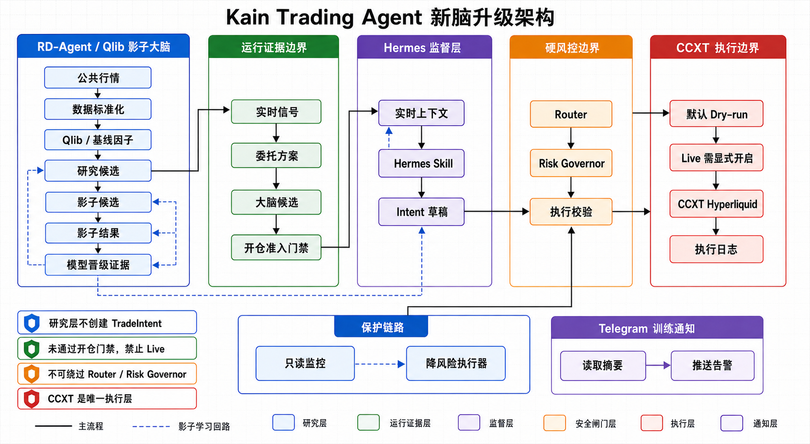
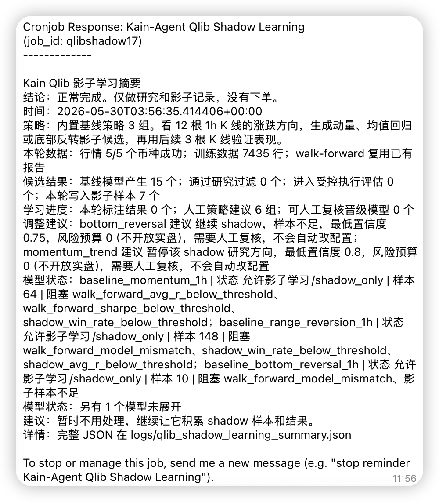
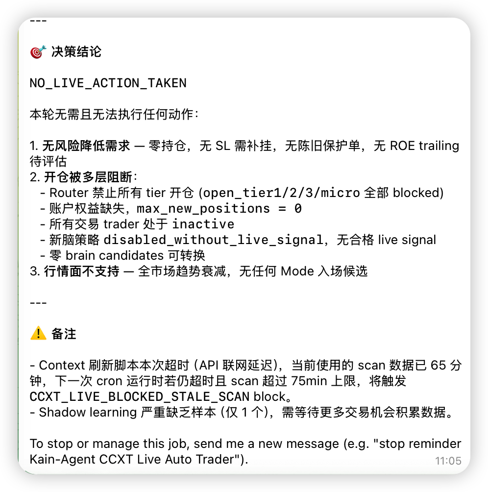
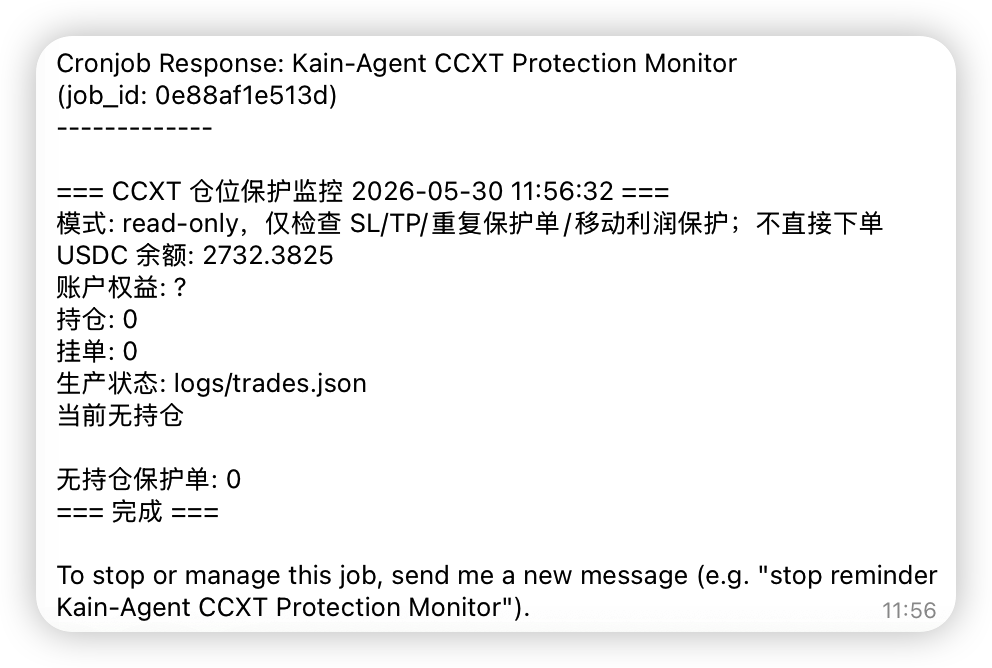
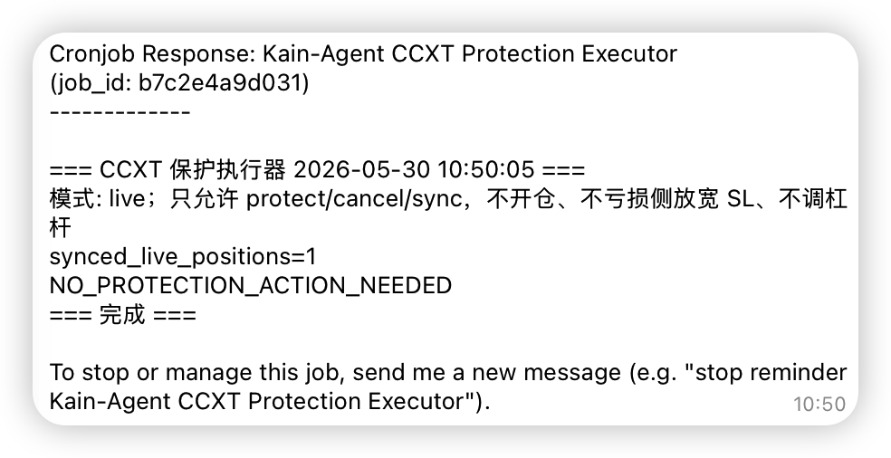
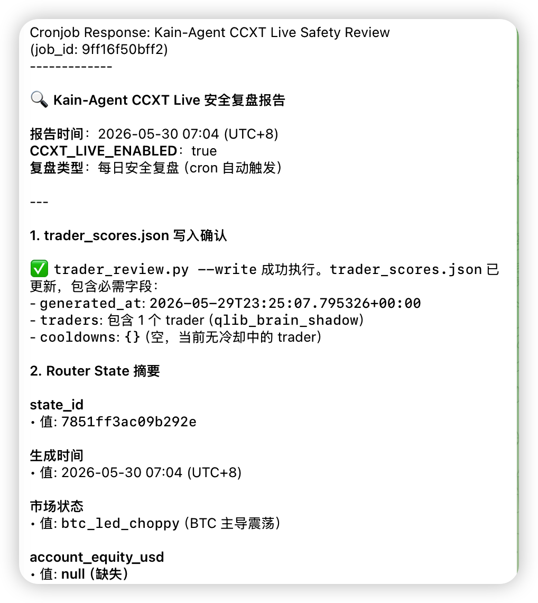

# 会下单不难：我把 AI 交易 Agent 做成了 7x24 值班系统

上午 11:05，Kain Trading Agent 给我发了一条 Telegram：

```text
NO_LIVE_ACTION_TAKEN
```

这不是故障，也不是模型没看到行情。它读了行情、仓位、Router state 和新脑信号，最后选择不动：Router 禁止开仓、账户权益缺失、没有合格 live signal、零 brain candidates。

以前我做自动交易 Agent 时，本能期待它「更聪明、更敢抓机会」。真正让它 7x24 跑起来之后，我反而越来越看重另一件事：

**它能不能把“不行动的理由”讲清楚。**

Kain Trading Agent 现在的结构可以概括成一句话：

> RD-Agent / Qlib 负责研究，Hermes 负责监督，Router / Risk Governor 负责拒绝，CCXT 负责执行，Protection Executor 只负责降低风险。

这篇文章不是投资建议，也不是策略收益复盘。它是一篇工程记录：一个真实资金相关 Agent，怎样从 prompt + SDK 的短链路，逐步变成研究、监督、执行、保护和复盘分层的 7x24 值班系统。

读完应该带走的不是某个交易脚本，而是一个更通用的 Agent 生产化原则：

**越接近真实世界后果，Agent 的权限越要窄。**

---

## 一、最早的问题：系统太容易直接动钱

自动交易 Agent 的初版很容易长成这样：

```text
LLM 看行情
  -> prompt 里判断多空
  -> 临时 Python 脚本拼订单
  -> Hyperliquid SDK 直接下单
```

这条链路短、反馈快、成就感强。第一次 dry-run 跑通，第一次看到订单结构生成出来，很容易产生一种错觉：系统已经活了。

但只要进入 7x24 运行，短链路的危险就会被放大：

- prompt 里一句模糊判断，可能变成真实 open；
- 一次性脚本绕过了状态文件和执行日志；
- 旧 SDK monitor 和新 CCXT executor 同时存在时，很难判断谁才是生产入口；
- LLM 看到一个「看起来不错」的信号，就可能试图自己补齐止损、杠杆、仓位；
- 本地状态过期时，系统还可能把不存在的仓位当成真实仓位继续管理。

我后来越来越清楚：**交易 Agent 最大的风险不是它不会思考，而是它有太多路径可以把思考直接变成动作。**

所以 Kain 的生产化不是给模型更多自由，而是反过来做拆分：把「会想」和「能做」拆开，把「研究」和「执行」拆开，把「保护」和「开仓」拆开。

---

## 二、当前架构：五层权限边界

现在的生产架构不是一个「全能交易员」，而是五个边界清楚的角色：

- **RD-Agent / Qlib shadow brain**：研究候选、影子样本、回测和晋级证据，不创建 `TradeIntent`；
- **Hermes supervisor**：解释候选、复盘、生成结构化 intent，不直接下单；
- **Router / Risk Governor**：检查 trader、tier、regime、亏损、杠杆、止损和风险预算，可以拒绝 open；
- **CCXT execution boundary**：唯一执行层，默认 dry-run，只有显式 `--live` 才提交订单；
- **Protection safety loop**：monitor 只读，executor 只能做补 SL、收紧保护、TP 维护和陈旧保护单清理。



*图 1：Kain Trading Agent 新脑升级架构。蓝色研究层只产生 shadow 与候选证据；绿色运行证据层形成实时信号、委托方案和大脑候选；紫色 Hermes 层只做监督与 intent 草稿；橙色硬风控层负责拒绝；红色 CCXT 层才是唯一执行边界。*

这五层里，每一层都有一句「可以做什么」和一句「不能做什么」。

| 层                      | 可以做什么                         | 明确不能做什么                                      |
| ---------------------- | ----------------------------- | -------------------------------------------- |
| RD-Agent / Qlib        | 研究因子、生成候选、做 shadow 学习         | 创建 TradeIntent、提交订单、修改生产配置                   |
| Hermes                 | 解释、监督、复盘、生成结构化 intent         | 绕过 Router / Risk Governor，直接调 SDK 下单         |
| Router / Risk Governor | 拒绝不合规 open intent             | 被模型说服后放宽硬规则                                  |
| CCXT executor          | 校验 intent 后 dry-run / live 执行 | 接受无止损、无 router_state、无 source binding 的 open |
| Protection executor    | 补 SL、收紧 SL、ROE trailing、TP 维护 | 开仓、调杠杆、亏损侧放宽止损、自由裁量平仓                        |

我现在判断一个交易 Agent 是否值得长期运行，不会先问「模型是什么」，而会先问这几个问题：哪个组件能创建候选？哪个组件能创建 intent？哪个组件能提交 live order？哪个组件只能读？哪个组件只能降低风险？哪个组件有权拒绝所有人？

如果这些问题回答不清楚，模型越强，系统越危险。

---

## 三、新脑升级：先 shadow，再授权

Kain 原本有一套人类可读的 Mode A/B/C/D/E/F/G 策略语言：顺势回调、震荡高抛低吸、超跌反弹、底部背离启动、强趋势回调等。

这套规则有价值，因为它把交易经验写成了人能看懂的框架。但它也暴露了一个问题：**纯人工阈值 + Hermes prompt 裁量，很容易把系统调成「几乎永远不开单」。**

不开单不是最坏的结果，乱开单才是。但长期不开单也说明系统没有形成有效学习闭环。于是新脑升级的方向变成：

```text
RD-Agent / Qlib 学市场
Hermes 做 supervisor
Router / Risk Governor 做硬拒绝
CCXT 做唯一执行层
```

Qlib / RD-Agent 不直接授权开仓。它先用公共 OHLCV 生成研究候选，写入 shadow 样本，再用后续行情标注 outcome：

```text
ResearchCandidate
  -> ShadowCandidate
  -> ShadowOutcome(target / invalid / timeout)
  -> model promotion evidence
```

低分 baseline 候选也可以进 shadow，因为训练期需要样本。但 shadow candidate 有一条红线：

> shadow candidate 不授权开仓。

只有更高置信的候选继续形成 `LiveSignal -> OrderProposal -> BrainCandidate`，并且 `brain_policy.open_intent_policy` 变成 `requires_brain_candidate_and_router_guard`，Hermes 才能考虑把候选转换成 open intent。

即便如此，open intent 也必须绑定：

```text
source_signal_id
order_proposal_id
brain_candidate_id
router_state_id
```

执行器还会继续校验 symbol、side、price drift、stop_loss 是否比候选 invalid price 更松。



*图 2：Qlib Shadow Learning 的 Telegram 消息示例。它正常完成了一轮研究和影子记录：生成 baseline 候选、写入 shadow 样本、输出人工策略建议，同时明确「没有下单」。这张图展示的是研究层的职责边界，而不是交易结果。*

我后来接受了一件事：交易 Agent 的进步，不一定表现为「下更多单」。很多时候，它的进步是更稳定地积累证据，并且更频繁地拒绝自己。

**学习可以宽，授权必须窄。**

---

## 四、Hermes 的降级：从交易员到主管

这个项目里一个很重要的心路变化，是我不再把 Hermes 当成主交易员。

早期很容易期待 LLM 直接做判断：它看行情、看指标、看仓位，然后输出「开多 ETH」「保护 SOL」「关闭 ZEC」。这符合人对智能体的直觉：既然它能推理，就让它决策。

但交易不是普通问答。LLM 给出的自然语言理由再完整，也不等于它应该拥有执行权限。

所以 Hermes 后来被降级成 supervisor：

- 它读取 `ccxt_live_context.json`，而不是自己到处抓状态；
- 它解释 Qlib / RD-Agent 候选，而不是凭旧技术规则自由裁量；
- 它最多输出一个结构化 intent，而不是直接下单；
- 它可以处理 protect / close / cancel，但 open 必须受 `brain_policy` 和 Router 约束。



*图 3：每小时交易 job 的 Telegram 消息示例。重点看第一行：`NO_LIVE_ACTION_TAKEN`。这个 Agent 的价值，不是每小时都行动，而是能把不行动的理由讲清楚：Router 禁止开仓、账户权益缺失、无合格 live signal、零 brain candidates。*

这个降级反而让系统更可信。Hermes 不再需要永远判断正确。它只需要在明确上下文里做选择、解释和转换。真正决定能不能 live open 的，是后面的确定性边界。

我后来越来越喜欢这种 Agent 设计：**让模型承担它擅长的语义工作，让代码承担必须可靠的权限工作。**

---

## 五、硬风控与保护链路：能拒绝，也能降风险

如果说 brain_policy 管的是「这个信号有没有资格被考虑」，Router / Risk Governor 管的就是「现在这个账户、这个币种、这个 trader、这个风险状态下，能不能开」。

一个 live open intent 至少要带这些字段：

```text
trader
router_state_id
symbol_tier
risk_pct
leverage
stop_loss
source_signal_id
order_proposal_id
```

Router 负责 trader、tier、regime：

- Tier1 可以在授权 trader 下 live；
- Tier2 只能是 `live_micro`；
- Tier3 禁止自动开仓；
- regime 不匹配时，trader / tier 会降级为 shadow；
- router state 有 TTL，过期就不能继续用。

Risk Governor 负责亏损和仓位风险：

- 日亏损触发后禁止新 open；
- 连续亏损达到硬阈值后禁止新 open；
- 账户权益缺失时禁止新 open；
- open 必须有 stop_loss 和 leverage；
- 单笔最大亏损不能超过预算；
- `stop_distance_pct * leverage` 不能超过最大止损 ROE。

保护链路则处理另一个问题：仓位一旦存在，保护必须持续维护；但维护保护不能变成新的交易权限。

所以它被拆成两段：

```text
Protection Monitor
  -> 只读检查 live positions、open orders、SL/TP、重复保护、陈旧 reduceOnly

Protection Executor
  -> 先 dry-run protect / cancel intent
  -> 校验通过后 live submit
  -> 只能执行确定性降风险动作
```



*图 4：Protection Monitor 的 Telegram 消息示例。它是 read-only，只报告账户权益、持仓、当前 SL/TP、止损风险和 ROE trailing 状态，不直接下单。*



*图 5：Protection Executor 的 Telegram 消息示例。它可以 live，但权限很窄：只允许 protect / cancel / sync，不开仓、不亏损侧放宽 SL、不调杠杆。*



*图 6：每日安全复盘消息示例。它把 `trader_scores.json`、Router State、市场状态、账户权益缺口等信息集中到一次只读复盘里。它不是未来路线图，而是当前运行闭环里的「每日复盘层」。*

这些规则不性感，但它们是生产系统里最值钱的部分。

真实交易里最可怕的不是模型判断错，而是模型判断错之后仍然保留完整权限。Router / Risk Governor 的作用，是在系统最想行动的时候，有权说「不」；Protection Executor 的作用，是在系统已经有风险暴露时，只能把风险往小处推；每日 Safety Review 的作用，则是把前一天的运行状态、冷却建议和阻塞点整理成一份只读复盘。

---

## 六、构建过程中的四个转折点

回看这套系统，它不是从第一天就设计成现在这样。它更像是在几个具体痛点里被迫长出来的。

### 6.1 第一次不舒服：自然语言建议没法审计

早期最自然的做法，是让 LLM 输出交易建议，再用脚本执行。

后来发现这不够。建议文本可以解释，但不能审计；自然语言可以说「小仓位」，但执行器需要知道 `amount`、`risk_pct`、`leverage`、`stop_loss`；模型可以说「止损放宽一点」，但系统必须知道这是盈利侧 relax 还是亏损侧放宽。

于是结构化 `TradeIntent` 成为边界。

LLM 可以输出意图，但意图必须被 parse、validate、guard、log。不能解析的就不执行，字段缺失的就不执行，方向错误的就不执行。

这一步之后，交易动作从「模型说了算」变成「模型提交申请」。

### 6.2 第二次不舒服：路径太多，没人知道谁有 live 权限

旧脚本能用，但路径多了之后，最大问题不是某个脚本坏了，而是没人能快速回答：现在到底哪个脚本有 live 权限？

所以后来把 CCXT 定义成唯一执行层。旧 SDK monitor、一次性执行脚本、历史 trailing stop 都归档到 `archives/`，只保留 rollback/reference 价值，不再作为运行入口。

这个整理动作不只是换库，而是把「执行权」收口。

### 6.3 第三次不舒服：系统很安全，因为它几乎不交易

手写规则越调越严，最后会出现一个安静但麻烦的状态：系统很安全，因为它几乎不交易。

解决方法不是马上放宽 live，而是先补学习闭环。

Qlib shadow learning 每小时跑一次，用公共行情生成候选、记录 shadow 样本、标注 outcome、积累 model promotion evidence。即使没有真实成交，系统也能用反事实候选学习「如果当时进，会发生什么」。

这一步把问题从「今天开不开仓」移动到「系统有没有持续获得证据」。

### 6.4 第四次不舒服：最频繁的动作不该靠 LLM

保护动作最开始也可以交给 LLM 建议。但 live 仓位的 SL/TP 维护，不适合靠自然语言判断。

缺 SL 就补，重复 SL 就清，陈旧 reduceOnly 就撤，盈利到一定 ROE 就 trailing。这些都更适合确定性代码。

所以保护执行器变成 no-agent worker。它不问模型，不写 prompt，只读状态，生成 protect/cancel intent，先 dry-run，通过后 live。

这一步让我对系统更放心：最频繁、最贴近 live order 的动作，反而没有 LLM 参与。

---

## 七、适用场景与路线图

Kain 是交易 Agent，但它沉淀出来的模式更通用。

只要你的 Agent 满足这几个条件，就可以借鉴这套架构：

- 会接触真实资金、生产资源、用户账户或不可逆外部动作；
- 需要 7x24 或定时运行，而不是一次性人工确认；
- 需要同时容纳研究、判断、执行、审计和回滚；
- 模型可以提出建议，但不能被允许绕过规则；
- 执行动作必须留下结构化日志。

对应到其他领域，可以类比成：

| 场景 | 研究层 | 监督层 | 执行边界 | 硬闸门 |
| --- | --- | --- | --- | --- |
| 云成本治理 | 资源使用分析 | LLM 解释异常 | Terraform / Cloud API wrapper | 预算、审批、资源白名单 |
| 广告投放 | 历史转化分析 | LLM 生成调整建议 | Ads API executor | 日预算、ROI、品牌安全 |
| 数据库运维 | 慢查询与风险分析 | LLM 写 migration plan | migration runner | schema diff、备份、锁表检查 |
| 客服自动化 | 工单分类与建议 | LLM 草拟回复 | ticket action API | 用户等级、退款额度、人工升级 |
| 供应链采购 | 价格和库存预测 | LLM 推荐采购 | purchase order executor | 预算、供应商、审批流 |

后续还有几条明确路线。

**1. 模型晋级证据：从 shadow 到可审查 promotion。**  
继续补 walk-forward 报告、按 trader / regime / tier 拆分 shadow outcome、低样本策略冷启动、promotion 失败案例归档。目标不是自动把模型推上 live，而是让「为什么这个模型可以进入 runtime」变得可审查。

**2. BrainCandidate 到 live intent 的转换继续收紧。**  
继续加强 candidate 有效期、价格漂移、stop_loss 宽度、不同 trader 适配限制，以及 rejected candidate 的原因沉淀。理想状态下，每一次没有开仓，也是一条有价值的数据。

**3. Adaptive protection 从 shadow 走向可控 live。**  
现在 `adaptive_protection` 默认只把杠杆感知建议写进 metadata。后续可以先积累样本，再限制在低风险 profile 或小仓位上进入 live。保护系统的目标不是更激进，而是在不同仓位状态下更早识别「应该保护多少利润」。

**4. 可观测性：从日志文件到运行驾驶舱。**  
当前状态散落在 `trades.json`、`executions.json`、`router_state.json`、`ccxt_live_context.json`、`shadow_candidates.jsonl`、`qlib_shadow_learning_summary.json`。后续需要一个只读 dashboard，让人工 30 秒内判断：系统现在到底能不能开仓、为什么不能、哪里卡住了。

**5. 演练和回滚：把「出事怎么办」写进系统。**  
继续补 staging runtime 验证、live 前 smoke checklist、Hermes job drift 检查、状态清理策略、一键 handoff 报告，以及无 SL、重复单、状态损坏、公共行情失败、CCXT 请求超时等 runbook。

---

## 八、风险提示：它也可以先只做风控

这套系统不应该被理解成「让 AI 自动替你赚钱」。

真实交易里，模型会误判，行情会跳变，公共数据会延迟，交易所接口会失败，本地状态也可能和链上状态短暂不一致。即使所有工程边界都写对了，它也不能消除市场风险，只能把错误动作限制在更小的权限范围里。

所以更稳的落地方式，未必是一开始就让它自动开仓。哪怕完全不用它做交易决策，只拿来做自动化风控，也已经有价值：

- 7x24 检查仓位是否缺 SL / TP；
- 发现重复保护单、陈旧 reduceOnly 单和本地状态漂移；
- 持续计算杠杆后止损 ROE 和账户风险；
- 在浮盈后按规则执行 trailing 或收紧保护；
- 把每次拒绝、保护、复盘都推送到 Telegram，不用人一直盯盘。

这类「只降风险」的 Agent，比「自动开仓」更容易先进入生产。它不替你判断机会，却能减少忘记挂保护、保护单漂移、深夜无人值守这类低级事故。

代价也很明确：系统会更保守，可能错过一些人类临盘会抓住的机会。Router 过期、账户权益缺失、shadow 样本不足、brain candidate 不完整，都会导致它选择不动。  

但这正是本文的核心取舍：**宁可错过机会，也不要让一个证据不足的 Agent 获得完整交易权限。**

---

## 总结：Agent 的能力要向内收束

Kain Trading Agent 最终不是一个「更会交易的 AI」故事。

它最后沉淀成一组很朴素的工程约束：

- 把研究收束到 shadow；
- 把判断收束到 supervisor；
- 把动作收束到 intent；
- 把执行收束到 CCXT；
- 把风险收束到 Router / Risk Governor；
- 把保护收束到只降风险的确定性 worker。

这套系统仍然会继续变化。模型会换，策略会改，Qlib/RD-Agent 的证据链会加厚，Protection profile 也会继续迭代。

但我希望它不变的是这条原则：

> **真实世界里的 Agent，不应该因为更聪明而拥有更大权限；它应该因为更聪明，而更懂得把自己交给边界。**

如果一个 Agent 要长期触达资金、生产系统或用户账户，它最重要的工程品质不是「像人一样果断」，而是「不像人一样冲动」。

---

## 延伸阅读

项目内更详细的设计与运行说明：

- `README.md` — 当前生产架构、关键文件、jobs 和执行方式
- `docs/ARCHITECTURE.md` — RD-Agent/Qlib、Hermes、Router/Risk Governor、CCXT、Protection loop 的边界说明
- `docs/OPERATIONS.md` — Hermes jobs、runtime 同步、readiness、shadow learning 和运维流程
- `docs/DIAGRAMS.md` — 新脑升级后的 Mermaid 架构图和时序图
- `docs/solutions/architecture-patterns/hermes-ccxt-trading-agent-runtime.md` — Hermes + CCXT 自动交易 Agent 的长期架构模式沉淀
