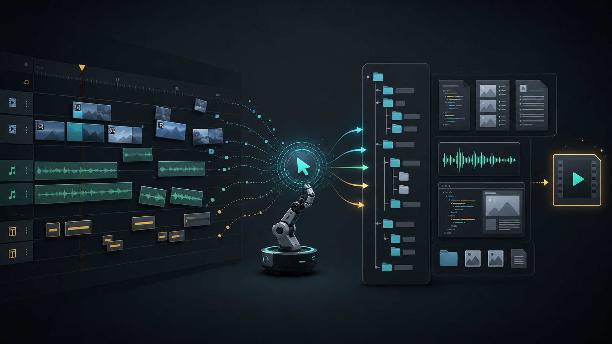
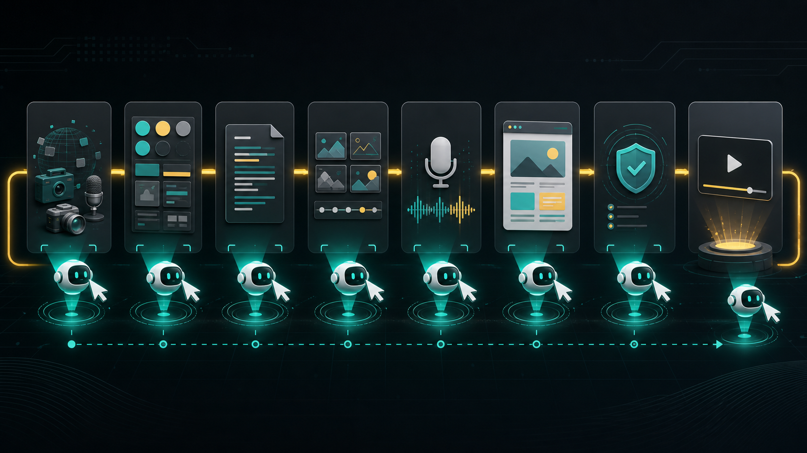
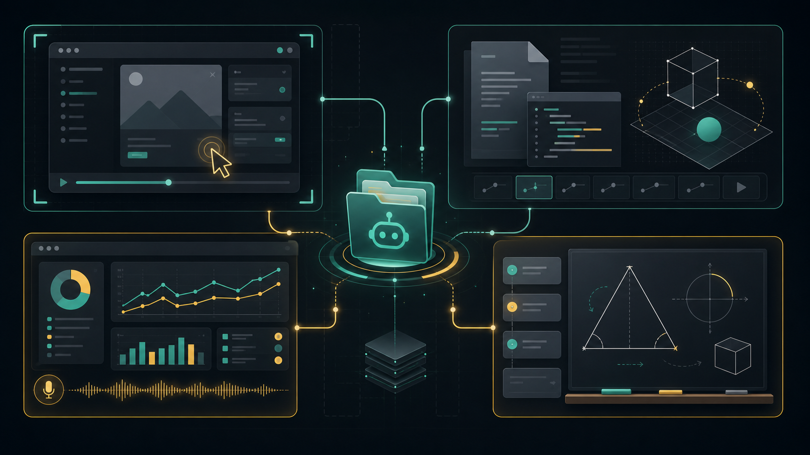

# AI 视频真正的变化：从一条成片，到一套文件

一条三分钟视频，以前至少要经过几只手。

先写脚本，再做 PPT 或分镜；再录屏、配音、找素材、加字幕、调转场、导出、压缩、发布。每一步都不算难，但每一步都要人盯着。真正麻烦的不是“生成一个画面”，而是这些中间状态都散落在剪辑软件、PPT、录音文件和人的脑子里。

最近我看到的一组信号，方向其实很一致：视频生产正在从剪辑时间轴里被拆出来，变成 Agent 能读、能改、能检查的一组文件。

它不再只是一个成片，而是：

```text
video-project/
├── capture/
├── DESIGN.md
├── SCRIPT.md
├── STORYBOARD.md
├── narration.wav
├── transcript.json
├── composition.html
├── subtitles.srt
└── publish-metadata.json
```



*图 1：从传统剪辑时间轴到 Agent 可维护的文件系统。视频不再只是最终 MP4，而是一组脚本、分镜、音频、字幕、画面文件与发布元数据。*

这件事比“某个视频模型更强了”更重要。

因为 Agent 最擅长的不是审美，也不是导演。它最擅长的是读写文件、反复修改、按规则检查、失败后重跑。只要视频还被锁在传统剪辑时间轴里，Agent 就很难真正接管；一旦视频被拆成代码、文本、配置和素材，它就进入了 Agent 的工作半径。

这篇不做 AI 视频工具大全。Veo、Runway、Kling 这一层当然重要，但我现在更关心另一件事：视频正在从“一个生成结果”，变成“一个可维护工程”。

## 一、中间产物比成片更重要

我们看视频工具，容易先问两个问题：画面真实吗？生成快吗？

这两个问题没错，但都盯着最后一帧。真正决定视频能不能被 Agent 接管的，是中间产物有没有被显式化。

如果一条视频只有一个最终 MP4，Agent 能做的事情很少。它最多看一遍、提建议、重新生成一版。中间出了问题，也很难局部修：字幕慢了半秒，第三个镜头节奏不对，配音和画面没对齐，产品名拼错，发布标题不适合平台。

但如果视频被拆成文件，事情就不一样了。

脚本错了，改 `SCRIPT.md`。分镜太平，改 `STORYBOARD.md`。旁白节奏不对，重跑音频，再更新 `transcript.json`。字幕没对齐，检查 `subtitles.srt`。画面风格不统一，回到 `DESIGN.md` 和 `composition.html`。

这更像软件构建，而不是传统剪辑。

在这个模式里，成片只是最后生成的产物。真正值钱的是前面的源文件、模板、规则和检查项。Agent 不需要一次性“灵感爆发”做出好视频，它只要能沿着文件系统，把每一步维护到及格线以上。

所以我觉得，“视频文件系统化”比“文本生成视频”更值得看。后者是在赌模型能力，前者是在搭生产结构。

## 二、HyperFrames 把流程拆开了

HyperFrames 是这条线上最清楚的例子。

它不是让 Agent 直接“做一个好看的视频”，而是把视频创作拆成一条流程。官方文档里的流程是七步：

```text
capture -> design -> script -> storyboard -> voiceover -> build -> validate
```



*图 2：Agent 原生视频流程的关键不是一步出片，而是把素材、设计、脚本、分镜、旁白、构建和验证拆成可追踪节点。*

这七步的意思很直白：

先收集素材和上下文，再定视觉风格；先写脚本和分镜，再做旁白；最后才进入画面构建和检查。

重点不是这些词有多新，而是每一步都有自己的产物。Agent 不需要把所有创作决策都记在上下文里，它可以沿着文件继续工作。

这对 Agent 很重要。它不一定知道“好看”是什么，但它可以读 `DESIGN.md`。它不一定能凭感觉保证节奏，但它可以检查脚本、字幕、音频和画面是否对齐。它不一定适合当导演，但适合当一个不知疲倦的维护者。

所以 HyperFrames 的意义，不是马上替代所有视频工具。它给了一个很清楚的形态：

```text
视频 = 文件 + 时间轴 + 动效 + 渲染 + 检查
```

一旦这个形态成立，Agent 就不是在“帮你剪视频”，而是在维护一个视频项目。

## 三、这不是单个工具的事

Remotion 早就把视频变成了代码。用 React 描述画面，用数据和时间控制内容，再渲染成视频。它更像成熟的视频产品底座，适合复杂模板、批量生成和服务端渲染。

HyperFrames 更轻，更贴近 Agent 直接写 HTML、改样式、跑检查的工作方式。两者不是谁替代谁，而是说明视频生产正在分层：

- 复杂产品化视频，可以走 Remotion 这种组件化路线；
- 轻量解释视频、产品 demo、教学片段，可以先走 HyperFrames 这种 HTML 路线；
- 真正的创作系统，会把它们都当作可调用的渲染层。

更有意思的是，Skill 正在把创作能力拆成一块块可安装模块。

GSAP Skills 让 Agent 更容易写出稳定的动画。`html-ppt-skill` 把主题、布局、动画、演讲稿和导出逻辑放进 HTML 演示系统。SenseNova-Skills 把 PPT、图像、数据分析、深度研究封成办公技能。

这些项目指向同一件事：创作不再只是“打开一个软件”，而是“让 Agent 维护一套可组合的文件和流程”。

传统创作软件把很多状态藏在 UI 里。人类可以凭经验理解，但 Agent 很难稳定操作。Skill 化之后，创作能力开始变成说明文档、目录结构、输入输出约定、示例工程和检查命令。

这正是 Agent 的舒适区。

## 四、先落地的不是电影

这条路不会先替代导演，也不会先替代剪辑师。

我更看好四类视频先跑出来。

第一类是产品 demo。产品 demo 的素材可控，结构稳定，目标明确：展示功能、讲清价值、引导试用。每次产品更新后，只要改局部脚本、镜头和发布文案。

第二类是技术文章转视频。技术文章本来就是结构化文本，章节、代码、图表、结论都在。Agent 可以把文章拆成讲解脚本，再配图示、字幕和旁白。

第三类是数据报告视频。周报、月报、运营看板、产品指标变化，都适合用同一套模板解释。数据变了，图表和旁白变；结构不变。

第四类是教学讲解视频。数学、编程、产品流程、工具教程，都有强结构。脚本、分镜、动画、字幕、例题、代码片段可以明确拆开。

这些场景的共同点是：结构强、素材可控、审美要求可以模板化，质量也可以靠检查项兜住。



*图 3：产品 demo、技术文章转视频、数据报告视频、教学讲解视频，是 Agent 原生视频管线更容易先落地的四类场景。*

相反，高写实长片、强艺术导演、复杂真人表演、完全无人审核的内容矩阵，现在还不该交给这套系统。不是因为模型不够强，而是这些场景里的失败很难被文件系统捕捉。

镜头气质不对，表演僵硬，节奏差一口气，审美廉价，这些都很难靠检查命令解决。

Agent 原生视频管线最早的价值，不是让人退出创作，而是把重复、可描述、可检查的部分先工程化。

## 五、别把它吹成全自动导演

这个方向很有意思，但现在也很容易被吹过头。

第一，性能要自己测。长视频、高分辨率、多层动画，渲染成本不一定低。真要做生产管线，至少先跑一条 60 秒样片。

第二，视觉一致性要锁。字体、断行、素材尺寸、颜色、平台比例，都要写进规则里。否则本地预览好看，导出后不一定稳定。

第三，复杂动画不要高估 Agent。Agent 很容易写出“能动”的东西，但“能动”和“稳定好看”不是一回事。越复杂，越需要模板。

第四，素材来源要管理。图片、音乐、配音、字体、视频素材、模型生成素材，都应该进清单。否则自动化越强，版权和来源越容易乱。

这些问题不会否定方向，反而说明它开始从玩具走向工程。只有一件事开始值得维护，才会出现性能、版本、依赖、测试、回滚、审计这些麻烦。

## 六、视频会先变成创作 Harness

我不相信视频会很快变成“输入一句话，自动出大片”。

更现实的路径是：视频先变成一套创作 Harness。

这套 Harness 里，LLM 负责读材料、写脚本、拆分镜、生成旁白、修改字幕、补发布文案；HyperFrames 或 Remotion 负责把画面渲染出来；GSAP 负责动效；PPT Skill 负责版式和讲解结构；TTS、图片模型、视频模型负责补素材。

它不是全自动导演。它更像一个不会睡觉的内容助理，守着一个文件夹，把每条视频都维护成可读、可改、可复盘的工程。

这也是我觉得“视频正在变成 Agent 可维护的文件系统”的原因。

真正的变化不在于“我输入一句话，它吐出一条视频”。真正的变化在于：一条视频可以被拆成脚本、分镜、声音、字幕、动效、代码和发布元数据；Agent 可以在这些文件之间穿梭，把创作变成可维护、可复盘、可重跑的流程。

视频不会先变成全自动导演。

视频会先变成一份构建产物。

## 参考资料

- [HyperFrames Pipeline](https://hyperframes.heygen.com/guides/pipeline)
- [heygen-com/hyperframes](https://github.com/heygen-com/hyperframes)
- [Remotion Agent Skills](https://www.remotion.dev/docs/ai/skills)
- [greensock/gsap-skills](https://github.com/greensock/gsap-skills)
- [lewislulu/html-ppt-skill](https://github.com/lewislulu/html-ppt-skill)
- [OpenSenseNova/SenseNova-Skills](https://github.com/OpenSenseNova/SenseNova-Skills)
- 本地 wiki：`wiki/concepts/ai-video-generation.md`、`wiki/concepts/programmatic-video-remotion.md`、`wiki/concepts/tech-radar.md`
