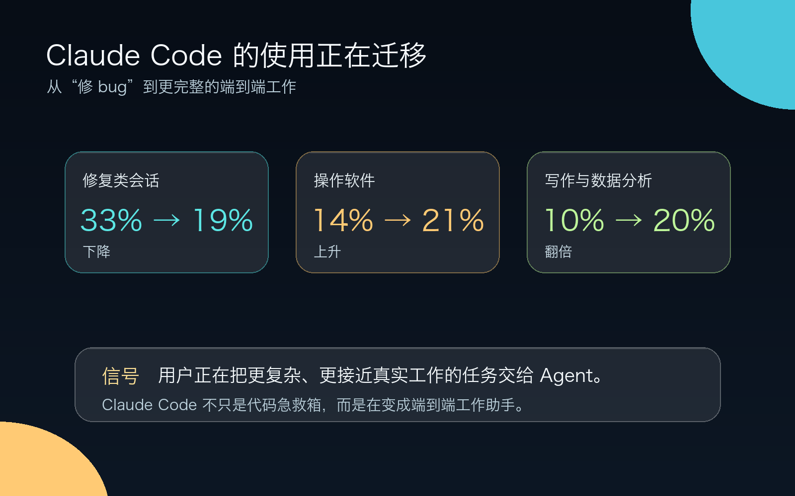
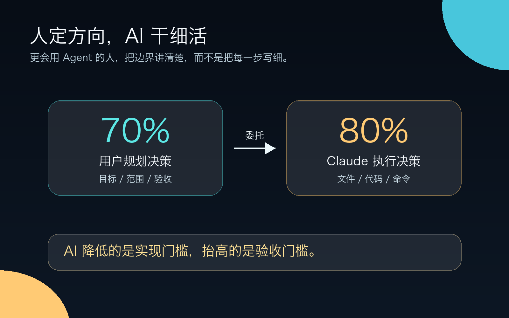

# 40万次 Claude Code 会话暴露真相：AI 越会写代码，越奖励懂业务的人

你可能也遇到过这种情况：

同样用 Claude Code，有人一条 prompt 跑完一套 PR，有人来回十几轮还卡在“再试一次”。

Anthropic 分析了 2025 年 10 月到 2026 年 4 月的 **398,198 个 Claude Code 交互会话**，覆盖 **234,751 名用户**。样本来自真实使用行为，比问卷和营销案例更接近工具的日常用法。

我读完后只记住一件事：

**AI 写代码越强，越奖励懂问题的人。**

只等需求、只做实现的人，会被 Claude Code 这类工具推到更被动的位置。

## 1. Claude Code 已经不只负责修 bug

很多人还把 AI Coding 当急救箱：报错了，把日志丢进去，让它修。

Anthropic 看到的使用场景比这宽很多。

约 **56% 的会话**在写代码、修代码、测试或编排代码；**17%** 在运行、部署、配置、监控；**14%** 在理解系统或规划变更；**13%** 在做数据分析或文档沟通。

6 个月里，修复类会话从 **33% 降到 19%**，操作软件从 **14% 升到 21%**，写作和数据分析类从大约 **10% 增长到 20%**。

用户开始把更完整的任务交给 Claude Code。

以前你说：“这里坏了，帮我补一刀。”  
现在你说：“先理解这套系统，改一段流程，跑测试，整理结果，必要时补文档。”

工具变强后，你给它的任务也变大了。

## 2. 人定方向，AI 干细活

典型会话中，用户承担约 **70% 的规划决策**，Claude 承担约 **80% 的执行决策**。

你负责决定“做什么、做到什么程度、什么不能碰”。Claude 负责判断“改哪些文件、写哪些代码、跑哪些命令”。

会用 Agent 的人，很少把每一步写满。他们会先把边界讲清楚。

差的委托是：

> 帮我修一下登录。

好的委托是：

> 只处理 token 过期后没有自动刷新的问题，不改 OAuth 主流程；保留现有错误提示；用这 3 个场景证明修好了。

这种委托靠专业判断，比 prompt 话术更有用。

## 3. 专家少写步骤，多给约束

报告把用户按任务专业度分成 novice 到 expert。这里的“专家”指的是你对当前任务的理解程度，不看公司头衔。

数据很直观：novice 用户每条提示平均触发约 **5 个 Claude 动作**、约 **600 词输出**；expert 用户每条提示平均触发约 **12 个动作**、约 **3,200 词输出**。

专家不会把 AI 当小学生，一步一步盯着。专家像一个好负责人：先讲目标、禁区、验收标准，再把执行空间交出去。

同一个 Claude Code，在不同人手里像两个工具。  
有的人只会说“改一下”。有的人能说清楚“什么结果算对”。

## 4. 新手先补“验收能力”

严格成功率下，novice 会话约 **15%** 成功；intermediate 及以上是 **28%-33%**。如果看更宽松的 partial success，novice 约 **77%**，intermediate 到 expert 约 **91%-92%**。

最大差距出现在 novice 到 intermediate。

普通开发者不需要立刻成为架构大师，但你至少要跨过一个门槛：

- 知道目标是什么；
- 知道哪些东西不能乱改；
- 知道怎么验证结果；
- 知道 AI 跑偏时怎么拉回来。

会话出现失败信号时，差距更大。novice 的 verified success 约 **4%**，expert 约 **15%**。AI 一旦跑偏，新手容易陪它一起绕圈；专家会先找错误假设。

## 5. 程序员身份的护城河，正在变薄

产生代码变更的会话里，软件相关职业 verified success 约 **34%**，非软件职业约 **29%**；宽松成功率分别是 **89% 和 88%**。

差距还在，但没有很多人想象中那么大。

“写代码”会像办公软件一样，进入更多知识工作者的日常。运营写数据脚本，财务做自动对账，研究员搭分析管线，产品经理改内部工具，这些场景会变常见。

程序员要把壁垒放在系统判断、工程边界、抽象能力、风险意识，以及对业务语义的理解上。

## 结论

我会这样概括这份报告：

**AI 降低的是实现门槛，抬高的是验收门槛。**

以前，弱程序员主要输在不会写。  
以后，更多人会输在：不知道哪里会错，也不知道怎么证明它对。

现在最该练三件事：

1. 把模糊需求拆成可验证任务；
2. 把业务规则、测试命令、项目禁区写进 `AGENTS.md` / `CLAUDE.md`；
3. 每次 AI 改完都问：它证明了什么？还有什么没证明？

如果你用 AI 写代码时总觉得“看起来能跑，但心里没底”，先别急着换模型。你需要给它更清楚的任务边界，也需要给自己一套验收方法。

## 参考来源

- Anthropic, "Agentic coding and persistent returns to expertise", 2026-06-16: https://www.anthropic.com/research/claude-code-expertise
