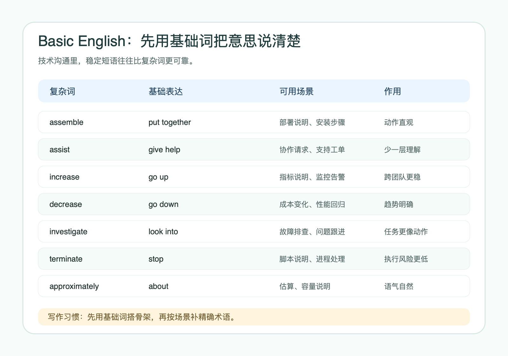
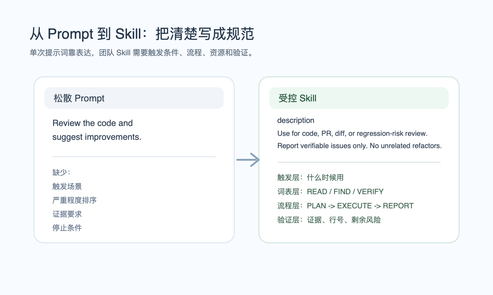

# 别让同事和 AI 猜你的意思：写给技术团队的受控语言指南

**技术团队里，很多故障来自语言。**

需求写得像愿望，Runbook 写得像备忘录，接口说明少了边界条件，故障复盘里到处是“适当”“尽量”“优化一下”。到了 Prompt 和 Agent 时代，这类模糊表达会放大：人看完要猜，模型看完也要猜。

**团队沟通里最贵的错误，就是别人看完还要靠猜。**

技术写作里早就有一组可借鉴的方法：Basic English、Plain English、Simplified Technical English。它们来自英语学习、公共写作和航空维护文档，却都在处理同一个麻烦。

技术团队要把话说清楚、稳定、少歧义。

技术人员每天都会碰到它：英文邮件、外企日常沟通、API 文档、部署手册、故障排查、代码审查、Prompt Engineering、Agent Skills。

先澄清一点：

**“受控语言”不是本文造的新词。**

它对应英文里的 `controlled language` / `controlled natural language`。这类语言会限制词汇、语法或语义，用来减少歧义、提升可读性，或让机器更容易处理文本。ASD-STE100 Simplified Technical English 就是一个典型例子。

先看 Basic English、Plain English、STE 这三条线，再回到软件/IT 技术写作、Prompt、Skills 和团队规范。

## #1 三个入口

Basic English、Plain English、Simplified Technical English 不是一个官方“三分法”。

把它们放在一起看，可以快速理解受控语言和清晰写作：

| 入口 | 核心问题 | 适合场景 |
|---|---|---|
| Basic English | 词少也能表达吗？ | 非母语沟通、跨国团队、基础表达 |
| Plain English | 普通人能快速读懂吗？ | 邮件、公告、帮助文档、团队沟通 |
| Simplified Technical English | 执行者会不会误解？ | 操作手册、维护文档、Runbook、安全关键流程 |

**这三个入口都用规则换取理解稳定性。**

### 1. Basic English：先用少量词汇表达清楚

Basic English 通常指 C. K. Ogden 在 1930 年代提出的 Ogden Basic English。它试图用 850 个核心词，加上受限制的语法，覆盖大量日常表达。

Ogden 没有要求学习者永远只用 850 个词。他给初学者一个表达骨架。

比如：

```text
assemble -> put together
assist -> give help
increase -> go up
```

这些表达不算漂亮，但足够清楚。技术人员可以借走三条习惯：

1. 少用大词，先用基础词说清楚。
2. 少写长句，把一个意思拆成几个短句。
3. **少追求“高级感”，先追求“别人能准确理解”。**

比如催进度，不一定要写：

```text
I would like to kindly inquire whether there has been any progress regarding the matter we previously discussed.
```

直接写：

```text
Could you send me an update on this task today?
```

短、清楚、有动作。



### 2. Plain English：让读者少花脑力

Plain English，或者 Plain Language，没有 Basic English 那样固定词表。它更像一套公共写作原则：用日常词、短句、主动语态、清晰结构，让读者快速理解并采取行动。

它常见于政府网站、法律说明、产品帮助中心、办公邮件和技术说明。

比如：

```text
It is requested that the document be reviewed prior to the meeting.
```

Plain English 会改成：

```text
Please review the document before the meeting.
```

再比如：

```text
Due to the fact that the deployment failed, we will postpone the release.
```

改成：

```text
The deployment failed, so we will postpone the release.
```

Plain English 对技术团队很有用。

**团队沟通里最贵的错误，是读者看完不知道下一步做什么。**

### 3. STE：严格，但不要神化

Simplified Technical English，简称 STE，最著名的标准是 ASD-STE100。它起源于航空航天领域，目标是让维护文档更清楚、更一致、更少歧义。

STE 的做法比 Plain English 更严格。它会控制：

1. 句子怎么写。
2. 指令怎么写。
3. 条件和动作怎么排序。
4. 哪些词可以用。
5. 一个词允许表达什么含义。

例如 `close` 在普通英语里可以表示“靠近”，也可以表示“关闭”。在技术文档里，多义词会带来风险。

**STE 的思路就是尽量让词义稳定。**

软件/IT 团队不必照搬完整 STE。STE 适合高精度、高风险、强流程的场景，比如维护手册、设备操作、安全关键流程。软件团队通常借鉴它的规则，不完整采用它的词典。

比如这句：

```text
The hose may be removed after the valve is made safe.
```

问题是：谁来做？什么叫 safe？什么时候可以移除？

技术作者可以拆成三步：

```text
Close the valve.
Make sure that the pressure is zero.
Disconnect the hose.
```

**作者把动作拆开后，执行者不需要猜顺序。**

## #2 软件/IT 更常用什么？

软件行业更常用几类灵活规范。

第一类是 **开发者文档风格指南**。

可以直接读 Google Developer Documentation Style Guide 和 Microsoft Writing Style Guide。它们都强调清晰、简洁、一致、主动语态、用户视角。Google 的指南还建议把条件放在指令前面，这一点和受控技术写作很接近。

如果你写 README、API 文档、部署说明、教程、内部平台文档，这类指南比原版 STE 更适合日常使用。

它们真正有用的地方，不是告诉你“写得清楚一点”，而是把清楚拆成可执行的写法。

比如，先把用户动作写清楚：

```text
Before:
The configuration file should be modified before the service is restarted.

After:
Update the configuration file.
Restart the service.
```

再比如，把条件放在动作前：

```text
Before:
Click Delete if you want to remove the API key.

After:
If you want to remove the API key, click Delete.
```

再比如，用用户视角写错误处理：

```text
Before:
An error may occur when the token is invalid.

After:
If the token is invalid, the API returns 401 Unauthorized.
Create a new token and send the request again.
```

这些例子看起来不高级，但很接近 Google 和 Microsoft 文档风格指南的共同方向：短句、主动语态、读者动作、条件清楚、结果可验证。

第二类是 **Docs as Code**。

Docs as Code 把文档当代码管理：Markdown 写作、Git 版本控制、review、CI 检查、发布流水线。程序员更容易接受这种落地方式。

第三类是 **内容治理工具**。

Acrolinx、HyperSTE 这类工具可以检查术语一致性、语气、风格、合规性和可读性。文档数量上来后，团队很难靠人工记住所有规则。

一些软件/IT 团队会把 STE 或简化英语规则用于用户手册、内部 Runbook、部署文档和故障排查流程。日常软件文档通常把航空版 STE 当作规则参考。

第四类是 **Controlled Natural Language（CNL）研究和需求工程实践**。

在软件工程里，CNL 常用于需求规格、规则描述、自动分析、测试生成等方向。它的目标比普通写作更进一步：让自然语言更接近可验证、可处理的规范。

**STE 是受控技术写作的代表。软件/IT 团队更适合组合使用 Plain English、Google/Microsoft 风格指南、Docs as Code 和少量 STE 规则。**

## #3 技术人员怎么用：从沟通到文档

如果你在外企或跨国团队沟通：

用 Basic English 的思路降低表达门槛。少堆长句，先把动作、对象和时间说清楚。`Could you send me an update on this task today?` 比一长串礼貌套话更有效。

如果你在写周报、邮件、评审意见：

用 Plain English 让别人读懂。删掉套话，结论前置，行动明确。

**把“希望大家关注一下”改成“请在周五前确认这 3 项”。**

如果你在写技术文档：

**优先读 Google 和 Microsoft 的风格指南，再把 STE 的核心规则借过来：短句、主动语态、一个句子一个动作、条件在前、结果可验证。**

如果你在做团队规范：

建立一份轻量的 Software Technical Writing Guide。不要一开始写成 50 页制度。先定义：

1. 常用术语。
2. 禁用模糊词。
3. 操作步骤模板。
4. Runbook 格式。
5. API 文档结构。
6. Prompt / Skill 输出格式。

一份 1 页版指南可以这样写：

```markdown
# Software Technical Writing Guide v0.1

## 1. Default writing rules
- Use short sentences.
- Put one action in one sentence.
- Prefer active voice.
- Put the condition before the action.
- Make each step executable and verifiable.

## 2. Banned vague words
- Avoid: properly, as needed, optimize, handle, related, reasonable.
- Replace them with the object, action, success criteria, and deadline.

## 3. Procedure template
When <condition> is true:
1. Do <action>.
2. Check <result>.
3. If the check fails, do <rollback action>.

## 4. Runbook template
- Trigger:
- Impact:
- Prerequisites:
- Steps:
- Verification:
- Rollback:
- Owner or role:

## 5. API documentation template
- Purpose:
- Request parameters:
- Response fields:
- Error codes:
- Edge cases:
- Example request:
- Example response:

## 6. Prompt / Skill template
- Trigger:
- Input requirements:
- Steps:
- Constraints:
- Verification:
- Output format:
```

这份指南不追求完整。它先把团队最容易写乱的地方固定下来：步骤、术语、边界、验证和失败处理。

## #4 再回到 Prompt：AI 也是一种读者

回到 Prompt Engineering，很多问题并不神秘。

**模型不是人类同事，但它同样会被语言影响。**

你给它模糊词，它就扩大解释空间；你给它长句和多重意图，它就可能漏掉约束。

**你不给验证标准，它就可能把“写完”当成“做完”。**

Prompt 可以借鉴四条受控语言规则：

1. 一个句子只放一个指令。
2. 一个词只表达一个稳定含义。
3. 输出格式先给，不要让模型猜。
4. 复杂任务拆成可验证的小步骤。

比如 `Please optimize this code.`，就太像聊天了。

改成：

```text
Read the service entry point and its callers first.
Find the database queries that affect response time.
Change only the necessary code.
Keep the existing API unchanged.
Add or update tests.
Report the changed files and verification results.
```

这段指令更长，也更可执行。

## #5 从 Prompt 到 Skill：把经验变成团队能力

单次 Prompt 解决“这次怎么说清楚”。Skill 需要处理重复触发、资源加载、验证和停止条件。你写 Claude Code、Codex、Cursor 或其他 Agent 使用的 Skill 时，就是在设计一个可反复触发的能力模块。

一个稳定 Skill 至少要有 5 层：

1. **触发层**：用清晰的 `name` 和 `description` 限定何时使用。
2. **词表层**：定义 8-15 个操作词，避免动作漂移。
3. **流程层**：固定 `PLAN -> EXECUTE -> VERIFY -> REPORT`。
4. **资源层**：把长知识拆到 `references/`，让模型按需读取。
5. **确定性层**：能用脚本完成的检查和转换，不让模型靠语言猜。

比如一个不受控的 code review Skill 会写成：

```markdown
description: Review the code and suggest improvements.
```

受控版本可以写成：

```markdown
description: Use when the user asks for a code, PR, diff, or regression-risk review. Report only verifiable issues. Do not suggest unrelated refactors.
```

第二个版本给出了触发场景、输出边界和禁止事项。

团队实践也一样。不要只说“大家写 Prompt 要清楚”。要把清楚变成规则：

1. 什么时候触发。
2. 先做什么，后做什么。
3. 哪些词有固定含义。
4. 输出必须包含什么。
5. 什么情况停止或追问。
6. 怎么验证结果。

一个小团队可以这样落地：

```markdown
Week 1: Collect 10 frequently used documents
- README
- API documentation
- Runbook
- Incident review
- Prompt / Skill

Week 2: Find common vague phrases
- "Optimize it"
- "Handle edge cases"
- "Keep it stable"
- "Related configuration"
- "Rollback if needed"

Week 3: Create 3 templates
- API documentation template
- Runbook template
- Prompt / Skill template

Week 4: Add the rules to review
- Documentation PRs must check term consistency.
- Runbooks must include verification and rollback.
- Skills must include trigger, constraints, and output format.
- Vague words cannot pass review. Rewrite them as concrete actions.
```

这样做的关键不是“统一文风”，而是统一协作成本。新人知道怎么写，Reviewer 知道怎么审，AI Agent 也能按同一套规则执行。

**团队把这些规则写进文档、模板和 Skill 后，Prompt 才能从个人技巧变成可复用资产。**

<section class="pull-quote pull-quote-rose">
  <p>Prompt 要从个人技巧变成团队资产，必须进入文档、模板和 Skill。</p>
  <small>稳定能力来自可复用规则，不来自一次性的漂亮提示词。</small>
</section>



## #6 一张检查表

写邮件、写文档、写 Prompt，都可以用这张表检查：

1. 读者是谁？
2. 读者读完要做什么？
3. 有没有一个句子塞多个动作？
4. 有没有模糊词，比如“尽量”“适当”“优化一下”？
5. 术语是否前后一致？
6. 条件是否放在动作前？
7. 输出或结果是否可验证？
8. 失败时是否知道该停止、追问，还是降级？

技术沟通、技术文档、Prompt Engineering 训练的是同一种能力：用受控的语言，让人或机器稳定理解并执行。

**这比堆高级词更有用，也比追逐最新 Prompt 模板更耐用。**

***

👉 **互动时刻：**

你们团队在写文档、提需求或写 Prompt 时，最常遇到什么样的“沟通灾难”或“模糊词”？欢迎在评论区吐槽。

如果你觉得文末这份检查表有用，欢迎转发给你的团队，或直接丢到工作群里。

## #7 延伸资料与引用

本文基于作者内部整理稿和以下公开资料改写。

清晰表达和受控语言背景：

- [Basic English 介绍与词表](http://ogden.basic-english.org/)
- C. K. Ogden, *Basic English: A general introduction with rules and grammar*, 1930。书目信息见 [Max Planck Institute publication record](https://www.mpi.nl/publications/item2366945/basic-english-general-introduction-rules-and-grammar)
- [Plain English Campaign 免费指南](https://www.plainenglish.co.uk/free-guides.html)
- [U.S. Plain Language Guidelines](https://www.plainlanguage.gov/guidelines/)

技术文档写作：

- [Google Developer Documentation Style Guide](https://developers.google.com/style)
- [Microsoft Writing Style Guide](https://learn.microsoft.com/en-us/style-guide/welcome/)
- [IBM Style Guide](https://www.ibm.com/docs/en/technical-content?topic=standards-style)
- [Write the Docs Documentation Guide](https://www.writethedocs.org/guide/)
- [Write the Docs: Docs as Code](https://www.writethedocs.org/guide/docs-as-code/)

受控语言和工具：

- [ASD-STE100 官方网站](https://www.asd-ste100.org/)
- [HyperSTE：STE 检查工具](https://hyperste.ai/asd-ste100/)
- [Acrolinx：内容治理和术语一致性工具](https://www.acrolinx.com/for-technical-communication/)
- [Controlled Natural Language SIG](https://www.sigcnl.org/)
- [A Survey and Classification of Controlled Natural Languages](https://direct.mit.edu/coli/article/40/1/121/1455/A-Survey-and-Classification-of-Controlled-Natural)

Prompt / Agent / Skill：

- [OpenAI Prompt Engineering Best Practices](https://help.openai.com/en/articles/6654000-best-practices-for-prompt-engineering-with-the-openai-api)
- [Microsoft Prompt Engineering Techniques](https://learn.microsoft.com/en-us/azure/foundry/openai/concepts/prompt-engineering)
- [Anthropic Agent Skills 工程博客](https://www.anthropic.com/engineering/equipping-agents-for-the-real-world-with-agent-skills)
- [Claude Code Skills 文档](https://docs.anthropic.com/en/docs/claude-code/skills)
- [OpenAI Codex Skills 文档](https://developers.openai.com/codex/skills)
