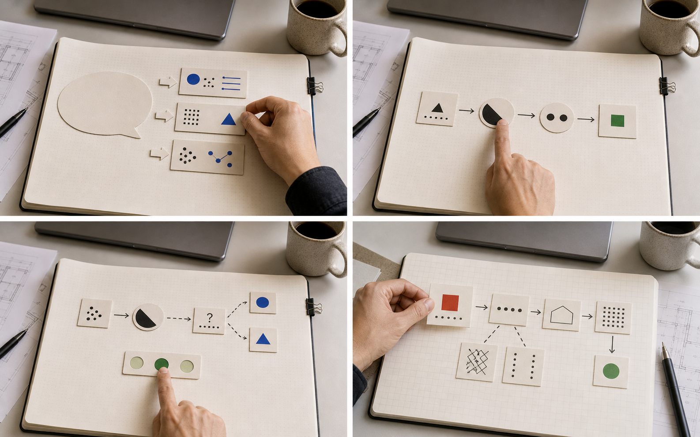

# 拿 100 分的输出，只有 18 分的理解：AI 时代的“知识幻觉”

> 关掉 AI，你还能讲清第二步为什么吗？

你刚用 AI 交了一份东西：方案结构完整，PR 能跑，步骤几乎没有错误。同事只追问一句：“为什么第二步要这样做？”

你停了几秒，重新打开对话框。

成品很完整，你仍无法判断自己是否理解了这份答案。

这个问题最先被教育研究写清楚。2026年，研究者让312名七年级学生完成同一套探究能力题，再用三把由松到严的尺子给同一批答卷判分：只看答案对不对，平均得分45.9%；要求答案和理由都正确，25.4%；再要求学生对答案和理由都有信心，只剩17.9%。同一批答卷，三套标准；测验全程也没有用AI。［1］

这套测验留下三类过程证据：答案、理由和信心。你现在也能用AI生成一份看起来正确的输出，跳过解释、验证和修正，直接交出流畅的成品。你若只看成品，会把流畅当成理解。学会的幻觉就从这里来。

## 1. 三套判分标准，越严越低：45.9%、25.4%、17.9%

这项研究发表在《科学与教育》期刊上。研究者让斯洛伐克11所学校的312名七年级学生完成14道探究能力题，覆盖提出研究问题、识别变量、预测、设计实验、处理和分析数据等能力。［1］

每道题设计成四层：

1. 选择答案；
2. 判断自己对答案是否有信心；
3. 选择答案背后的理由；
4. 判断自己对理由是否有信心。

再从同一份作答中拆出三种判分方式。同一批答卷，三把尺子，得分层层往下掉：

| 判分方式 | 判定条件 | 平均得分 |
| --- | --- | ---: |
| 一层 | 只看答案是否正确 | 45.9% |
| 两层 | 答案和理由都正确 | 25.4% |
| 四层 | 答案、理由都正确，且对二者都有信心 | 17.9% |

这些数字不是及格率，变的是尺子。五选一随机猜中的概率就是20%；加入理由，可以检查是否理解过程；再加入信心，能区分“碰巧答对”“知道自己不会”和“确信一个错误观念”。答错且不确定，通常需要补知识；答错且确信，可能已经形成需要先纠正的“迷思概念”。

换到你的工作里：只看“能跑”“写得通”，等于只看第一层。AI进入写作、编码、调研后，理由和信心这些过程证据，比成品更能说明你学到了什么。


*图1：概念示意。同一份输出，证据可以从答案逐层深入到信心、理由和对理由的信心。*

## 2. 练习时提高48%，撤掉AI后反而低17%

2025年，《美国国家科学院院刊》发表了一项接近1000名高中生参与的研究。研究者把学生随机分成三组：不使用AI、使用类似普通ChatGPT的GPT Base，以及使用带教学护栏的GPT Tutor。［2］

在可以使用AI的练习阶段，GPT Base组的成绩相对对照组提高48%，GPT Tutor组提高127%。

撤掉AI、让学生独立考试后，GPT Base组的成绩比对照组低17%。GPT Tutor组与对照组没有显著差异，研究也没有发现它能提高独立考试成绩。

GPT Base可以直接交付答案，学生更常直接索取；GPT Tutor优先给提示，学生更常先尝试、再求助。AI越早给出完整答案，人越容易跳过原本要练习的推理。

这项实验只发生在一所土耳其高中的数学复习中，观察的也是短期结果，不能推广到所有年龄、学科和AI产品。对你有用的是同一把尺子：练习阶段涨分，撤掉AI还在不在。


*图2：概念示意。AI在场时，交付可以很顺；撤掉AI后，能否独立重建推理，才暴露学习结果。*

## 3. 同样是用AI，效果取决于谁在主导判断

2026年，一篇系统综述梳理了89项研究：40.4%报告AI对高阶认知能力有正向影响，23.6%发现效果取决于使用条件，其余约36%报告负面或没有显著影响。［3］这些研究多关注大学生，样本常偏小、周期偏短，不能直接推广到所有人。

差异主要来自谁在判断：人必须主动判断时，AI更像认知放大器；人直接接受输出时，它就替代了原本要练习的思考。

心理学称这种借助外部工具减轻认知负担的做法为“认知卸载”。记笔记、搜索和IDE补全都属于这一类。［4］工具可以接管记忆、检索和纠错，但别一并交出任务想训练的判断。

判断自己是否在外包思考，记录AI拿走了哪一步：纠错和生成练习能腾出精力；代写论点和关键路径会跳过训练。

## 4. 关掉AI，才知道答案是谁的

阅读这些研究后，我借用四层诊断测验的思路，整理了一套“四步理解检查”：复述、解释、校准、迁移。关掉AI，看脱离工具后还能留下哪些过程证据。这套动作既适合自己学新技术，也适合用来带新人、做 Code Review 或辅导孩子写作业。



*图3：四步检查示意。复述、解释、校准、迁移，把“我看懂了”拆成四种可观察证据。*

### 复述：用自己的话重讲

收起AI，重新说明问题和推理。替换几个同义词不算；如果离开对话框就无法开口，这份输出多半还没有变成自己的理解。口头表达慢不等于没学会，还要结合解释和迁移判断。

### 解释：说出依据和中间步骤

说出每一步为什么这样做、用了什么条件。比如研究湿度是否影响面包发霉，却让温度和湿度同时变化，即使猜对结论，也不能证明理解了控制变量。

工程里同样如此：讲清为什么选这个接口、为什么这层缓存失效，才算解释过关。讲不清，就标记下来再查证。

### 校准：标出确定和不确定

在答案旁标出“确定”“拿不准”或“不知道”，再说明判断依据。研究者把这种自我判断与实际表现的匹配程度称为“元认知校准”。承认不知道，至少标出了需要查证的边界。

### 迁移：换一个条件再判断

换掉原题中的一个条件，再作答。如果理解了方法，就能根据新条件重新推理；如果只记住原答案，换题后往往无从下手。

原论文的第四层检查对理由的信心。本文基于真实学习场景新增了“迁移”检查，两者不是同一层。

## 5. 先留下自己的思考，再打开 AI

按使用前、使用中、使用后三个时点给自己定规则。

### 使用前：留下一版自己的答案

打开AI之前，写下自己的判断或草稿。答案可以不完整，但要留下真实起点。

### 使用中：用“AI反问法”要提示和反馈

把“替我写出答案”改成让AI反问和提示：

- 先不要告诉我答案，请指出我遗漏了哪个条件；
- 请用一个问题反问我，提示我下一步该怎么想；
- 请检查我的推理，如果错了，反问我哪里出了问题，不要直接重写。

### 使用后：关掉AI，再做检查

完成后收起AI，按第4节的四步检查（复述、解释、校准、迁移）过一遍。你由此能检查：刚才那通帮助，有没有留下能独立调用的理解。

这套流程由现有研究和四层诊断思路整理而来，尚未经过正式测试。用它观察一次过程即可，不要当成“AI依赖”量表。

带新人时，可以缩成日常动作：PR 里追问“这一步为什么这样做”，或用只改一个条件的变式题检查迁移。

## 6. 学校在划边界，你也需要自己的边界

2025年教育部指南按年龄划分AI使用边界：小学不得独自使用开放式内容生成，初中侧重逻辑分析，高中可结合技术原理探究。［5］联合国教科文组织也要求学习者继续承担高阶思考和准确性判断。［6］知识工作者没有学段表，但同样要先划清：哪些步骤必须自己完成，哪些可以交给AI。

## 7. 产品也在转向“先提问、后提示”

“先提问、后提示、再检查理解”已经进入正式产品：

| 产品 | 主要学习交互 |
| --- | --- |
| ChatGPT学习模式 | 用苏格拉底式提问引导思考、分步解释并检查理解［7］ |
| Claude学习模式 | 引导学生说明解题方法、提供证据，强调概念而非直接答案［8］ |
| Gemini引导式学习 | 用开放式问题、分步讲解和互动测验推进解题［12］ |
| Khanmigo | 在Khan Academy课程里以提示和问题充当专用AI导师［13］ |

这些产品都在减少直接给答案，但尚未把信心标注、变式迁移和AI参与记录串成完整流程，也不能证明长期效果。OpenAI也提醒：学习模式仍可能犯错或提前给出答案。［7］

## 8. 嫌每次手动？把它固化成一个随叫随到的助手

可以把这套流程存进支持自定义指令的AI助手。我整理了两个版本：一个负责“使用中”，先让人尝试，卡住了才逐级提示；一个负责“使用后”，依次检查复述、解释、校准和迁移，最后只给观察记录，不打分。

跑起来大概是这个样子。拿一道刚用AI做完的两步方程`2x+3=11`举例，人已经从AI那儿拿到答案`x=4`，“5分钟理解检查”这样开场：

> **助手：** 先收起AI的答案。第一步为什么两边都减3？
>
> **你：** 因为要把3移走，但我拿不准。
>
> **助手：** 那换成`2x+5=11`，第一步怎么走？为什么？

几轮之后，你会得到一条具体观察：能报答案，但“为什么减3”还没说清。附录提供复制即用版，完整两个助手与设置说明见文末。

## 结语：检查你如何得到答案

AI几秒就能生成完整答案。你需要提高“学会了”的证据门槛：解释依据、标出不确定，再关掉AI做一道变式题。下一次交出完美输出前，先问自己：第二步为什么这样做？

如果这套“复述、解释、校准、迁移”检查对你有用，可以转给同样在判断自己是在学习、还是在外包思考的同事。

## 附：直接复制就能用的5分钟检查

把下面的指令复制到ChatGPT、Claude、Gemini或其他支持连续对话的AI，即可用于自学自检、带新人和做 review。

复述和解释部分参考了哈佛大学Project Zero的证据追问例程，以及自我解释和主动回忆研究。［9］［10］［11］校准沿用本文四层测验中的信心判断。［1］迁移则通过只改变一个条件，观察学习者能否重新使用同一方法。“5分钟”是使用时长目标，不是经过验证的测量标准。

### 使用方法

1. 新建一个AI对话，粘贴下面整段指令；
2. 按提示提供任务背景、原题或原输出；
3. 由被检查的人本人回答，不要代答；
4. 把最后结果当作一次观察记录，不作为成绩或诊断。

**（长按下方提示词区域即可直接复制）**

```text
你是“5分钟理解检查助手”。你的任务是检查学习者在撤掉AI后还能独立完成什么，不替他完成任务，也不判断他是否“依赖AI”。

开始时，一次性收集三项信息：
1. 任务背景（学段/岗位/主题均可）；
2. 原题或原输出；
3. AI刚才参与了哪些步骤，可从读题、选方法、列步骤、计算、表达、检查中多选，也可自行补充。

收到信息后，提醒学习者收起原答案。依次完成四轮，每轮只问一个问题，等学习者回答后再继续：

1. 复述：请学习者用自己的话说明题目要解决什么，以及自己用了什么方法。
2. 解释：从他的回答中选一个关键步骤，追问为什么这样做、使用了什么条件。
3. 校准：在反馈对错之前，请学习者把自己的判断标为“确定”“拿不准”或“不知道”，并说明信心来自哪里。
4. 迁移：只改变原题的一个条件，生成一道不需要新知识的变式题。不要给答案，请学习者重新作答并说明哪些方法仍然适用。

执行规则：
- 学习者作答前，不给完整答案或直接评价对错；
- 优先用反问引导；卡住时提供一级提示，并记录“提示后完成”；
- 四轮结束前，不公布原题或变式题的完整答案；
- 普通回复控制在80个汉字以内，一次只推进一步；
- 无法核实原题或答案时，明确说明无法核实，不要猜测；
- 使用符合学习者背景的语言，不表扬聪明或批评能力。

四轮结束后，输出一份不超过250字的“本次观察”：
- AI参与：复述学习者自报的步骤，并标明“学习者自述”；
- 独立完成：列出本次对话中已经表现出来的能力；
- 提示后完成：列出使用提示后才完成的部分；
- 需要修正：指出一个最关键的错误或理解缺口；
- 尚未确认：列出本次对话没有足够证据判断的部分；
- 下一步：只给一个具体练习建议。

不要给总分，不要输出“依赖”或“不依赖”的结论，不要使用心理、医学或教育诊断名称。
```

模型仍可能越过流程直接给答案，也可能判断错误。遇到这种情况，可以发送：“回到当前检查，一次只问一个问题，不要给答案。”

## 参考来源

［1］Dominik Šmida、Anna Drozdíková、Ráchel Nechajová，*A New Perspective on the Evaluation of Pupils' Inquiry Skills Using Four-tier Test*，《Science & Education》，2026：<https://doi.org/10.1007/s11191-026-00747-3>

［2］Hamsa Bastani等，*Generative AI without guardrails can harm learning: Evidence from high school mathematics*，《Proceedings of the National Academy of Sciences》，2025：<https://doi.org/10.1073/pnas.2422633122>

［3］Fawzia Omer Alubthane，*Amplifier or substitute? A systematic review of generative AI's impact on higher-order cognitive skills among university students*，《Frontiers in Psychology》，2026：<https://doi.org/10.3389/fpsyg.2026.1863931>

［4］Evan F. Risko、Sam J. Gilbert，*Cognitive Offloading*，《Trends in Cognitive Sciences》，2016：<https://doi.org/10.1016/j.tics.2016.07.002>

［5］教育部基础教育教学指导委员会，《中小学生成式人工智能使用指南（2025年版）》：<https://jyj.linxia.gov.cn/jyj/xxgk/fdzdgknr/zcwj/GJZC/art/2025/art_ec21649bfa774fb28ca73d6c6e287e4c.html>

［6］联合国教科文组织，《生成式人工智能教育与研究指南》，2023，页面更新于2026年1月：<https://www.unesco.org/en/articles/guidance-generative-ai-education-and-research>

［7］OpenAI，*Introducing study mode*，2025：<https://openai.com/index/chatgpt-study-mode/>

［8］Anthropic，*Introducing Claude for Education*，2025：<https://www.anthropic.com/news/introducing-claude-for-education>

［9］Project Zero，*What Makes You Say That?*，Harvard Graduate School of Education：<https://pz.harvard.edu/resources/what-makes-you-say>

［10］Michelene T. H. Chi等，*Self-Explanations: How Students Study and Use Examples in Learning to Solve Problems*，《Cognitive Science》，1989：<https://doi.org/10.1207/s15516709cog1302_1>

［11］Jeffrey D. Karpicke、Janell R. Blunt，*Retrieval Practice Produces More Learning than Elaborative Studying with Concept Mapping*，《Science》，2011：<https://doi.org/10.1126/science.1199327>

［12］Google，*Guided Learning in Gemini: From Answers to Understanding*，2025：<https://blog.google/products-and-platforms/products/education/guided-learning/>

［13］Khan Academy，*What Are the Community Guidelines for Khanmigo?*，2025：<https://support.khanacademy.org/hc/en-us/articles/13860282793869-What-are-the-Community-Guidelines-for-Khanmigo>

## 完整助手与设置说明

[下载两个学习助手（learning-skills.zip）](/assets/articles/ai-learning-tool-or-crutch/learning-skills.zip)

[查看腾讯文档版](https://docs.qq.com/document/DRmNramJxYkZpRFNK)
