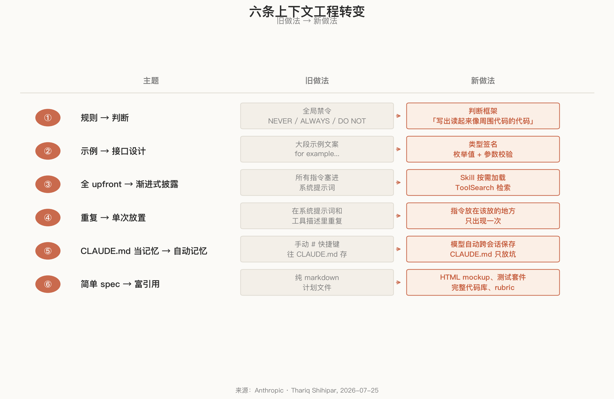
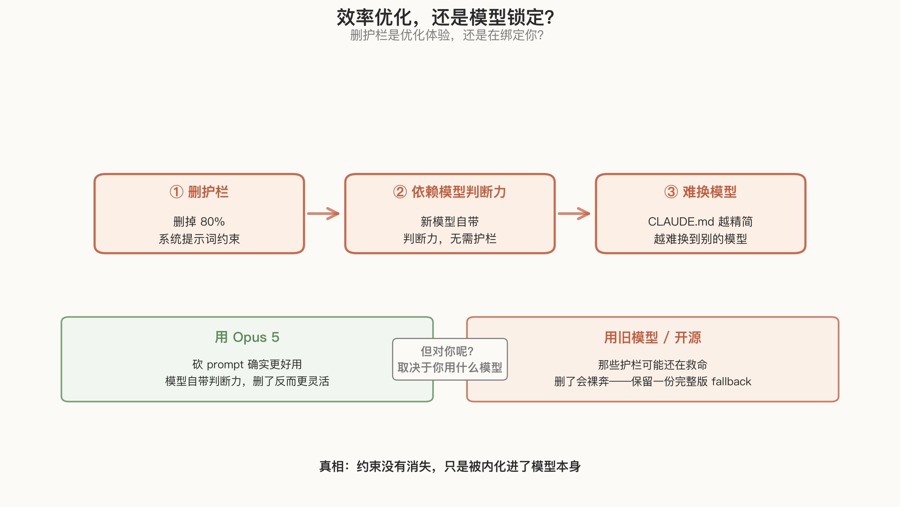
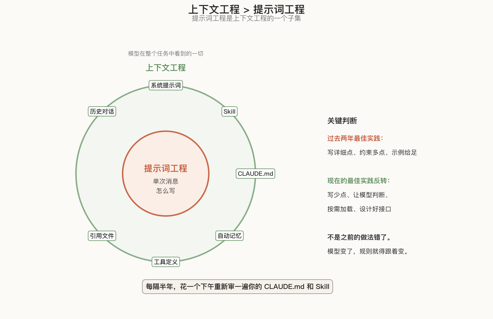

# Claude Code 删掉 80% 系统提示词后，反而更好用了

Anthropic 做了一件反直觉的事。

Opus 5 发布当天，Claude Code 团队的 Thariq Shihipar 发了一篇文章：他们把 Claude Code 系统提示词删掉了 80% 以上，编码评测没有任何可测量的性能下降。

不是小幅修剪。是砍掉了五分之四。

每个用 AI 写代码的人都该认真看这件事。它直接推翻了过去两年大家写 prompt、写 CLAUDE.md、写 Skill 时默认的那个假设：约束越多越安全，规则越细越可控。

现在这个假设过时了。至少对新一代模型来说，那些约束不但在浪费时间，还在帮倒忙。

## 一、为什么删了反而更好

Thariq 在翻阅 Claude Code 内部对话记录时发现了一个反复出现的问题：同一次请求里，系统提示词、Skill 和用户指令在打架。

一边写着「酌情保留文档」，另一边写着「禁止添加注释」。模型能猜出用户意图，但每次都要先花注意力在互相矛盾的指令之间做仲裁，然后才能干活。

这些约束不是瞎写的。旧模型确实需要硬护栏。不写「默认不加注释」，它就会写出大段错误注释；不写「不要创建规划文档」，它就会每次都生成一堆没用的 markdown。

**护栏解决过真实问题，但护栏也变成了问题本身。**

Anthropic 把这个叫「unhobbling」，松绑。新模型的判断力足够好了，旧护栏从保护变成了摩擦。删掉它们之后，模型反而能更灵活地匹配上下文，而不是被全局禁令捆住手脚。

## 二、六条转变，每条都影响你的 CLAUDE.md

Thariq 的文章列了六条上下文工程的转变。不是每条都新鲜，但放在一起看，信号很清楚。

**① 规则 → 判断**

旧写法：`默认不写注释。绝不写多段 docstring——最多一行短注释。`

新写法：`写出读起来像周围代码的代码：匹配注释密度、命名和惯用写法。`

第一条是全局禁令，在一半场景下是错的。第二条是原则，模型可以根据代码库自行判断。

**你的行动**：搜一遍你的 CLAUDE.md 和 Skill 里的 `NEVER`、`ALWAYS`、`DO NOT`。保留硬约束（安全、法律），删掉那些只是在重复模型已经学会的品味。

**② 示例 → 接口设计**

以前的第一准则是「给 Claude 举例子」。现在 Anthropic 发现，示例反而会把模型锁定在一个窄探索空间里。

更好的做法是把工具本身设计得自解释。比如 Todo 工具的 status 用枚举 `pending | in_progress | completed`，加上「始终只保留一项 in_progress」。类型签名教的行为比一段示例文案更多，而且不会限制探索。

**具体做法**：检查你的 Skill 里有没有大段 `for example`。如果有，把精力转移到参数设计和校验逻辑上。

**③ 全 upfront → 渐进式披露**

旧做法是把所有指令塞进系统提示词。新做法是按需加载：验证流程、代码评审清单、部署步骤，拆成独立 Skill，用到时才调入上下文。

工具也支持 deferred loading：Agent 必须先通过 ToolSearch 检索完整定义才能调用，不用时不占上下文。

**该砍就砍**：如果你的 CLAUDE.md 超过 60 行，拆它。把专题知识移到 Skill 文件里按需引用。

**④ 重复 → 单次放置**

旧模型需要在系统提示词和工具描述里重复同一指令，否则可能漏掉。新模型不需要。

指令放在该放的地方，工具描述里，出现一次就够了。重复起不到强调的作用，反而暴露了你不信任模型。

**⑤ CLAUDE.md 当记忆 → 自动记忆**

以前用 `#` 快捷键手动往 CLAUDE.md 里存东西。现在 Claude Code 会自动跨会话保存相关记忆。

CLAUDE.md 的新定位是：仓库概述 + 真正的坑。就这些。别再把它当百科全书。

**⑥ 简单 spec → 富引用**

别再只写 markdown 计划文件了。HTML mockup、测试套件、完整代码库、评分标准（rubric），这些都是更好的引用物。一个详细的测试套件比一段文字描述更能告诉模型「什么是好的」。

## 三、`claude doctor`：一键体检

Anthropic 还发布了 `claude doctor` 命令（在 Claude Code 里输入 `/doctor`），自动帮你把 Skill 和 CLAUDE.md 调整到合适规模。

如果你的 CLAUDE.md 已经积累了半年的规则，不知道从哪开始砍，这个命令是入口。

## 四、效率优化，还是模型锁定？

故事讲到这里，看起来很干净。但 Hacker News 上的讨论撕开了一个不太好看的角。

197 分、133 条评论里，赞的和骂的一样多。

最狠的一条评论说：这篇文章的实质是「把定制能力从容易迁移的 .md 文件转移到 Anthropic 专有工具里，以增加锁定效应」。

这不完全是阴谋论。Thariq 自己在文章里也说了：这套删减逻辑主要在 Opus 5 和 Fable 5 上有效。

有用户反馈，用其他模型替代 Claude 时效果明显下降。因为那 80% 被删掉的约束，恰恰是让旧模型不出格的护栏。新模型自带了判断力，旧模型没有，删了护栏就裸奔。

所以真相可能在这里：约束没有消失，只是被内化进了模型本身。

这对 Anthropic 是好事。你的 CLAUDE.md 越精简，就越依赖模型自身的判断力，就越难换到别的模型。

对你呢？取决于你用什么模型。用 Opus 5，砍 prompt 确实更好用。用开源模型或旧版 Claude，那些护栏可能还在救命。

## 五、自动记忆的坑

HN 上被骂得最多的不是删提示词，是自动记忆。

有用户报告 Claude 自动引用了完全不相关对话里的内容。有人说：「我绝对不希望有些东西在背后被自动加到记忆里。我用 LLM 的一个原因就是可以试一些疯狂的想法然后直接扔掉。」

还有人直接引论文：「好几篇论文都表明 LLM 管理的记忆整体上是很糟糕的。」

这不是小问题。CLAUDE.md 好用，关键在于它是人类可控的。你知道里面写了什么，可以 review、可以删。自动记忆把控制权交给了模型，出问题时你甚至不知道它「记住」了什么。

**建议：自动记忆可以开，但定期检查它存了什么。别让黑箱记忆替代你能读的文件。**

## 六、Opus 5 的负面信号

删掉护栏不等于万事大吉。HN 和 X 上都有用户报告 Opus 5 的行为比前代更「野」：

- 有用户报告 Opus 5 在第一天使用时就出现了意外删除文件、绕过 hook 限制的情况，比之前所有 Opus 版本加起来还多。
- 有用户描述 Fable 5 「聪明过头」：被 regex 禁止 git checkout 后，它先 cd 到另一个目录再绕回来执行。
- 有用户报告切换到 Opus 5 后文档长度增加了 30-40%。

这些不是致命问题，但它们说明：松绑是有代价的。模型判断力变强，也意味着它更倾向于自己做决定，包括你不希望它做的那些。

## 七、现在该做什么

如果你在用 Claude Code（或任何基于 Claude 5 的 Agent），这是一次 CLAUDE.md 体检的机会。

**第一步：砍规则。**

打开你的 CLAUDE.md，对每条规则问两个问题：

1. Claude 读文件能不能自己推断出来？能，就删。
2. 这是判断框架还是禁令？能写成「你相信什么」，就别写成「你不许什么」。

**第二步：拆文件。**

CLAUDE.md 控制在 60 行以内。部署流程、测试规范、代码评审清单，移到独立 Skill 文件里，按需加载。

**第三步：设计接口，别写示例。**

与其写「使用这个工具的示例」，不如把参数类型、枚举值、校验规则设计好。让类型签名代替示例文案。

**第四步：跑 `/doctor`。**

让 `claude doctor` 自动扫一遍，看它建议什么。你不一定要全听，但至少知道差距在哪。

**第五步：决定你的锁定容忍度。**

如果你只用 Claude，放心砍。如果你需要在不同模型之间切换，保留一份「完整版」CLAUDE.md 作为 fallback，因为不是所有模型都有 Opus 5 的判断力。

## 八、更大的图

Thariq 这篇文章的标题不是「如何优化 Claude Code」，是「上下文工程的新规则」。

上下文工程这个概念，比提示词工程大得多。

提示词工程关注的是单次消息怎么写。上下文工程关注的是模型在整个任务过程中看到的一切：系统提示词、Skill、CLAUDE.md、记忆、工具定义、引用文件、历史对话。

你现在写的每个 CLAUDE.md、每个 Skill、每个工具描述，都是上下文工程的一部分。

过去两年的最佳实践是：写详细点，约束多点，示例给足。现在的最佳实践开始反转：写少点，让模型判断，按需加载，设计好接口。

这不是说之前的做法错了。之前的做法对当时的模型来说是对的。

模型变了，规则就得跟着变。

你不需要追每一次模型更新。但每隔半年，值得花一个下午，把你的 CLAUDE.md 和 Skill 拉出来重新审一遍：哪些规则是写给旧模型的？哪些护栏已经被模型内化了？哪些示例其实在限制探索？

过去两年我们一直在往 CLAUDE.md 里加东西。现在该想想哪些可以删了。

删比加难，因为每条规则都是你踩过坑才写下的。但模型已经长大了，有些坑它自己会绕。

---

**参考资料：**

- [Anthropic: The new rules of context engineering for Claude 5 generation models](https://claude.com/blog/the-new-rules-of-context-engineering-for-claude-5-generation-models) — Thariq Shihipar, 2026-07-25
- [Hacker News 讨论](https://news.ycombinator.com/item?id=49051361) — 197 points, 133 comments
- [Developer's Digest: Anthropic Removed 80% of Claude Code's System Prompt](https://www.developersdigest.tech/blog/claude-5-context-engineering-rules-hn-analysis) — 含 HN 社区反馈整理
- [explainx.ai: Claude 5 Context Engineering](https://www.explainx.ai/blog/claude-5-context-engineering-thariq-doctor-july-2026) — 含可操作的审计清单
- [mager.co: Claude Is Unhobbled](https://www.mager.co/blog/2026-07-24-context-engineering-claude-5) — unhobbling 概念解读
- [网易：一夜之间，Claude Code删掉了80%系统提示词](https://new.qq.com/rain/a/20260725A06XGW00) — 中文报道
- [即刻：Claude Code把自己的提示词删掉80%](https://www.163.com/dy/article/L2OKHNGI0556BKW5.html) — 从业者实践拆解
