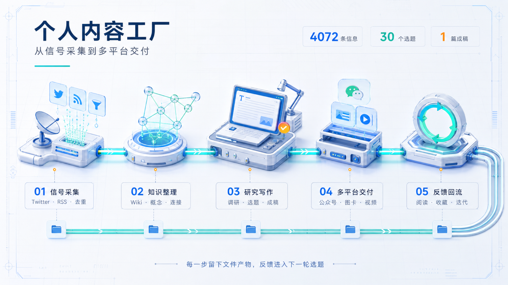
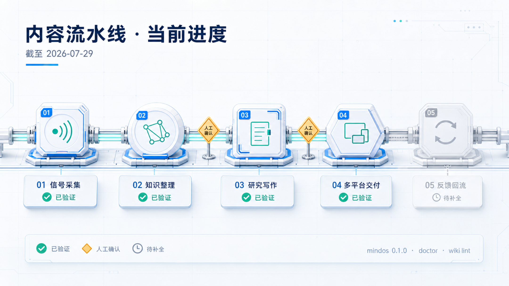

# 4072 条信息、30 个选题、1 篇成稿，我的五段流水线

这篇文章的题目，是从 4072 条信息里挑出来的。

7 月 14 日到 28 日，30 份简报进了本地知识库。选题 Skill 把它们跟 Wiki 里的存量素材交叉，吐出 30 个候选，每个按素材、热度、差异、可行性打分。我从里面挑了这一个。

至于这五段是怎么一段一段长出来的，从数目录那天说起。

写这篇之前，我把 `published` 目录数了一遍。

9 篇长文，66 张图，4 个视频，4 份 HTML，7 段音频。单看这个数量，挺像一间已经开工的内容工厂。

但它们是一批一批攒出来的。到 7 月 29 日为止，没有任何一篇文章是在同一次运行里，从采集素材一路走到公众号、小红书和视频。公众号 HTML 跑通过，8 张小红书卡片跑通过，33 秒的竖版视频也跑通过，可这几段之间全靠我用手接。

最早我图省事，一段提示词干完全部。研究、写作、排版、平台改写全塞进去，指望一次出稿。出稿是真快，返工是真要命。哪个事实错了，或者版式在某个平台崩了，我定位不到是哪一步坏的，只能从头再跟 AI 讲一遍上下文。模型一换，结果又飘。

东西都在，线没接上。

所以我现在要做的事是，把采集、知识整理、研究选题、写作和多平台交付拆成五段，串成一条流水线。每一段的结果都落成文件，下一段直接读。需要取舍的地方，我自己来。

[](/assets/articles/mind-os-content-pipeline/content-production-pipeline.png "查看原图")

*从信号采集、知识整理、研究选题，到公众号、图卡和视频交付。每一步都留下文件产物，反馈再回到下一轮选题。*

## 每写完一篇，我都得把同样的活再干一遍

技术文章写完，公众号要重新排一遍版。小红书不能直接截长图，得把论证压成几张能单独看懂的卡片。视频还要重写开场，安排旁白、字幕和画面。

标题、摘要、配图说明、引用来源，散在不同窗口里。下一篇来了，从头再来一遍。

长提示词救不了这个。任务越长，模型越容易把前面的约束丢掉。任何一步出岔子，我都得把整份结果重看一遍。成稿里看不出用了哪些证据，也查不到是哪次修改把前面的判断改坏的。

后来我去看了 Docs as Code。Write the Docs 那套做法很朴素，文档用纯文本存，改动交给版本控制，结果靠评审和自动测试兜住。[1] 改了什么、怎么构建、哪项检查没过，全都留痕。

我照这个思路把内容生产拆开。素材、证据、选题、正文、平台成品，各自落成文件。Agent 每次只干当前这一段，下一步直接读上一步的产出。

拆完以后，返工至少知道该回哪一步。

## 我把这条线拆成了五段

前四段都有真实产物。第五段是发布之后的数据，现在还是空的，缺口在哪我在后面会讲。

### 先把信息拦住，再决定留谁

Twitter 和 RSS 的新内容先进一份临时候选清单。`mindos collect` 从 OpenCLI 和 Folo 拉内容，统一格式、去重。哪些值得留，Agent 判断，再补上翻译、摘要和分类。

采集这一步我拆成了 `prepare` 和 `commit`。`prepare` 只准备候选，不碰知识库。`commit` 先预演一遍，报出条目数和目标文件，等我点头才真写。同一份决策重复提交，不会多出第二份内容。

我开始写这篇的时候，7 月 22 日到 29 日的采集状态里有 148 条回执，其中 145 次写入、1 次撤回、2 条游标。seen 文件记了 5094 个来源 ID，意思是这 5094 条东西我不用再看第二遍。同期 16 份简报一共收了 1705 条，里面还包含 7 月 22 日从旧流程迁进来的存量。

那 1 次撤回是收进来的东西不该留，用同一份决策文件原路退掉，对应的 seen 也一起解开。

所以一条内容我看过没有、留没留、后来有没有退回去，随时查得到。

### 简报是原料，不是知识

Mind OS 用三个目录把来源、知识和成品分开。

`raw` 放事实来源，Agent 没权限乱动。`wiki` 放整理过的概念、实体和连接。`published` 放准备公开的文章和配套资产。

Wiki 页面都是能直接读的 Markdown，用 `index.md` 导航，用 wikilinks 串起相关主题。查询过程中冒出来的新判断，只要值得留，我就写回 Wiki。写下一篇的时候顺着链接往下查就行，不用再去聊天记录里捞结论。

收藏夹里那些「以后再看」的东西，只有整理进 Wiki，才真的能用在下一次研究和写作里。

### 选题和写作，我故意让几套 Skill 打架

研究、选题、写作这三件事没有唯一答案。所以我不让一套 Skill 从头包办，同一个阶段放几套上去，让它们互相顶。

选题先由我自己写的 `media-topic-selection` 读本地知识库和近期信号，生成候选并打分。入围的主题再交给 WorkBuddy 的「科技频道选题评估师」，从技术读者、传播潜力和切入角度重新评一次。这篇文章也走了这一步。两边打架的时候，我把各自的理由都留下，再决定写哪个。

调研以 `tech-research` 为主，负责找一手资料、核对技术细节、把证据链搭起来。wigolo 负责联网搜索、抓网页、复用缓存和深度研究，`last30days` 补最近 30 天的社区讨论。三个不是重复劳动，一个管证据，一个管公开网页的广度，一个管近期讨论的温度。

写这篇的时候，我同时开了 `khazix-writer`、WorkBuddy 的「自媒体内容写作专家」和 `article-writing`。前两个管公众号的结构、阅读节奏和传播切口，后一个负责把论证和段落收紧。成稿之后再让 Codex 的 `stop-slop` 和 WorkBuddy 的「去 AI 味」Skill 交叉挑刺，专挑机械转折、重复总结、翻译腔和过度包装。它们只给建议，技术术语怎么写、最后话怎么说，我定。

开头说的那 30 个候选，每个都按素材、热度、差异、可行性打了分。

「内容工厂」这个题拿到的是 5、4、5、3。可行性只有 3 分，因为各段都有成品，但没有一篇文章真的做全过公众号、小红书、视频三个版本。这个限制我在开头就写明了。

一个 Skill 就是 `SKILL.md` 加脚本和参考资料，能跟着项目做版本管理，用到的时候再加载。[2] Anthropic 的建议也是这个路子，步骤明确的任务写成固定流程，需要判断的任务才交给 Agent。[3]

路径守卫、批次 ID、预演、重复提交不叠加、写文件要么全成要么不留，这些都归命令管。命令挂了，不会留下半份文件。信息值不值得留、选题有没有料、文章该怎么说，我和 Agent 一起判断。

### 一份内容，三种活法

公众号这条线用 `gzh-design` 把 Markdown 转成内联样式 HTML，再跑一遍平台合规检查。视觉资产交给 `guizang-social-card-skill` 和 `html-everything` 之类的工具，一个出社交图卡，一个做更自由的 HTML 视觉稿。7 月 27 日那篇 Claude Code 文章生成了正文和预览页，复检脚本数出 313 个文字节点包裹完整，可以直接复制进公众号编辑器。

按发布那一下，我用 `ego-lite` 的浏览器自动化 Skill 进保留登录态的公众号后台，填内容、核图、看预览。标题、摘要、封面和隐私都过了，才真的发。

小红书走另一条线。一篇讲 LLM Wiki 的长文被拆成 8 张 1080 × 1440 的图卡，之后又用同一组卡片加音频，生成了一条 33 秒的竖版视频。另一篇 GitButler 的文章产出 13 张小红书卡片和 2 张公众号封面。

来源和核心观点三个平台可以共用，表达得分开做。公众号留完整证据，小红书一张卡只讲一个判断，视频重新安排开场、旁白和画面。

Markdown 管内容结构，HTML 管公众号样式，图片管固定版式，视频还要分镜、音频和时间轴。我不再指望找到一种万能格式把它们全兼容。

### 发出去之后的事，现在还是断的

Wiki 有变更日志，采集有回执，HTML 有校验，图卡和视频有清单。但仓库里没有项目级的 `REVIEW.md`。公众号完读率、小红书收藏、附件领取、真实转化，全留在平台后台，下一轮选题看不到。

我打算先手工记。下一篇发出去之后，把阅读量、收藏数，还有评论里被反复追问的具体问题，写进 `REVIEW.md`。这个做法我还没验证过有没有用。

也就是说，这条线现在只跑到「发出去」为止。

## 现在这些文件，还散在四个地方

- 文章 frontmatter 的 `source` 存来源清单
- `wiki/connections/media-topic-strategy-2026-07.md` 存选题判断
- `published/日期-标题.md` 存正文
- `published/assets/日期-标题/` 和 `manifest.json` 存平台成品与输出清单

分开存的好处是局部改动很方便。引用出问题，我改文章的来源字段和正文，再重新生成图卡或 HTML。坏处是一篇内容没法从采集一路跑到多平台，因为统一的项目状态还不存在，`BRIEF.md`、`REVIEW.md` 和各阶段进度都待在各自的角落里。

要把这些环节接上，每一步至少得留三样东西。

- 这一轮用了哪些材料
- 这一步产出了什么文件
- 哪些内容已经过人确认

这三样现在散在不同目录和对话里。所以我准备给每篇内容开一个项目目录，状态、输入和产物放在一起。

## 有四个地方，我必须自己按确认

OpenAI Agents SDK 碰到高风险工具调用会先停下来，把待执行的动作交给用户确认，再决定要不要继续。[4]

我给自己留了四个这样的停点。

- 采集，确认哪些信息符合长期方向
- 研究，确认结论没有越过证据
- 写作，决定哪些经历可以公开
- 发布前，检查标题有没有夸大、内容有没有隐私风险、各平台成品对不对

人不需要盯着 AI 一句一句打字。尺寸、链接和 HTML 交给脚本查，作者的时间该花在观点、证据和公开边界上。

## 哪些是真跑通的

本地的 `mindos 0.1.0` 已经有 Wiki、采集、读书、蒸馏、任务、MCP、技术雷达和研究入口，登记了 6 个任务，两条采集、日记蒸馏、Wiki 检查、技术雷达复查和技术调研。

写这篇之前我把 `doctor`、任务列表、Wiki 检查、雷达预演和日记扫描重跑了一遍。Wiki 检查 0 个错误，19 个红链警告。公众号 HTML、图卡、封面、音频和视频都有本地文件和清单对得上。

没做完的有三件。一篇文章还没端到端跑完所有平台，发布反馈还没回流到本地，Mind OS Builder 的独立仓库、示例和跨平台安装也没弄好。

[](/assets/articles/mind-os-content-pipeline/pipeline-status.png "查看原图")

*绿色表示已经验证的环节，橙色接口表示人工交接，灰色部分留给后续的反馈回流。*

## 下一篇，我把一篇内容当成一个项目做

内容团队早就习惯按简报、草稿、评审、发布这些状态推进任务。[5] 技术写作那边用纯文本、版本控制和评审管修改。[1] Hugo 的 Page Bundle 把正文和相关资源收进同一个目录，Astro 再用 Schema 检查内容结构。[6][7] 每家的做法都成立，但没有汇成一套通用的项目目录。

最近一则创作者社区的讨论把流水线压成五个状态，想法、草稿、编辑、排期、发布。评论里被反复提到的痛点是，内容散进多个工具之后，很难确认哪份文案、哪个素材才是当前版本。[8] 文件该叫什么名字，各家也不一致。

我打算把这些做法拼成一套适合个人技术创作者和 Agent 的内容项目协议，先拿三篇文章实测。下面这组目录还没进当前仓库。

```text
content-project/
├── project.yaml
├── SOURCES.md
├── BRIEF.md
├── DRAFT.md
├── REVIEW.md
├── assets/
│   ├── source/
│   └── working/
└── outputs/
    ├── manifest.json
    ├── wechat/
    ├── social-cards/
    └── video/
```

`project.yaml` 记选题编号、当前阶段、目标渠道和人工确认状态。Agent 开工前先读它，脚本跑完再更新它。这样不翻聊天记录也知道一篇内容走到哪了。

`SOURCES.md` 存事实、链接和证据说明。`BRIEF.md` 写清读者、问题、核心判断和交付形式。`DRAFT.md` 是正文的唯一真源。

`REVIEW.md` 只存会影响后续生产的决定，哪条事实还没核实，某段为什么删了，发布前确认过什么，发出去以后读者集中追问什么。逐句批注留在编辑工具里。`assets/source` 放原始图片和截图，`assets/working` 放加工中的素材。

`outputs` 只放生成结果，公众号、社交图卡、视频分开。`manifest.json` 记每个成品用了哪份草稿、哪些素材、哪个工具生成，免得正文改完，旧图卡还躺在发布目录里。

哪一步的输入错了，就回那个文件改，再重新生成下游产物。来源有误改 `SOURCES.md`，选题偏了回 `BRIEF.md`，正文变了别直接去公众号 HTML 里打补丁。

前三篇我手工更新 `project.yaml`，记每个阶段的耗时、人工交接次数和返工原因。同一种操作重复三次，才给它补脚本或 Skill。实测下来没能减少交接和返工的字段，直接删，不写进 Mind OS Builder。

Mind OS Builder 只收经过实测的流程。AI 整理素材、跑检查、生成平台版本，我负责选题、证据和公开边界。

下一篇文章，我会第一次按这个目录组织项目，同时构建公众号、小红书和视频。做完之后，我会把目录、耗时、返工记录和各平台产物一起公开，当作第一份可复现的内容生产样例。

到这篇为止，采集、知识整理、研究选题和多平台交付都有实测和本地文件。反馈回流和端到端样例，还欠着。

## 参考资料

[1] [Write the Docs，Docs as Code](https://www.writethedocs.org/guide/docs-as-code/)

[2] [Agent Skills，Overview](https://agentskills.io/home) / [Specification](https://agentskills.io/specification)

[3] [Anthropic，Building Effective AI Agents](https://www.anthropic.com/engineering/building-effective-agents)

[4] [OpenAI Agents SDK，Human in the loop](https://openai.github.io/openai-agents-python/human_in_the_loop/)

[5] [Notion，How to create an efficient content workflow in 7 steps](https://www.notion.com/blog/content-workflow)

[6] [Hugo，Page bundles](https://gohugo.io/content-management/page-bundles/)

[7] [Astro，Content collections](https://docs.astro.build/en/guides/content-collections/)

[8] [Reddit r/creators，How do you store and track your content ideas from planning to publishing?](https://www.reddit.com/r/creators/comments/1v0njqb/how_do_you_store_and_track_your_content_ideas/)

## 本文数字的来源

文里的数字和产物都能在本地文件里对上。

- `.mindos/collect/` 下的 `seen.json`、`receipts.json`、`cursors.json`，对采集状态和回执
- `published/assets/` 下各篇的 `manifest.json`，对图卡、视频和封面的尺寸与时长
- `wiki/concepts/mind-os-builder.md` 及相关 Wiki 页面，对系统架构和设计决策
