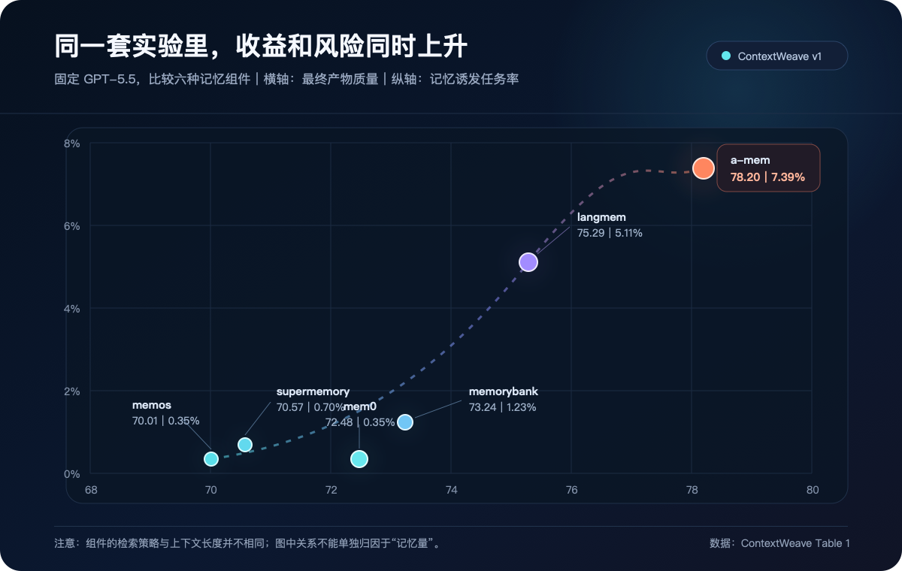
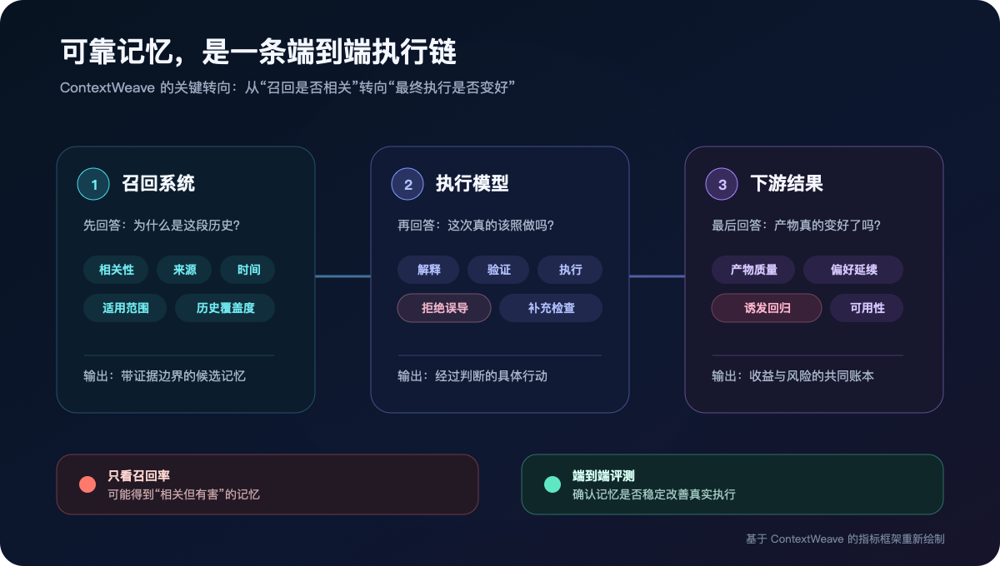

# AI 记忆越强，为什么反而可能错得更离谱？

7.39% 和 0.35%，相差约 21 倍。

拿到 7.39% 的 a-mem，也是论文里表现最好的记忆组件。它把 Workspace Score（最终产物质量）从 68.08 提高到 78.20，Preference Score（用户偏好一致性）从 41.50 提高到 70.60。

研究团队在同一张表里记录了它带来的收益和问题。

数据来自复旦大学、上海创智学院和字节跳动在 8 月 5 日提交至 arXiv 的论文 [ContextWeave](https://arxiv.org/abs/2608.04830)。

前两天，虎嗅一篇《大模型的下半场，拼的是记性》很快冲到 10w+。AI 失忆很烦，聊过的背景要重复，定好的规则会忘，跨天工作又得重新交代。

ContextWeave 的研究者换了一种测法。他们把历史交给 Agent，再检查最终产物有没有变好，用户习惯有没有延续，以及召回是否给任务添了新问题。

## ContextWeave 把真实工作流搬进了评测

研究团队收集了同一个开源项目中 14 名参与者数月的文档编辑记录。他们保留每次编辑前后的内容和 diff，再用 LLM 分段、人工校验，重建任务指令和缺失观察，整理出 1,005 个可执行任务。

其中 568 个主工作流任务进入核心评测，541 个能在更早的任务中找到至少一条相关历史。部分会议记录、数据文件和实验结果，则被研究团队重建成结构化笔记或 mock API。

这套 benchmark 保留了真实工作的时间关系，也控制了每次实验的初始环境。Agent 要接着已有文档往下做，沿用参与者的习惯，还要处理前序任务留下的状态。

这组任务专门考 Agent 能不能把一件持续数月的工作接下去。

## a-mem 同时拿了两个第一

研究团队固定 Codex harness 和 GPT-5.5，只替换记忆组件。六种方案里，a-mem 的 Workspace Score 和 Preference Score 都排第一。

它的记忆诱发任务率也排第一，达到 7.39%。

这项指标统计加入召回后，有多少任务出现了由误导性记忆导致或加重的问题。摘要型记忆 mem0 的数字是 0.35%。

这 21 倍描述的是两套完整配置。六种组件同时改变了检索策略和上下文长度，实验没有单独控制记忆量。研究团队观察到，更可行动的经验带来了更高收益，也伴随更高的误导风险。

a-mem 保存了更接近完整工作过程的 in-context experience。动作、约束、已有产物和操作路径都在里面，Agent 可以少走很多探索步骤。模型也更容易直接采用其中的误导信息。

你大概见过类似的经验主义。上个项目靠一套流程救了火，换个项目后，团队照搬流程，反而多绕一圈。问题出在适用条件已经变了。

## 记忆还要过模型这一关

研究团队又固定 mem0，只替换执行模型。GPT-5.5 的记忆诱发任务率是 0%，GLM-5.1 是 2.11%。

用模型强弱解释这组差异，会漏掉一个细节。GLM-5.1 在无记忆条件下的 Workspace Score 是 71.91，高于 GPT-5.5 的 67.53。

同一段召回交给不同模型，模型会采用不同的解释、验证和执行方式。记忆系统负责取回什么，执行模型决定怎样使用，两边共同决定收益和风险。

## 论文真正想改的是记忆的验收方式

固定使用 mem0 时，五个模型加入召回后都拿到了更高分。Workspace Score 提升 2.19 到 5.61 分，Preference Score 提升 5.55 到 9.61 分。

收益和回归可以出现在同一套系统里。研究团队同时记录三项指标。Workspace Score 看最终产物能不能用，Preference Score 看 Agent 有没有沿用参与者的习惯，Memory-induced Task Rate 单独记录召回带来的新问题。

看到这里，论文的观点就清楚了。它没有证明「记忆越强，错误越多」。更准确地说，一段历史能不能成为有用的记忆，要看它进入执行之后发生了什么。

召回结果相关，只是起点。经验够不够具体，模型能不能识别适用条件，遇到冲突时会不会停下来验证，这些因素共同决定最终结果。

ContextWeave 把评测对象从「有没有找回正确内容」推到了「有没有做出更好的产物」。我觉得，这是这篇论文最重要的变化。

## 放到我们的 Agent 工作流里，记忆要先分层

Claude Code、Cursor、Codex 的 Skills 属于预置的程序性指令，ContextWeave 测的是从历史任务形成的情景记忆。两者进入模型上下文后，都会改变模型下一步的动作，但它们不应该拥有相同的可信度。

放到我现在使用的 Mind OS 里，这个区分很实际。raw 里的原始材料，wiki 中整理过的知识，AGENTS.md 和 Skills 里的规则，journals 里的任务记录，进入上下文后看起来都是文字，证据等级却完全不同。

当前用户明确写下的规则，不能被上个项目留下的一条经验覆盖。经过来源核验的事实，也不能和 Agent 从历史任务里总结出的临时判断混在一起。

这里最危险的情况，是旧经验写得太完整。它带着现成步骤、文件路径和操作顺序，看起来比当前任务更像答案，模型很容易直接照做。

所以我会给影响执行的记忆留下来源、形成时间和适用范围。召回之后，Agent 还要判断当前任务是否与原任务足够相似，环境有没有变化，这段经验能否通过现有文件或工具验证。

只要有一个答案不确定，它都应该有权拒绝使用这段记忆。

## 验收时要看三笔账

如果我来验收一个 Agent 记忆功能，不会先问它召回了多少条，而会看三件事。

**最终产物有没有变好。**

用同一批真实任务对比无召回和有召回的结果，直接检查代码、文档、报告或决策产物。找到相关笔记，只能证明检索工作了，不能证明记忆有用。

**用户习惯有没有延续。**

检查 Agent 是否保留了用户的目录约定、表达偏好、工作边界和决策方式。任务做完了，不代表它接住了之前的工作。

**记忆有没有制造新问题。**

把错误经验、过时规则和适用范围错配造成的回归单独记账。不能用总体分数上涨，把这些问题平均掉。

模型变化后，这套组合也要重新验收。同一段召回交给不同模型，会得到不同的解释和动作。最终可靠性属于记忆组件、执行模型与任务环境组成的整套系统，不能只看其中一个。

对系统实现来说，记忆层不能只有取回。它还需要核验、拒绝、失效和追踪。每次重要决策最好都能回答，这段历史从哪里来，模型为什么采用，以及它最终改出了什么。

我更愿意把 Agent 记忆看成一名带着旧项目经验的新同事。经验越丰富，越能少走弯路，也越需要知道什么时候那套经验已经失效。

论文列出了数据与评估框架的仓库地址。截至 2026 年 8 月 6 日，该地址仍返回 404，现阶段还无法复现。论文的样本也只来自一个开源项目的 14 名参与者，任务 rubric 仍在校准，细粒度人工验证尚未完成。

这些限制让论文的结论还不能变成通用定律，但它给出了一条值得马上采用的工程原则。

记忆系统真正要优化的，不是取回了多少相关内容，而是这些历史能否在执行中产生可验证的净收益。

---

**数据来源说明**

本文依据 ContextWeave v1，作者来自复旦大学、上海创智学院和字节跳动，论文于 2026 年 8 月 5 日提交至 arXiv。当前结论只适用于论文测试的模型、记忆组件和工作场景。

### 参考资料

1. [虎嗅《大模型的下半场，拼的是记性》](https://mp.weixin.qq.com/s?__biz=MTQzMjE1NjQwMQ==&mid=2656191260&idx=1&sn=c86869bb1a4d940daf520804088e9ce0#rd)
2. [ContextWeave 论文](https://arxiv.org/abs/2608.04830)
3. [ContextWeave 论文所列仓库，截至 2026-08-06 尚不可访问](https://github.com/OpenMOSS/ContextWeave)
