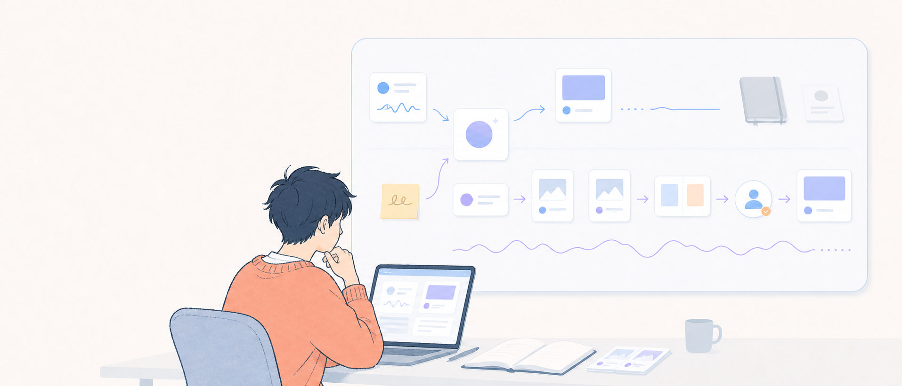
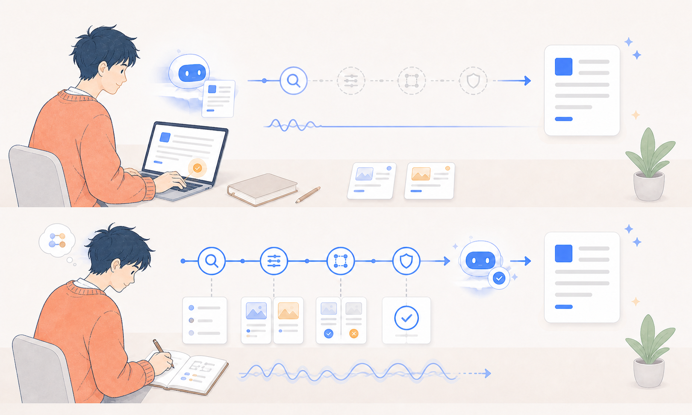
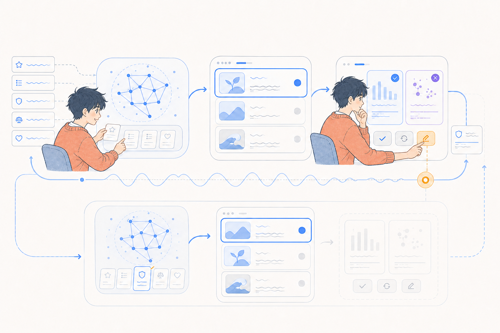

# AI 是一面镜子，照出你怎么思考

Every 最近写到两个负责人。两个人都用 Codex 搭工作流，配出来的东西却很不一样。

一个只交代目标和边界，让流程自己跑。另一个把任务拆得很细，几乎每一步都亲自过问。还有一位员工没有急着搭流程，而是先让 AI 采访自己。

「我有哪些重复工作？哪些决定必须自己做？」

表面上，他们在配置同一套工具。往深一层看，他们在划分思考权。哪些工作可以交出去，哪些判断要留在手里，已经写进了工作流。

你每天也在做类似的选择。打开空白文档，是先写下自己的判断，还是先让 AI 给一版？看到一段很顺的回答，是继续追问，还是复制出去？

这些动作太小，很少有人把它们当成选择。可一旦写进记忆、指令和自动化，它们就会反复发生。

我们通常把这种分工当成效率问题。时间长了，就会变成能力问题。

## 01 你先决定把什么交给 AI

2026 年 7 月，《心理学前沿》发表了一项研究。研究者对 589 名大学生和刚进入职场的知识工作者做了三次调查，每次间隔两周。

他们没有按「用不用 AI」给参与者分组，而是观察两种不同的用法。

一种叫**依赖式认知卸载**。你把关键思考交给 AI，很少核验，拿到答案就用。

另一种叫**自主式认知卸载**。你让 AI 帮忙找选项、挑漏洞、改思路，结论仍由自己来定。

两种用法都能让眼前的任务变轻松，差异藏在任务之外。依赖程度越高，参与者越容易把思考主导权交给 AI，继续钻研的动力也更低。自主式使用者对自己的独立判断、创造力和深度思考评价更高。

这项研究主要依赖自我报告。它只能看到关联，证明不了 AI 会让人变笨。

但它确实指出了一个很难从成品里看出的问题。工作按时交了，文档也写得不错，你是否还能解释其中的判断，往往没人检查。

被交出去的那部分工作，可能恰恰是你长本事的那部分练习。

## 02 交出去的工作，也可能是你停止的练习

Anthropic 今年做了一项随机对照实验。52 名大多处于初级阶段的软件工程师，要学习一个陌生的 Python 库。一组可以用 AI，另一组自己写代码。

随后的掌握测验里，AI 组平均得分 50%，自己写代码的一组是 67%。两组差了 17 个百分点。AI 组平均只快约两分钟，速度差异没有达到统计显著性。

把任务全交给 AI，或者连调试也让 AI 包办的人，平均得分低于 40%。只问概念、要求解释、写完再检查理解的人，平均达到或超过 65%，已经接近不用 AI 的那组。

怎么问，决定了你真正在练什么。有人练习理解和调试，有人练习从 AI 的输出里挑一份能用的答案。两种人都完成了任务，测验时留下来的能力并不一样。

一项覆盖近千名高中生的课堂实验，看到了同样的差距。类 ChatGPT 工具让练习成绩提高 48%，撤掉 AI 后，学生的独立测验成绩却比对照组低 17%。另一个版本只给提示，不直接交答案，学生没有出现显著的测验损失。

另一项实验里，AI 让学生的即时知识测试提高了 0.27 个标准差，一周后这个提升还在。受益最多的是那些要求 AI 解释概念的学生。主要让 AI 生成文字的人，撤掉工具后就失去了短期优势。

这些结果不是在说 AI 有害。它替你练习时，能力可能受损。它帮你理解、搜索和自查时，又能改善学习。

*同样完成任务，练习路径不同，留下来的能力也不同。*

直接拿答案，你练的是挑选和接受。要求提示、追问理由、关掉工具再做一遍，你练的还是自己想、自己推、自己查。用得久了，这种每天重复的分工才可能留下痕迹。

连续使用两年会怎样，研究现在还回答不了。2026 年一项汇总 89 篇论文的系统综述，也没有找到足够的大样本随机对照和长期跟踪研究。现有证据够你做风险判断，但还证明不了长期下来一定变笨。

长期结果还没有，产品已经能替你把今天的分工固化到明天。

## 03 默认设置会把一次选择变成习惯

一条提示词影响一轮对话。记忆、工作流和自动化会在下一次继续生效。

你把「先找支持材料，再写结论」写进流程，AI 就会反复执行这个顺序。你把「尽快给我一版能发的」设成默认目标，它也会习惯跳过争议和证据缺口。

久而久之，过去的选择会影响你先看到什么、跳过什么，以及做到哪一步就算完成。思考习惯不再只留在脑子里，它成了工作环境的一部分。

Every 在同一封邮件里提到另一个案例。低成本原型让一个团队迅速做出 30 个版本，决策质量却没有同步提升。执行变便宜后，他们得到更多可选项，也更容易用制作新版本来推迟选择。

三十个原型只有在检验不同假设时才有价值。否则，团队只是给同一个模糊问题换了三十种包装。

更关键的是，团队练习的内容也变了。他们不断生成更多版本，决定删掉哪些方案、为什么删，反而被继续往后推。

AI 自己也在推这个过程。《自然·人类行为》的一项实验发现，带有轻微偏见的人类数据会训练出偏见更强的 AI。参与者与这样的 AI 反复互动后，后续判断也变得更偏。他们往往低估了 AI 对自己的影响。

记忆和个性化让这个反馈更快。一个只记得你喜欢什么、习惯顺着你说的 AI，会把已有偏好越磨越顺。它还需要记住另一条规则，在关键判断上提供反例和证据，别一味迎合。

*默认规则反复执行，工作流也会把你的偏好送回给你。*

AI 工作流更像一套环境。它安排你看到的信息，省掉某些步骤，让你不知不觉做出下一次选择。

你训练它沿着一条路工作，也让自己越来越少走另外几条路。

工作流接走的步骤越多，人的位置越不能含糊。

## 04 AI 接管执行之后，人负责判断

Anthropic 分析了约 40 万次 Claude Code 会话。人类承担了约 70% 的规划决策，Claude 承担了约 80% 的执行决策。领域知识更强的用户很少逐步遥控 AI。他们会给出更有效的约束，也更容易发现任务已经跑偏。

这组数字把人的位置说得很清楚。AI 多做执行，人要负责动手前后的判断。

动手之前，你要判断这个问题值不值得做。AI 可以拆目标，也能建议目标，但它不会替你承担选错方向的成本。问题定义错了，跑得越快，浪费越大。

材料搜回来以后，你要决定什么算证据。AI 能找支持材料，也能找到反例。你是否愿意因为新证据改掉原来的结论，决定了这次工作是在研究，还是给旧观点添装饰。

到了执行阶段，发布、授权和承担后果的人仍然是你。系统可以替你按下很多按钮，现实不会因此把责任记到模型名下。

回到开头那位先让 AI 采访自己的员工。

「我有哪些重复工作？哪些决定必须自己做？」

第一个问题划定自动化的范围，第二个问题决定你准备长期保留什么能力。

比起翻最近十次对话，我更建议看一遍写进记忆、规则和自动化的默认值。它们鼓励你先形成判断，还是先索取成品？它们要求 AI 提供证据，还是只追求一版能发的答案？

你可以少亲手做很多事，但至少要说得清为什么做、凭什么信，以及出了问题由谁负责。

你还可以让 AI 帮你练习那些还没养成的习惯。下结论前找反例，引用数据时追到原始出处。把这些要求写进系统，下一次你找它研究或做决定，它会再次要求你补上反例和来源。

AI 会记住你的规则，你也会适应这些规则。你每次配置工作流，都在选择哪些习惯值得放大，以及自己想变成什么样。

---

## 参考资料

1. Every：《[Your AI Is a Mirror of How You Think](https://every.to/context-window/your-ai-is-a-mirror-of-how-you-think)》及《[A Codex of One’s Own](https://every.to/context-window/a-codex-of-one-s-own)》
2. 《[Not all cognitive offloading is equal](https://www.frontiersin.org/journals/psychology/articles/10.3389/fpsyg.2026.1878629/full)》，《心理学前沿》，2026 年 7 月
3. Anthropic：《[How AI assistance impacts the formation of coding skills](https://www.anthropic.com/research/AI-assistance-coding-skills)》，2026 年 1 月
4. 《[Generative AI without guardrails can harm learning](https://doi.org/10.1073/pnas.2422633122)》，《美国国家科学院院刊》，2025 年
5. 《[Experimental Evidence on the Learning Impact of Generative AI](https://arxiv.org/abs/2607.08849)》，预印本，2026 年 7 月
6. 《[Amplifier or substitute? A systematic review of generative AI’s impact on higher-order cognitive skills among university students](https://www.frontiersin.org/journals/psychology/articles/10.3389/fpsyg.2026.1863931/full)》，《心理学前沿》，2026 年 6 月
7. 《[How human–AI feedback loops alter human judgements](https://www.nature.com/articles/s41562-024-02077-2)》，《自然·人类行为》，2024 年
8. Anthropic：《[Claude Code 专业能力研究](https://www.anthropic.com/research/claude-code-expertise)》，2026 年 6 月
