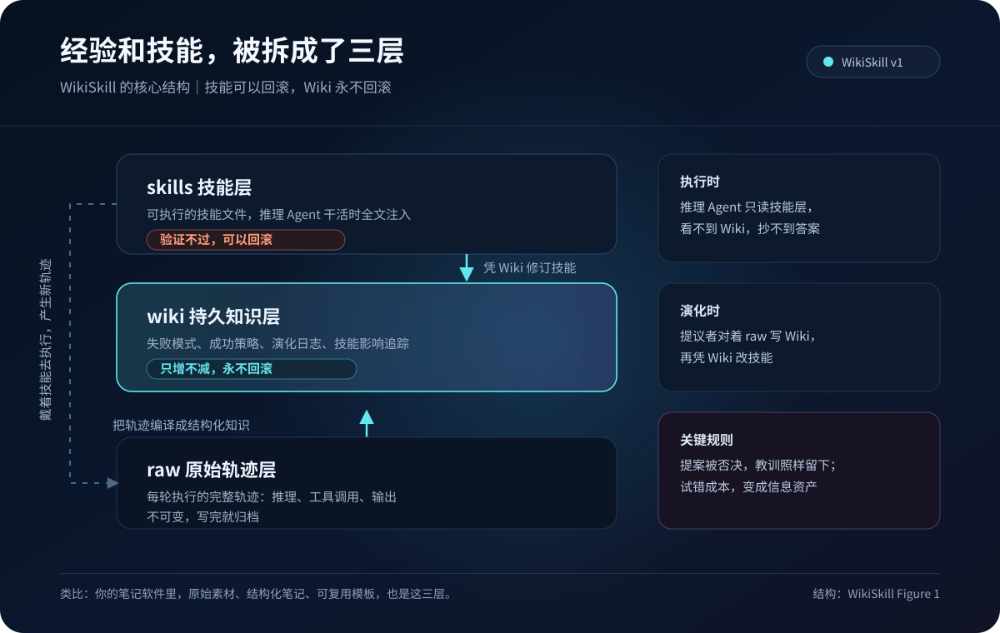
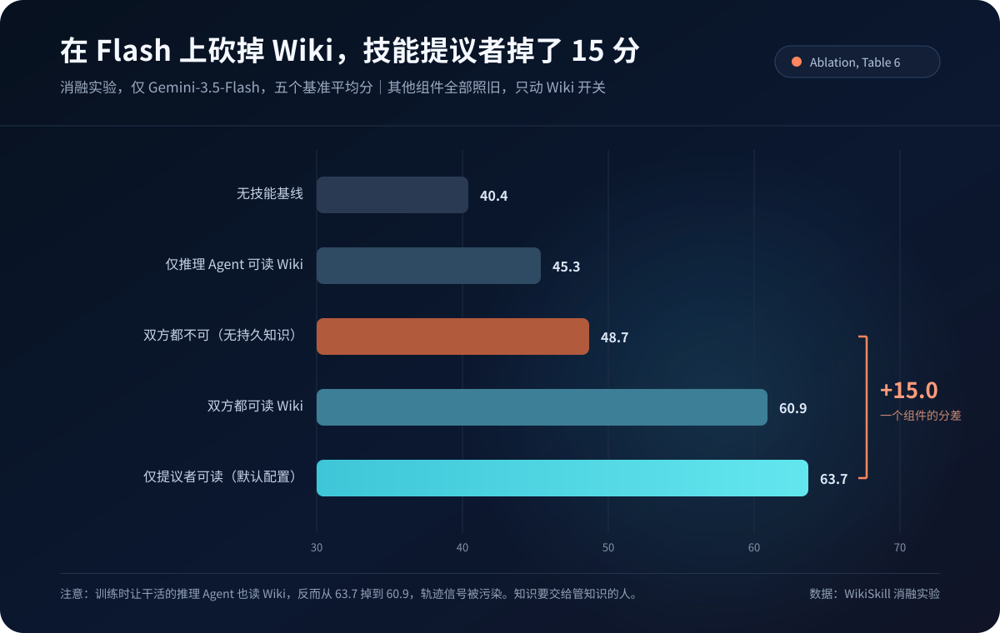

# Agent 在重演你的知识管理

47.4% 对 39.4%。

两个都是五个基准上的平均分。47.4% 是 Qwen-3.5-9B 带上演化技能，大约 90 亿参数。39.4% 是 Qwen-3.6-27B 不带技能，参数量大约三倍。在 Google Research 8 月 27 日提交到 arXiv 的论文 WikiSkill 里，小模型加上技能，把没有技能的大模型按在地上。同一张主结果表里，27B 带上 WikiSkill 是 63.3%。

它靠的是一个 Wiki。

更准确地说，是一个持久知识层，介于「原始执行轨迹」和「可执行技能」之间。Agent 每干完一轮活，失败模式和成功策略，再加上被否决的提案，全部编译进这个知识层，供下一轮演化使用。

看到「原始素材和结构化知识，再到可执行产出」这三层结构的时候，我愣了一下。这和我笔记软件里的目录结构，长得一模一样。

## 它只做对了一件事，先把系统分成三层

整套系统就三层，一层不多。

| 层 | 存什么 | 能不能改 |
|---|---|---|
| raw 原始轨迹层 | 每轮执行的完整轨迹，推理、工具调用、输出 | 不可变，写完就归档 |
| wiki 持久知识层 | 失败模式、成功策略、演化日志、技能影响追踪 | 只增不减，永不回滚 |
| skills 技能层 | 可执行的技能文件 | 验证不过可以回滚 |

对干活的大模型来说，这三层走的是两条时间线。执行时，推理 Agent 只戴技能：程序性指令全文注入 system prompt，告诉它这一轮怎么做。演化时，另一组角色对着 raw 里的完整轨迹写 Wiki，再凭 Wiki 改技能。PURPOSE.md 还会把每条技能指回催生它的 Wiki 模式，技能从哪条教训来的，查得回来。

**经验教训是原料，Wiki 是编译产物，技能是执行模型真正读到的那一份。**

**技能可以回滚，Wiki 永不回滚。**

三层推出来的结论就这一句：知识和技能必须拆开。

提案被拒绝了，教训留下来。同一个错误要是犯了三次，日志会记这一笔。失败被编译成结构化知识，成为下一轮演化的地基。试错成本，就这样变成信息资产。

对比之下，之前的技能演化方法，经验全散在优化历史里。提案记录和轨迹教训，再加上被拒绝的编辑反馈，每次迭代都在重新发现同一个坑。像那种改完就扔的工作方式。

Google 把 WikiSkill 和三个技能演化方法放在一起比，分别是 Trace2Skill、EvoSkill 以及 SkillOpt。5 个基准、5 个模型，每个配置独立完整跑 3 次取平均。

| 模型 | 无技能 | 最强竞品 | WikiSkill | 相对最强竞品 |
|---|---|---|---|---|
| Qwen-3.5-4B | 26.2 | 35.2 | 38.5 | +3.3 |
| Qwen-3.5-9B | 29.9 | 42.3 | 47.4 | +5.1 |
| Qwen-3.6-27B | 39.4 | 53.3 | 63.3 | +10.0 |
| Gemma-4-31B | 41.3 | 49.1 | 54.9 | +5.8 |
| Gemini-3.5-Flash | 49.5 | 56.1 | 68.1 | +12.0 |

竞品方法会在不同任务上正负乱跳。EvoSkill 让 Qwen-9B 在数学基准 LiveMath 上涨 29.9 分，转手让 Gemma-31B 在同一任务掉 4.1 分。WikiSkill 在绝大多数模型与数据集组合上为正。例外也有：长文档问答 OfficeQA 上，4B 模型执行不动多步搜索工作流，甚至小幅退化。相对最强竞品从 +3.3 到 +12.0，已经不能用运气解释。

## 在 Flash 上砍掉 Wiki，技能提议者掉了 15 分

消融实验只在 Gemini-3.5-Flash 上做。其他一切照旧，只动 Wiki 开关。

| 推理 Agent 访问 Wiki | 技能提议者访问 Wiki | 平均分 |
|---|---|---|
| 无技能基线 | 无技能基线 | 40.4 |
| ✓ | ✗ | 45.3 |
| ✗ | ✗（无持久知识） | 48.7 |
| ✓ | ✓ | 60.9 |
| ✗ | ✓（默认配置） | 63.7 |

技能提议者没有 Wiki 是 48.7 分，有 Wiki 是 63.7 分。一个组件，15 分。同一张表里，数学任务从 51.3 涨到 72.6，电子表格任务从 49.9 涨到 76.6。这是 Flash 的消融结果，不是五模型通吃的魔法常数。

更有意思的是倒数第二行。训练时让干活的推理 Agent 也能访问 Wiki，分数反而从 63.7 掉到 60.9。Agent 直接抄了 Wiki 里的答案，轨迹就不再反映技能本身好不好用，信号被污染了。

**知识要交给「管知识的人」，不能让「干活的人」直接抄答案。**

做过团队知识库的人，应该秒懂这个分寸。

## 别人的技能可能更好用，也可能把你拖废

论文里最有产品意味的，是跨模型迁移。正负两个方向都在同一张表里。

| 发现 | 证据 |
|---|---|
| 迁移可以有效 | 27B 的电子表格技能给 9B 用，干到 50.5%，超过 9B 自演化的 33.6% |
| 小模型也能教大模型 | 4B 的技能让 Gemma-31B 在数学任务干到 73.1% |
| 负迁移存在 | 4B 的电子表格技能给 Gemini-Flash 用，该任务从 50.5% 掉到 18.1% |

负迁移的原因很具体。小模型的技能里全是单行 Python、字符串转换这类低层 workaround。强模型本来能写端到端脚本，被这些技巧反绑住手脚。

这拆开了两件平时被混为一谈的事：技能发现，和技能执行。强模型负责从经验里提炼知识，便宜模型负责执行，这条分工已经有数据。一个「技能市场」能不能成立，取决于你能不能标注适用模型与任务边界。4B 教 Gemma 数学能成，4B 的表格 workaround 绑死 Flash，说的是同一件事。

## 工业界在做同构的一环，和论文仍是两套系统

WikiSkill 是学术验证。产品侧已经出现同构的零件，只是缺门控，也做不到 Wiki 那种只增不减。

源头是 Every.to 去年底提出的 compound engineering，复利工程。干完活把教训固化进 CLAUDE.md，下一个循环从更聪明的起点开始。Kieran Klaassen 的说法很直白，「我们不再写代码，我们在养一个会写代码的系统」。

今年 2 月，Claude Code 上线 Auto Memory。Agent 在会话里自动把构建命令和架构约定，还有调试经验写进本机记忆文件，下次会话再加载。CLAUDE.md 是你写给它的规则，Auto Memory 是它写给自己的笔记。这一环补上了「经验」，但和 WikiSkill 的 Wiki 层不是一回事：它会截断、会整理，没有验证集门控，也不是永不回滚的编译层。

OpenAI 的 Codex 在 6 月上线 Record & Replay。你演示一遍工作流，它转成可复用的技能。更接近 WikiSkill 的技能层，而不是知识层。

我自己的工作区里也有 agent 自动维护的记忆文件。每次任务结束，它把关键决定和教训写进去。下次会话开始，它会先读这些文件再干活。几个月下来，同一个坑它不会再踩第二次。这是复利的体感，对不上论文里的 15 分。

选题本身也来自一次链接碰撞。8 月底精读 WikiSkill，笔记里留下一句「Agent 的经验管理，正在重演人类知识管理」。往前翻，5 月发过《从 LLM Wiki 到个人 Harness》。两条笔记撞在一起，才有这篇文章。WikiSkill 的 skill-impact.md 干的是同一类事：把提案 diff 和验证分数，以及接受结果串成审计轨迹，让后来的提议者撞上前面的失败，免得重犯一遍。

知识堆在仓库里，叫存档。持续被链接、被引用，也会被撞见，才叫复利。

## 但复利有个前提，你复利的得是对的东西

反面的证据也得讲，不然这篇文章就成了软文。

CL-Bench 测的是另一件事：agent 能不能靠经验在连续任务上变好，和 WikiSkill 这种「训练集演化、验证集门控」不是同一套协议。结果仍然刺耳。全上下文 ICL（把对话历史尽量原样留着）在多项指标上压过专门的记忆系统。最贵的 ACE 单次完整运行约 62.8 美元，增益却排在十名开外。记忆基础设施堆得越多，不一定越好。

还有一篇研究把这种走偏叫做 misevolution。在他们的记忆演化编码 agent 上，有害指令的拒答率出现过约 45% 的下降，摘要里另有约 55% 的表述。良性交互不断把「完成任务优先」写进记忆，安全边界被慢慢侵蚀。早期写错的一条经验，也会被放大成系统性偏差。

WikiSkill 自己也留了后路。论文承认：技能是全文注入的，没测检索和触发；验证门控过严，会拒绝「当下不涨分、却给后面铺路」的提案；Wiki 没有自动剪枝，跑长了可能膨胀；优化器多出来的 API 成本，正文也没量化完。4B 的表格技能拖垮 Flash，训练时给干活的人开放 Wiki 反而掉分，说的都是经验会反噬。

所以，带着适用条件，并且能被验证、能被剪枝的经验才是资产。WikiSkill 用验证集给每个提案把关，防的就是这件事。记笔记也一样。一条没有上下文的「这个坑别踩」，三个月后可能就是一条误导。

8 月写 ContextWeave 那篇时聊过类似的话。记忆系统真正要优化的，是这些历史能不能在执行中产生可验证的净收益。这句话放在这里，依然成立。

## 你在编译知识

9B 打赢 27B，靠的是一套永不回滚的知识层。失败被保留，教训被编译，干活的人抄不到答案。

如果你也在给 Agent 养记忆，今晚可以只改三件事。

1. 失败和被拒绝的方案写进 `wiki/`，只增不减。不要只改 `skills/` 里那份可执行文件。
2. `skills/` 要改，先设一道验证。过不了就回滚技能，把这次失败追加进 `wiki/`。
3. 每条经验写上适用边界：哪个模型、哪类任务、什么情况下作废。完整轨迹留在 `raw/`，不要当第二天的待办再灌回去。

Karpathy 把经验编译成持久知识。产品在补记忆和技能，Google 则用 5 个模型乘以 5 个基准把机制写进论文。三条线今年碰到一起了。

下次写下「这个坑别踩」的时候，问一句它能不能被验证、会不会绑死下一个更强的执行者。Flash 上那 15 分，标的是失败被编译，并且不让干活的人直接抄答案。

---

**数据来源说明**

本文依据 Google Research 论文 WikiSkill v1，2026 年 8 月 27 日提交至 arXiv。主结果为五基准平均；消融表仅针对 Gemini-3.5-Flash；负迁移数字来自电子表格任务。实验结论只适用于论文测试的模型、基准与演化预算。截至 2026 年 9 月 4 日，论文代码尚未开源。Claude Code Auto Memory 与 Codex Record & Replay 相关信息来自公开产品说明与社区讨论。CL-Bench 与 misevolution 是独立研究，任务设定与 WikiSkill 不同，不能直接互相解释。

### 参考资料

1. [WikiSkill: Compiling Agent Experience into Persistent Knowledge for Skill Evolution](https://arxiv.org/abs/2608.27454)
2. [Continual Learning Bench（CL-Bench）](https://arxiv.org/abs/2606.05661)
3. [Your Agent May Misevolve: Emergent Risks in Self-evolving LLM Agents](https://arxiv.org/abs/2509.26354)
4. [Claude Code 记忆说明（CLAUDE.md 与 Auto Memory）](https://code.claude.com/docs/en/memory)
5. [How to Make Claude Code Better Every Time You Use It（Kieran Klaassen 的 compound engineering 演示）](https://second-brain-nuxt.vercel.app/how-to-make-claude-code-better-every-time-you-use-it)
6. [Agent Memory 全景盘点，2026 年主流智能体记忆架构深度拆解](https://tianqi.csdn.net/6a7ede9d662f9a54cb9cb393.html)
