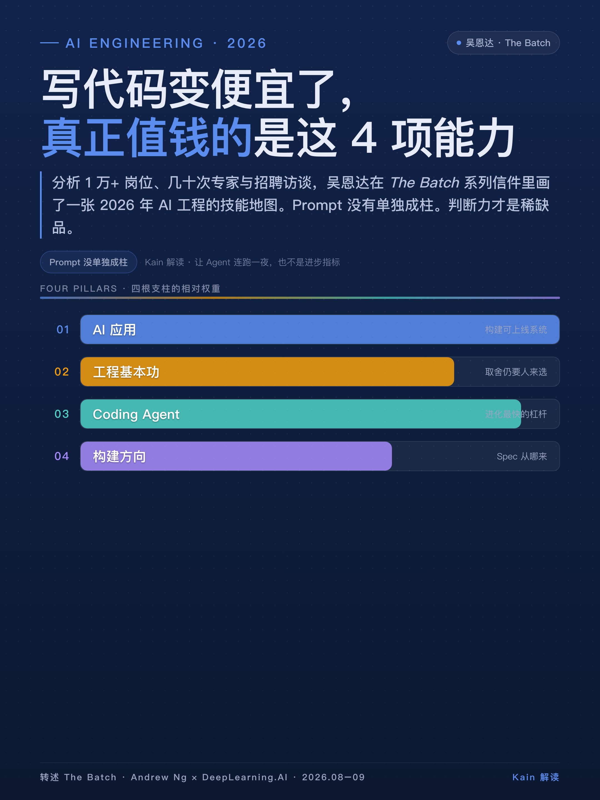
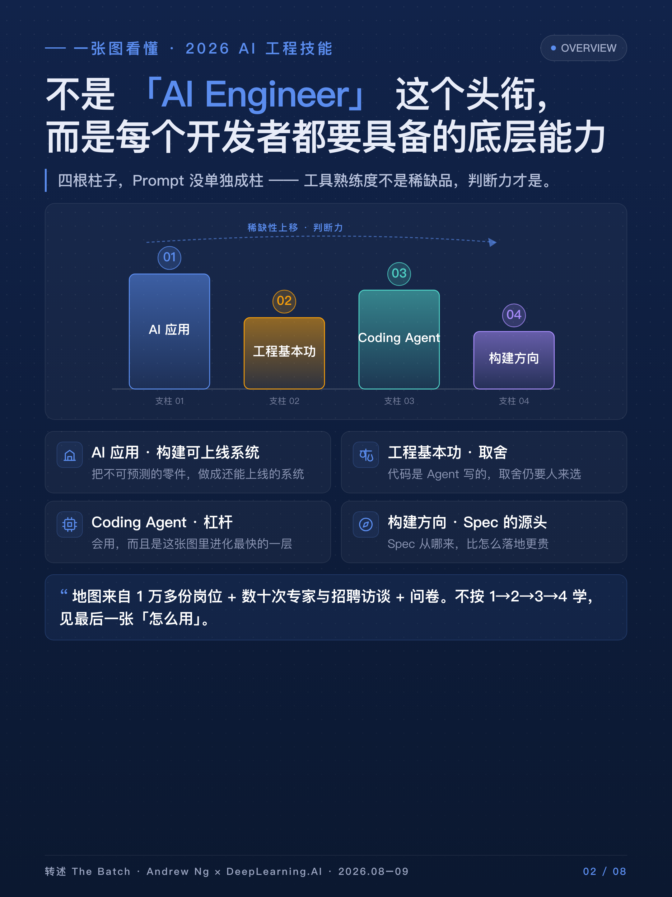
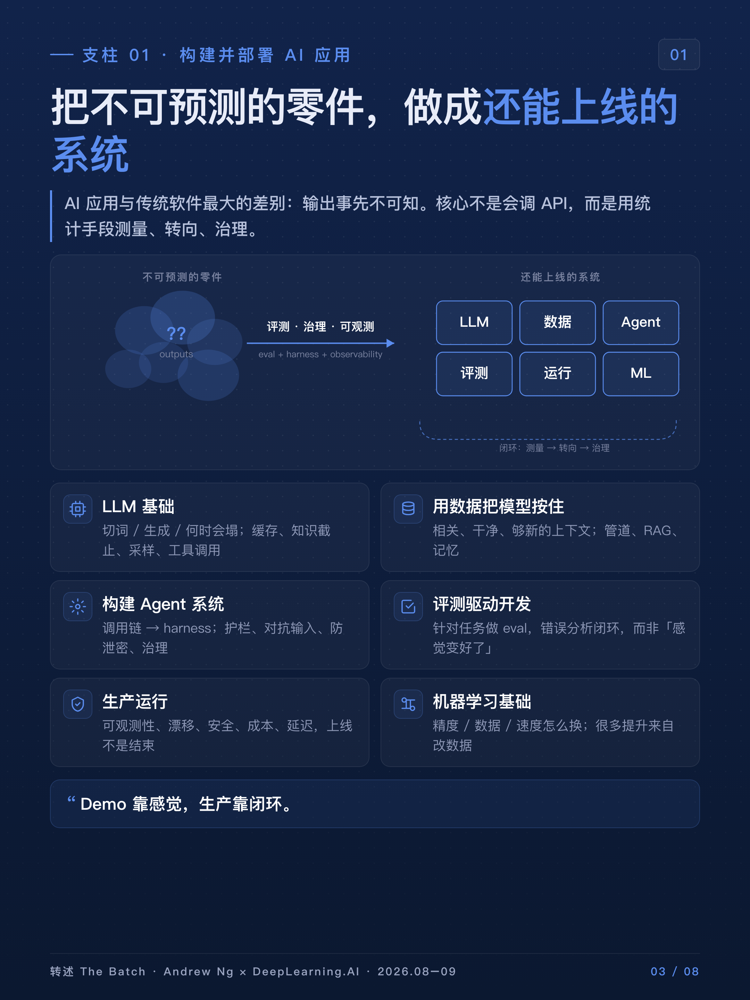
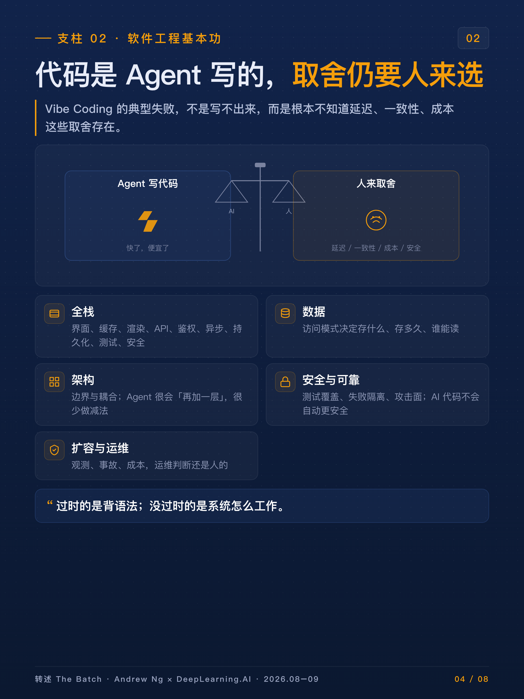
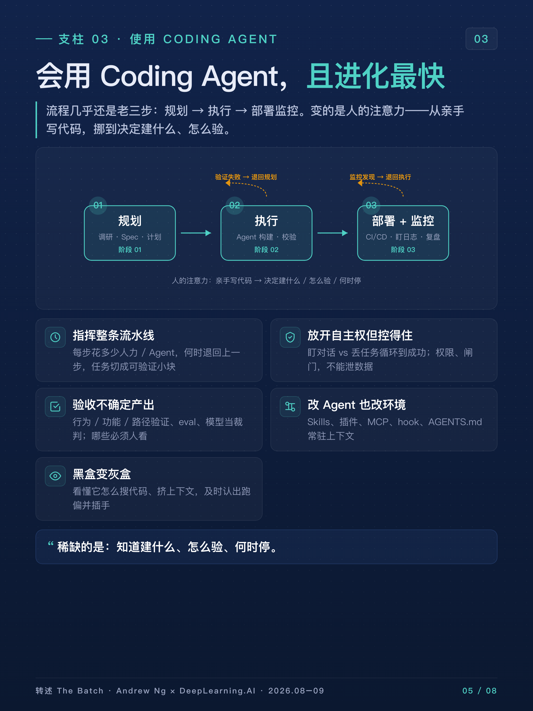
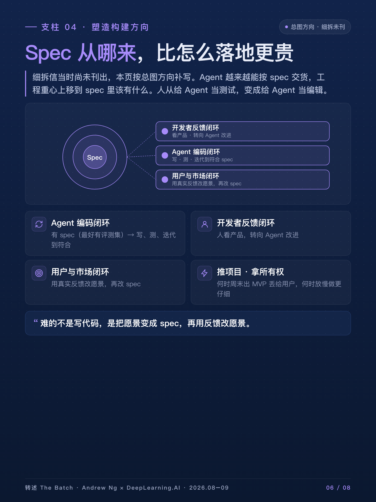
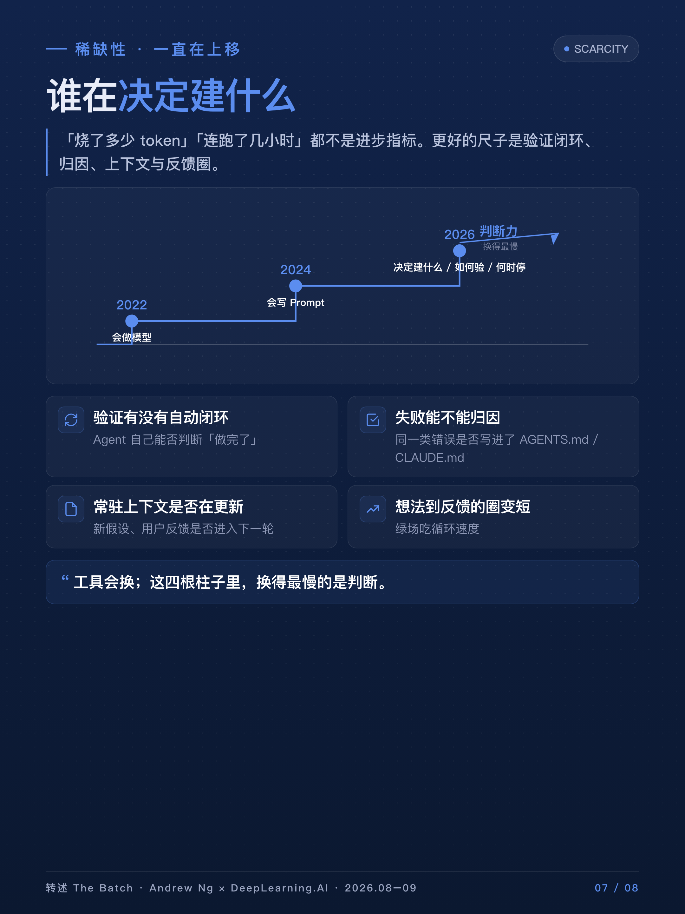
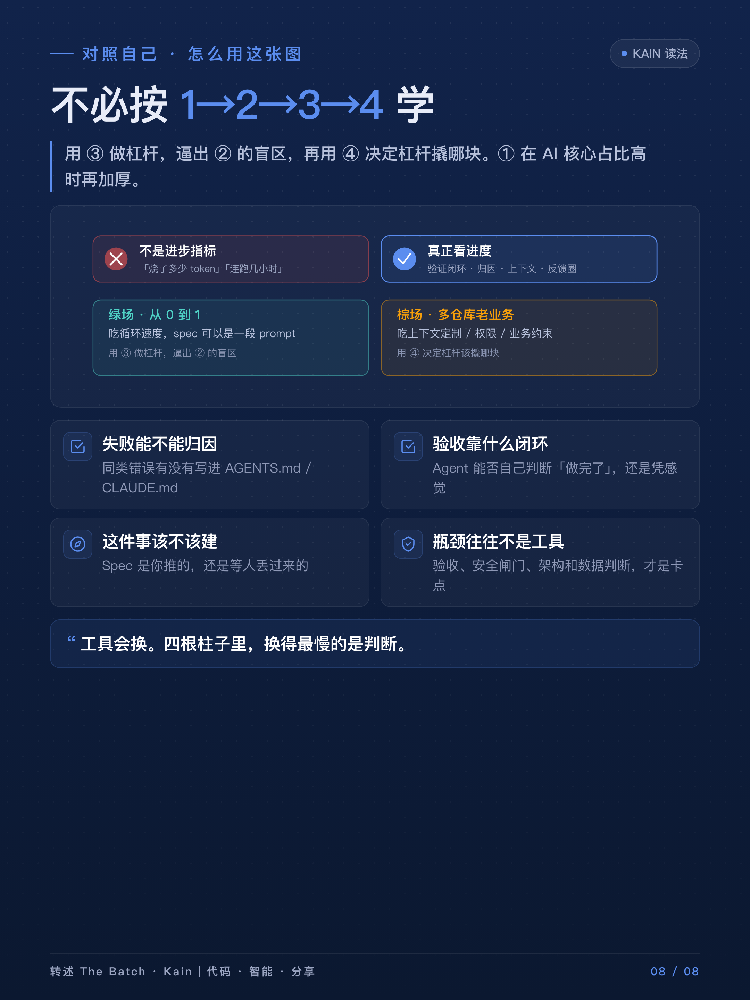

# 写代码变便宜了，吴恩达画出 2026 年真正值钱的 4 项能力

写代码这件事，正在快速贬值。

不是说软件不重要了，而是「把想法敲成能跑的代码」这件事，被 Coding Agent 压到了很低的成本。Claude Code、Codex、Cursor，以及开源的 OpenCode、Pi，几个月一个台阶。很多人的反应是：那我是不是该让 Agent 连续跑几个小时、烧掉几百万 token？

吴恩达不这么看。

2026 年 8 月到 9 月，他和 DeepLearning.AI 连续发了一组信，叫 **AI Engineering Skills Map**。材料不是个人灵感，而是 1 万多份岗位、几十次专家和招聘访谈、再加上问卷。他要回答的问题很土：在这种噪声里，到底该优先学什么？雇主又该按什么来招人？

他先澄清一个用词：说的是 **AI 工程技能**，不是「AI Engineer」这个头衔。就像今天几乎所有开发者都该会用云，但只有少数人叫云工程师。全栈、后端、数据、DevOps、机器学习，都要具备这套能力。

地图上只有四根柱子：

1. 构建并部署 AI 应用
2. 软件工程基本功
3. 使用 Coding Agent
4. 塑造构建方向（Shaping the build）

Prompt 工程没有单独成柱。它被拆进了接地、Agent 编排、指挥 Agent 这几件事里。这本身就是一个立场：工具熟练度不是稀缺品，判断力才是。

---

## 第一根柱：把不可预测的零件，做成还能上线的系统

AI 应用和传统软件最大的差别，不是「用了大模型」，而是 **输出事先不可知**。你发一条 prompt，不知道会回来什么；你训一个模型，不知道新样本上会怎样。传统软件相对可预期。

所以这项能力的核心，不是会调 API，而是会用统计手段去测量、转向、治理，让系统「足够可预期」。细拆六块：

- **LLM 基础**：它怎么切词、怎么生成、何时会塌。多模态何时该上，上下文里放什么，缓存命中、知识截止日期、推理强度、采样、工具调用。不懂机制，就无法预判失败，也选不好模型。
- **用数据把模型按在地上**：相关、干净、够新的上下文。管道、检索、RAG、记忆。模型再强，接地差就会一本正经胡说。
- **构建 Agent 系统**：从「预先排好的 LLM 调用链」，到「harness 让模型自己决定下一步」。哪些串行、哪些并行、何时写死代码、何时交给模型、fallback、MCP/CLI/沙箱、记忆、长会话、单 Agent 还是多 Agent。原型变生产，还要护栏、对抗输入、防泄密、治理。
- **评测驱动开发**：针对任务做 eval，用错误分析闭环推进，而不是「感觉变好了」。
- **生产运行**：可观测性、漂移、安全、成本、延迟。上线不是结束。
- **机器学习基础**：模型、数据、精度、速度之间怎么换；很多提升来自改数据，不是换更大的模型。

Demo 靠感觉，生产靠闭环。这根柱子解决的是：不可靠的零件，如何组成还敢给人用的系统。

---

## 第二根柱：Agent 替你写代码之后，取舍仍然要人来选

有人以为「代码都是 Agent 写的，基本功可以放下了」。吴恩达的判断相反：基本功变得更重要，因为你要指挥 Agent 做对的取舍——延迟、可用性、一致性、可靠性、可维护性、简单、成本。

Vibe Coding 的典型失败，不是写不出来，而是开发者根本不知道这些取舍存在，于是 Agent 替你选了一个看起来能跑、长期很贵或很脆的方案。

五块基本功：

- **全栈**：Agent 让前端、后端、移动都能跨过去，但你仍要懂界面、缓存、渲染、API、鉴权、会话、异步、持久化、测试、安全。否则它会在你看不见的那一层做错。
- **数据**：数据难改，即便 Agent 能帮忙迁库。访问模式决定存什么、存多久、谁能读。丢失、重复、过期、互相矛盾，都是人没想清楚。
- **架构**：边界、耦合，MVP、正式版、扩张期各用哪套结构。Agent 很会「再加一层」，很少主动做减法。
- **安全与可靠**：单测和集成怎么配、覆盖到什么程度、失败如何隔离、攻击面在哪。AI 写的代码不会自动更安全。
- **扩容与运维**：观测、事故、成本。AI 核心通常嵌在更大的软件系统里，运维判断还是人的。

过时的是背语法。没有过时的是：系统怎么工作，以及软件做不到什么。

---

## 第三根柱：会用 Coding Agent，而且进化速度比另外几根更快

这是 9 月 4 日那封信的主题，也是这张图里变化最快的一层。专有工具和开源工具都在「harness + 模型」两边同时跃进，所以这项能力不是学一次就够，要持续实验、实战、更新。

有意思的是：用 Agent 做软件的高层流程，几乎还是老三步。

**规划。** 调研、试探、摸清现有代码；写出需求、技术方案、架构，再生成执行计划；回头审假设、安全、过度设计。

**执行。** 让 Agent 去构建，同时校准「它自己跑」和「人盯着」的比例；用自动检查和人工抽查验证。

**部署与监控。** CI/CD 或人工闸门上线；让 Agent 盯日志、暴露问题、提出并执行改进。

变的是人的注意力：从「亲手写代码」，挪到「决定建什么、架构怎么定、spec 怎么写、产出怎么验」。

绿场和棕场差非常大。从零做的原型，spec 可能就是一段随手 prompt；已有用户的存量系统，spec 就要写细、验严。流程高度迭代：验证失败就退回执行，监控发现问题就退回规划。

要在这条流里真正用好 Agent，他拆了五项技能：

**指挥整条流水线。** 每一步花多少人、多少 Agent，何时退回上一步。速度、成本、技术风险、人力，这些账要会算：前期研究做到哪、哪些路径必须人拿着、架构怎么选、spec 写多细、任务怎么切成可验证的小块。

**放开自主权，但控得住。** 是盯着来回对话，还是一次丢一块大任务让它循环到成功。Context 要管：阶段变了，哪些新假设、用户反馈必须写进后续。还要会拆并行、在多个会话之间分配注意力，以及设权限、设闸门——快，但不能泄数据、删生产库。

**验收不确定的产出。** Agent 可能有惊喜，也可能埋雷。行为验证、功能验证、用户路径（甚至让它交截图当证据）、eval set、用模型当裁判。哪些测试全自动，好让 Agent 自己知道「做完了」；哪些必须人看。再加上 Agent 做代码审查、安全与架构审计。AI 不够时，再插入人审行为（很少才审代码本身）。

**改 Agent，也改它工作的环境。** Skills、插件、MCP；用 hook 把自动审查、CI 接上；维护 `AGENTS.md` / `CLAUDE.md` 这类常驻上下文：仓库结构、架构假设、风格、数据访问方式。跨会话保存状态，跑完做复盘，把「这次什么有效」沉淀下来。给代码库定约定，让 Agent 好检索；偶尔清掉它堆出来的债。团队里还要考虑不同人的 Agent 如何共享上下文。

**把黑盒变成灰盒。** 它怎么搜代码、怎么挤上下文、加工具会怎样占窗口、主 Agent 和子 Agent 怎么配合、harness 如何包住模型。有了这层模型，才能认出典型失败：把简单问题做复杂、因为没有显式验证而失去严谨、提前停工、误伤文件或生产数据。监控时也能更快判断：它跑偏了，该插手了。

他对社交媒体上的一种叙事很不以为然：好像最高境界就是让 Agent 连续跑几小时、烧掉千万 token。超长程任务在当前成本收益下被夸大了。真正有效的用法，大多是复杂、高迭代、需要人用高水平判断及时介入。

写代码变便宜了。稀缺的是：知道要建什么、怎么验、什么时候该杀掉这次 run。

---

## 第四根柱：Spec 从哪里来，比 Spec 怎么落地更贵

细拆信还没发，但总图已经把方向写住了。

Agent 越来越能「按 spec 交货」，工程重心上移到 **spec 里该有什么**。工程师不该再等一张像素级设计稿，再负责实现。需要产品感觉、业务上下文、客户目标，参与并推动「建什么」。

AI 也给了更大的所有权：自己发现问题和机会，并负责任地做出来。这要求会推项目——何时周末做出 MVP 丢给用户，何时该放慢、做更仔细。

可以把它理解成三层闭环同时转：

- Agent 编码闭环：有 spec（最好还有评测集）→ 写、测、迭代到符合 spec。
- 开发者反馈闭环：人看产品，转向 Agent 改进。人从「给 Agent 当测试」变成「给 Agent 当编辑」。
- 用户与市场闭环：用真实反馈改愿景，再改 spec。

难的不是写代码，是同时「把愿景变成 spec」和「用反馈改愿景」。两边都要做。

---

## 这张图故意没写进去的东西

特定模型、特定 IDE，都不是技能。Claude Code 今天强，不代表工作流可以焊死在它身上。要练的是：换 harness、换模型之后，流程怎么跟着变。

「烧了多少 token」「连跑了几小时」也不是进步指标。更好的尺子是：

- 验证有没有自动闭环
- 失败能不能归因
- 同一类错误有没有写进常驻上下文
- 从想法到用户反馈的圈，有没有变短

地图来自岗位和访谈聚类，天然偏向「能写进 JD 的能力」。大公司内部的推进阻力、合规政治、烂存量系统里的摩擦，着墨不多。当参考坐标系很好，当宗教不行。

---

## 对照自己时，可以这么用

不必按 1→2→3→4 学。更有效的顺序往往是：

用第三根柱做杠杆，逼出第二根柱的盲区，再用第四根柱决定杠杆该撬哪块。第一根柱在你系统里「AI 核心」占比高时，再加厚评测、接地和线上漂移。

如果已经能让 Agent 从 spec 跑到合并请求，瓶颈多半不在「会不会用工具」，而在验收和安全闸门、架构与数据判断、以及「这件事到底该不该建」。

绿场吃循环速度。棕场——多仓库、老业务、已有用户——吃的是上下文定制、权限、并行 Agent 的状态，以及把业务约束写进 spec 的能力。Agent 不会自动理解你公司那几十个仓库为什么长成这样。

---

## 一句收束

2022 年的稀缺是「会做模型」。
2024 年的稀缺是「会写 Prompt」。
2026 年这张图给出的稀缺是：在 Agent 能把代码写出来之后，谁能决定建什么、如何验、何时停、以及系统在不可预测时仍然可控。

工具会换。这四根柱子里，换得最慢的是判断。

---

## 信息边界

本文基于吴恩达与 DeepLearning.AI 2026 年 8–9 月 *The Batch* 系列信件整理与转述，非官方译文。系列原文：[The AI Engineering Skills Map](https://www.deeplearning.ai/the-batch/the-ai-engineering-skills-map) 以及后续关于构建 AI 应用、软件工程基本功、使用 Coding Agent 的细拆；信件索引见 [The Batch · Letters](https://www.deeplearning.ai/the-batch/tag/letters)。第四项 Shaping the build 的专文当时尚未刊。观点部分为阅读理解，不代表原作者立场。
