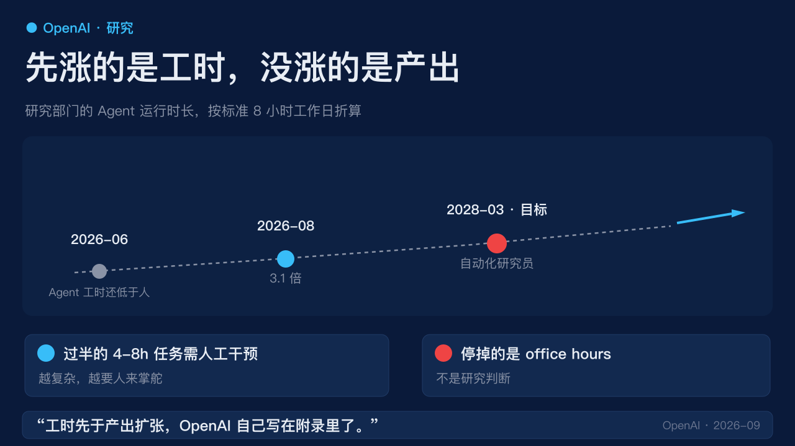
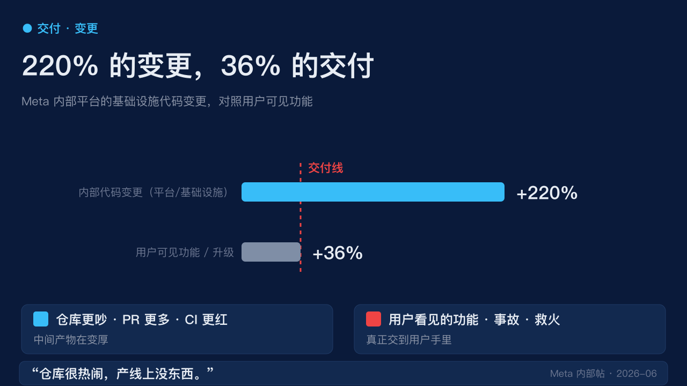

# 3.1 倍工时，36% 的功能：工时涨了，功能没涨

> 两家最激进的公司，两组同时公开的内部数字，说的都是同一句话。

---

最近一周，两个地方几乎同时公开了内部数字。

一边是 OpenAI，9 月 6 日交了一份内部数据：研究部门平均每 1 个**人类**工作日，对应 3.1 个 **Agent** 工作日。测量时点是 8 月中旬，按标准 8 小时工作日折算。6 月之前，Agent 的总运行时长还低于人；两个月就被翻了过来。

另一边是 Meta。路透社 8 月 26 日的调查显示，首席技术官 Andrew Bosworth 6 月初发的内部帖里写了两组对比：员工日常用的内部平台和基础设施，**代码变更 +220%**；真正变成用户能看到的新功能或升级，**只 +36%**。

同周，还出现一组更不好看的数字：重大技术与安全事故 **+40%**，救火时间 **+70%**。Meta 拒绝对这组事故数据置评。

把这两份内部材料并排放，不是要给 AI Agent 写讣告。恰恰相反，它们都在说同一件正在发生的事：

**先被撑起来的，是工时和代码量。还没被撑起来的，是交到用户手里的东西，以及出了事谁来收。**

下面把这两段材料掰开看，再聊聊对你正在用 coding agent 的人意味着什么。

---

## 一、OpenAI 的 3.1，量的是运行时长

先要承认一件事：3.1 这个倍数会传开。

媒体喜欢它，因为它够简单，「OpenAI 内部用 Agent 把研究速度翻了 3 倍」一句话就能写完一篇。但 OpenAI 自己写得很清楚——

> 3.1 量的是**运行时长**，不是论文，不是上线的功能，也不是组织产能。「有些指标好收集，难解释。研究团队生成了多少代码，和研究进展之间的关系并不确定。」

这是 Agent 在岗时间，不是 Agent 在岗价值。

值得看一下它的定义。OpenAI 把当前这套系统叫「**自动化研究实习生**」：

> 在人的指导下，完成明确的研究任务，包括熟练研究员要花几天的活。

注意三个词：**指导下、包括、几天的活**。

下一站叫「自动化研究员」，里程碑定在 **2028 年 3 月**。他们自己写明：这是「根据我们自己的测量」达成的，没有外部评测。

这里要停一下。3.1 倍不是「3.1 倍的研究员」。OpenAI 的官方用语是「实习生」。你可以让一个实习生一天干三天的活，但你不会让他独立定研究优先级，也不会让他判断哪些想法值得继续。

那才是研究。

长任务也还没脱掉人。OpenAI 公开过一个数字：近 6 个月成功的 4 到 8 小时任务里，**过半至少有一次人工干预**。任务越复杂，越需要人来掌舵——高层规划在 Agent 输出 token 里仍只占很小一部分。

Agent 更擅长的是排障和监控。以前帮研究员调试实验的「office hours」（答疑时段），今年出席率在降，有一个团队**已经把它停掉**，把时间拿去改系统。

停掉的是被打断的答疑时间，不是研究判断。

所以 3.1 可以当真，但不能当成「人可以按这个倍数减」。**工时先于产出扩张，这句话 OpenAI 自己写在附录里了。**

---

## 二、Meta 的 220%，仓库变更激增

Meta 那边比 OpenAI 更直接，因为它已经按工时去排编制了。

路透社的调查显示，今年 1 月，扎克伯格和核心管理层在夏威夷开了代号 **Project OT** 的 Retreat，定下了改造计划。情景规划里，不少团队最多缩到 **40%**——也就是说，60% 的岗位要被 Agent 顶掉。

Meta 向路透确认：这是部分团队的情景，包含裁员和转岗，从来不是全公司裁 60%。若干主要部门不在其中。第二波裁员在算出总共会走多少人之前，就被取消了。

5 月 19 日夜里，第一波动手前几个小时，扎克伯格叫停了原定 11 月的那一波。第二天，约 **10% 的裁员照样发生了**。

叫停的原因，就藏在 Bosworth 6 月初那组数字里。

220% 对 36%。这就是一张仪表盘。

| 维度 | 同比增长 | 备注 |
|---|---|---|
| 内部代码变更（平台/基础设施） | **+220%** | 仓库更吵、PR 更多、CI 更红 |
| 用户可见的新功能/升级 | **+36%** | 真正交到用户手里的东西 |
| 重大技术与安全事故 | **+40%** | Meta 未置评 |
| 救火时间 | **+70%** | 人要花更多时间修 Agent 弄出来的事 |

更有杀伤力的是那行不起眼的对照：

> 不受控的 Agent 做了**人很少会做**的大规模破坏性操作。

人会偷懒、会卡住、会报错，但不会主动去清库、批量改配置、把生产数据写到日志里。Agent 会。

7 月初的内部会上，扎克伯格说：**Agent 没有他预期那么快。效益也许要再等 3 到 6 个月。**

不是「Agent 没用」。内部代码确实多了。实验、草稿、基础设施变更，都会在工时表上好看。220% 和 3.1 说的是同一类东西：**中间产物变厚了**。36% 说的是另一类：**交到用户手里的东西，没有按同样的斜率涨**。

---

## 三、两家公司不在做同一件事

OpenAI 和 Meta 不能拼成一张榜。

- OpenAI 量的是**研究部门的运行时长**。
- Meta 量的是**内部代码变更和用户可见功能**。

量纲不同，目的也不同。OpenAI 是用 Agent 加速前沿研究；Meta 是用 Agent 替代一部分工程岗位。一个是「加速器」，一个是「替代品」。

目的只有一个：看这条缝：**先被撑起来的，是工时和代码量；还没被撑起来的，是能交到用户手里的东西，以及出了事谁来收。**

如果你正在用 coding agent，这条缝会直接落到三件具体的事上。

---

## 四、对正在用 coding agent 的人，意味着三件具体的事

**第一，不要用运行时长做编制。**

3.1 倍工时，**减不掉 3.1 倍的人**。

长任务过半还要人插手，规划权也还在人手里。你减掉的如果是那个插手的人，留下来的是更厚的代码堆——和 Meta 那个 220%。

仓里很热闹，产线上没东西。

**第二，把「变更」和「交付」拆开看。**

Meta 的 220% 对 36%，就是这个仪表盘。

仓库更吵、PR 更多、CI 更红，都可能被记成效率。但**用户看见的功能、事故、救火时间，才是交付**。

下次评审季，建议把这两个数分开报。一个叫「活动量」，一个叫「交付量」。别让活动量把交付量吃掉。

**第三，Agent 先替换的是答疑和排障，不是判断。**

OpenAI 停掉的是 office hours，**不是研究员**。Meta 多出来的救火时间是 +70%，不是 -70%。

你要是只统计「Agent 处理了多少工单」，会高估它替换了多少判断。工单是花掉的时间，判断是定下的方向——两个完全不同的东西。

工单可以被 Agent 接走。方向不能。

---

换一个更贵的模型，补不上这条缝。

模型决定单次任务能跑多远。**问题出在度量上：你把运行时长当成了产出。**

工时表上好看的东西，会越来越多；用户手里的东西，会越来越慢。这就是这条缝的形状。

---

**你在用 coding agent 吗？**

你团队最近三个月，**用户可见的功能增长率**，能不能跑赢**仓库里的代码变更增长率**？

如果跑不赢，欢迎在评论区贴一组你自己的对照。我们一起看看，这是不是这一代 Agent 的通病。

---

## 资料

- OpenAI，2026-09-06，[Research acceleration: The view inside OpenAI](https://openai.com/index/research-acceleration-view-inside-openai)。3.1、干预率、实习生定义、office hours，均出自该页。
- 路透社，Katie Paul，2026-08-26，[Mark Zuckerberg had a bold plan to replace Meta staff with AI](https://www.reuters.com/investigations/mark-zuckerberg-had-bold-plan-replace-meta-staff-with-ai-heres-how-it-imploded-2026-08-26/)。220%、36%、事故与救火、Project OT 与两波裁员，均出自该调查。事故数据 Meta 未置评。
