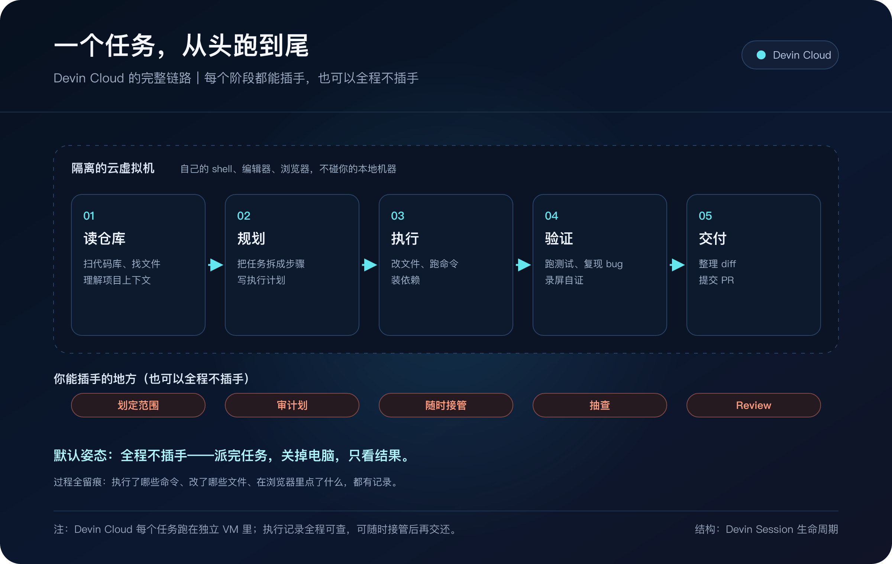
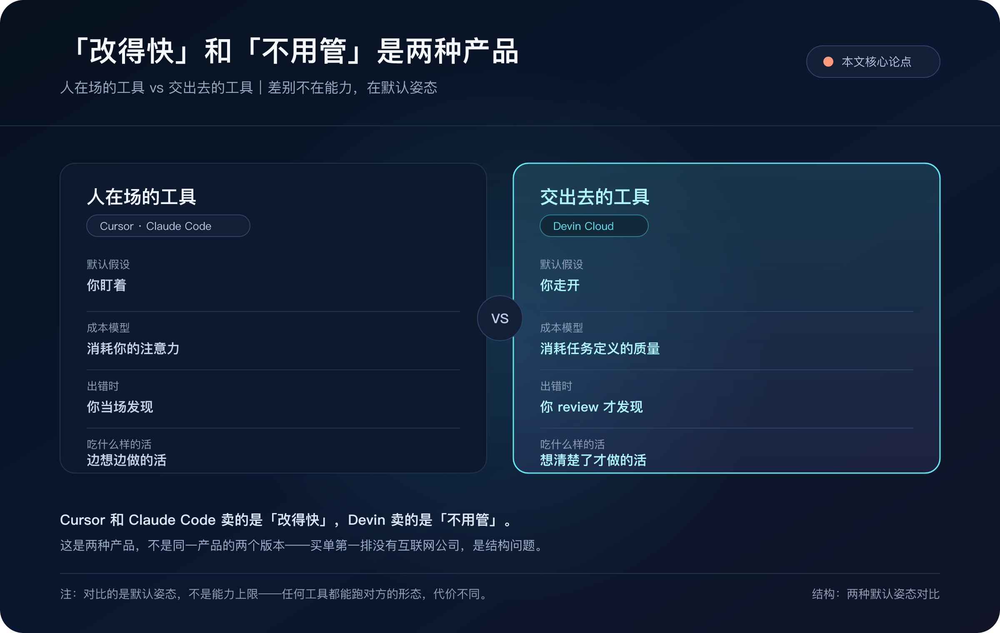
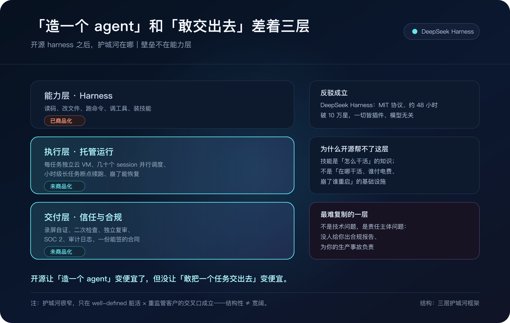

# 480 亿估值，买单主力不是互联网公司

9 月 8 日，AI 编程公司 Cognition 宣布完成超过 20 亿美元 E 轮融资，投后估值 480 亿美元。

四个月前，它的估值是 260 亿。

大部分报道盯着「翻倍」这个数字。我盯的是它同时公开的客户名单。

NVIDIA、高盛、花旗、奔驰、NASA-JPL、GE 航空、思科、戴尔、桑坦德银行，还有美国陆军和美国海军。

E 轮公告里还点了 Modal。更早的公开名单里出现过 Ramp、Palantir、Mercado Libre。所以不是「一家互联网公司都没有」。

扎眼的是另一件事：大规模被点名的买单方，仍是芯片厂、银行、车企、航天机构和军队。天天把 All in AI 挂在嘴边的互联网公司，并没有站在第一排。

为什么是它们？我把公开信息翻了一遍，答案比估值本身有意思得多。

## 先搞清楚 Devin 到底是什么

Devin 是 Cognition 的旗舰产品。2024 年 3 月发布时，它自称「第一个 AI 软件工程师」。

它和代码补全工具最大的区别，在一个动作上：你不用坐在它旁边。

给它一个任务，它会自己走完一整条链：读仓库，拆任务，改文件，跑命令，跑测试，最后提交一个 PR。

整个过程跑在一台隔离的云虚拟机里，有自己的 shell、编辑器和浏览器，不碰你的本地机器。

更关键的是进度可查。它执行了哪些命令、改了哪些文件、在浏览器里点了什么，都有记录。你可以随时接管，改完再让它继续。

| 阶段 | Devin 做什么 | 你能插手的地方 |
|---|---|---|
| 读仓库 | 扫代码库、找相关文件、理解上下文 | 划定范围 |
| 规划 | 拆任务、写执行计划 | 审计划 |
| 执行 | 改文件、跑命令、装依赖 | 随时接管 |
| 验证 | 跑测试、开浏览器复现、录屏自证 | 抽查 |
| 交付 | 提交 PR | Review |

所以它和代码补全工具的分野，是人在不在场。

这个问题先放这儿。后面的客户名单，会一直用到它。

**Devin 早就不只是一个云端 agent，很多介绍文章还没跟上。**

2025 年 7 月，Cognition 收购了 Windsurf。2026 年 6 月，Windsurf 直接改名成 Devin Desktop。它从 VS Code 衍生而来，第一屏是一块叫 Agent Command Center 的看板，管着你所有正在跑的 agent，本地和云端的都在一起。

打开它，你看到的不再是文件树，是一排任务：哪个在跑，哪个卡住了，哪个等着你 review。

| 形态 | 是什么 | 什么时候用 |
|---|---|---|
| Devin Desktop | 原 Windsurf，完整编辑器 + Agent Command Center | 你要盯着改、随时插手 |
| Devin Cloud | 自主云 agent，自己的 VM | 整块任务交出去，人走开 |
| Devin CLI | 终端里的 Devin | 你本来就活在命令行 |
| Devin Review | 独立跑一遍代码审查 | 让第二个 agent 挑毛病 |

配套还有两件值得单独说的东西。

**Spaces**：把同一个项目的 agent 会话、PR、文件、上下文圈在一个视图里。新开的会话直接继承，不用每次都跟它重新解释一遍代码库。多个 agent 并行的时候，这个差别很大，否则你会花一半时间在重复交代背景。

**ACP（Agent Client Protocol）**：一个开放协议。Codex、Claude Agent、OpenCode 这些别人家的 agent，也能跑在 Devin Desktop 里，用同一块看板管。这一手挺聪明，它把自己从「一个工具」变成了「一个容器」。

再说模型。2026 年 7 月，Cognition 发布了自研的 SWE-1.7。

这不是套壳。它是在 Moonshot 的 Kimi K2.7 Code 基础上，拿 Devin 自己的 agent harness 又跑了一轮大规模强化学习训出来的。官方口径是：FrontierCode 1.1 Main 42.3%，Terminal-Bench 2.1 81.5%，SWE-Bench Multilingual 77.8%，单个任务成本 1.97 美元，通过 Cerebras 跑在每秒 1000 token。上下文窗口外界常写 256K，多半是从 Kimi 基座推断的。

注意它的措辞。它没说「最强」，说的是「前沿水平的智能，成本低得多」。

它不争第一，要在「分数 vs 花钱」的曲线上占一个好位置。

## 它们拿 Devin 干的活，一点都不性感

我把公开的客户案例整理成了这张表。

| 客户 | 行业 | 拿 Devin 干什么 | 公开结果 |
|---|---|---|---|
| 奔驰 | 汽车 | 遗留系统现代化 | 四周试点：分析约 20 万行 COBOL，预估 8 个月 → 8 天 |
| Nubank | 银行 | 核心 ETL 单体拆成子模块 | 迁移工时降约 12 倍 |
| Itaú | 银行 | 安全漏洞修复 | 约 70% 的漏洞自动修掉 |
| 高盛 | 银行 | 遗留 IT 现代化，与约 1.2 万名工程师协同 | 厂商未单列高盛细账 |
| NASA-JPL | 航天 | 高保证软件 | 已公开使用；企业侧提供 VPC 等隔离部署 |
| NVIDIA | 芯片 | 芯片设计工程 | 官方点名的场景 |

注意一件事：这六家，没有一家在拿它「写新功能」。

遗留系统现代化、平台迁移、漏洞修复、回归测试生成、依赖升级。全是工程 backlog 里那批人人都知道怎么做、但没人愿意做的活。

Cognition 自己的说法很直白：Devin 的能力介于初级工程师和中级工程师之间，专门处理长尾的、重复的、不讨好的工作，让人类工程师去做设计和架构。

我喜欢这个定位，因为它诚实。没有说「取代工程师」，也没有说「超越人类」。

它就是在说：那些你们不爱干的活，交给我。

高盛那条常被写成「漏洞修复从 30 分钟/个降到 1.5 分钟」。Cognition 自己的 2025 年绩效回顾里，这是「另一家客户」的数字，不是高盛官方披露。Forbes 也写过高盛没公布自己的细账。后面算账时，请把这条当厂商案例，别安在高盛头上。

## 它真正卖的，是「交出去」

银行、航天、军队，看起来最保守、最不可能先用 AI。最先掏钱的，正是这批客户。而且它们用的还不是花活。上一节那张表里，全是遗留现代化、代码迁移、漏洞修复这类最枯燥、最没人愿意碰的活。

这个反常，指向 Devin 真正在卖的东西。

先看一条链条：监管越严，流程就越死；流程越死，任务文档化的程度就越高；文档化程度越高，验收标准就越明确。

而验收标准明确，正好是 Agent 能干活的边界条件。

真正让 Agent 卡住的，从来不是模型不够强，是任务本身没法验收。

| 特征 | 先被吃掉的活 | 还吃不掉的活 |
|---|---|---|
| 需求清晰度 | 有明确 spec | 需求还在讨论 |
| 验收标准 | 有测试，结果可复现 | 「感觉不太对」 |
| 出错代价 | 可回滚、有 review 兜底 | 一次事故上新闻 |
| 人的意愿 | 没人愿意干 | 有人抢着干 |

四个条件同时满足，Agent 就能上场。少一个，就还得人顶着。

这也解释了为什么互联网公司很难成为第一批主力。业务跑得快，需求一天三变，很多东西没有明确 spec，验收标准靠感觉。这种环境里，Agent 的优势发挥不出来。Modal、Ramp 这类公司可以是客户，但不改变这张表的结构。

但「验收标准明确」只是一张入场券。要理解 Devin 为什么能拿下那批客户，还得看它的形态。

先把「交出去」这三个字拆开。

**它不是体验偏好，是默认姿态。**

Cursor 和 Claude Code 的默认假设是「你在场」。你发起任务，你看着它改，你随时打断、随时纠偏。它们的价值主张是「改得快」。

Devin 的默认假设是「你不在场」。你派一个任务，然后关掉电脑。它的价值主张是「不用管」。

这个差别看着小，实际是两种产品：

| | 人在场的工具 | 交出去的工具 |
|---|---|---|
| 默认假设 | 你盯着 | 你走开 |
| 成本模型 | 消耗你的注意力 | 消耗任务定义的质量 |
| 出错时 | 你当场发现 | 你 review 才发现 |
| 吃什么样的活 | 边想边做的活 | 想清楚了才做的活 |

**这个差别，决定了它们能吃的活完全不同。**

回头看开头那份客户名单。银行、车企、航天机构的工作方式，恰好同时满足那张表里的四个条件。

互联网公司的活，往往需求还在变、验收靠感觉。能占住一条就不错。

所以互联网公司没有排在买单第一排，是结构问题。

还有一个更容易被忽略的点。

让一个工程师坐在 Cursor 旁边，看 agent 一行一行改 COBOL 遗留代码。这件事本身就是组织不愿意干的。

不是技术做不到。是这批活之所以留到今天，就是因为没人愿意花时间在它上面。你在旁边看着，等于把「没人愿意干」变成了「有人被迫干」，问题没解决，只是换了个姿势。

Devin 的形态刚好绕开了这一层：你不看，你只看结果。

这才是它拿到那些客户的原因。不是它模型更强，它的自研模型分数并不领先。是它的默认姿势，和这批活的形状对上了。

**「交出去」不是没有代价。**

代价是：任务定义得好不好，直接决定结果好不好。

人在场的工具，你一边看一边纠偏，容错空间大。交出去的工具，你走开那段时间里它跑偏了，你也拦不住。所以它对任务描述质量的要求，比对模型能力的要求更高。

这也解释了它为什么天然只能吃 well-defined 的活。这既是它的边界，也是它的护城河，因为恰好，这些活就是没人愿意干的那批。

对普通团队来说，「交出去」这三个字其实是一把尺子。

以后评估任何一个 agent 工具，先问一句：它的默认姿态，假设我在不在场？

对不上，再强的模型也是白搭。

## 而且它已经在接组织的岗了

如果说上面讲的是「什么活能被交出去」，那 Devin 2026 年的三个新产品，回答的是另一个问题：这些活原来是谁在干。

| 新功能 | 它接走的人类工作 |
|---|---|
| Auto-Triage | 值班、事故第一轮排查 |
| Security Swarm | 漏洞扫描、分级、指派 |
| Automations | 从 Slack / GitHub / Linear 的事件直接触发任务，不用每次开对话 |

Auto-Triage 接的是 on-call 值班，Security Swarm 接的是安全响应，Automations 接的是「等人来派活」这个动作。

这三件事有个共同点：它们都是流程里最没意思、最消耗人、但最容易定义「做完了没有」的环节。

它没有去碰「这个功能该不该做」，也没有去碰「架构怎么设计」。它挑的，全是工单。

上一节说的那条边界，在这里又划了一次：能被写成工单的，交出去；写不成工单的，留下。

## 那为什么非得是 Devin？

看到这里，你大概会问一句：那为什么非得是 Devin？Claude Code、Cursor 不也能干？

答案已经变了。

**2026 年，决定你用哪个 AI 编程工具的关键，已经落在模型外面那层。**

前沿模型已经收敛。Claude Opus 4.8、GPT-5.5 这一档，在主流基准上的差距，小到普通团队根本感觉不出来。

真正拉开差距的，是包在模型外面那层东西，行业里叫 harness，外壳。

它决定模型看到哪些文件、能调什么工具、命令怎么审批、沙箱怎么开、上下文怎么记、最后交给你一个什么样的 diff。

按执行环境分，现在的工具基本是三条路线：

| 路线 | 代表 | 它假设你人在哪 |
|---|---|---|
| 终端优先 | Claude Code | 你在终端里，边看边指挥 |
| 编辑器原生 | Cursor | 你在编辑器里，顺手改 |
| 云端 agent | Devin、Codex | 你不在场，任务自己跑完 |

注意第三列的措辞。它问的其实就是同一个问题：这个工具的默认姿态，假设你在不在场？

这四家工具的具体差别，我整理成了这张表：

| 维度 | Devin | Claude Code | Cursor | Codex |
|---|---|---|---|---|
| 执行环境 | 自己的云 VM（shell + 编辑器 + 浏览器） | 终端为主，另有 IDE / web / 手机 | 编辑器内，云端 agent 跑在隔离 microVM | 本地沙箱（macOS 用 Seatbelt、Linux 用 bubblewrap）+ 云 |
| 默认自主度 | 高，人走开也能跑 | 交互式为主，可开自动模式 | Agent 模式默认，人一般就在旁边 | 人在环，三档审批可调 |
| 模型 | 自研 SWE-1.7 + OpenAI / Anthropic / Google 多家 | Claude 原生（Opus 4.8） | 多模型 + 自研 Composer 2.5 | OpenAI（本地 GPT-5.5 / 云 5.3-codex） |
| 上下文 | 256K（SWE-1.7，多来自基座推断） | 100 万 token | 靠代码库索引 | 按所选模型 |
| 入口价 | Free / $20 / $200，Teams $80 起 + 全席 $40 | $20 Pro，$100 Max | Free / $20 / $60 / $200 | 含在 ChatGPT 里，$8 起 |
| 最适合 | 边界清楚、能整块交出去的活 | 大型陌生代码库的深度重构 | 日常编码，改得快 | 跨界面派活，异步出 PR |

这里还有一件事值得记一笔。Cursor 在训自己的 Composer，Cognition 在训自己的 SWE。两家都是从 harness 起家，现在都在往模型层爬。

逻辑很直白：如果你的产品只是 Claude 或 GPT 上面一层薄壳，那你的毛利是别人剩下的，延迟是别人的，限流也是别人的。

## 那开源 harness 呢？

讲到这里，一定会有人反驳：现在 harness 都开源了，Devin 的优势还剩什么？

这个反驳成立，而且有具体证据。

2026 年 8 月 13 日，DeepSeek 开源了 DeepSeek Harness（简称 dsh），MIT 协议。约 48 小时破 10 万星。NordSys 报道称，6 天内社区提交了 4638 个插件。星标还在涨，不必钉死某一个数。

它的设计是「一切皆插件」，模型、工具、技能、会话、沙箱、UI，连 agent 主循环本身，都能从配置里换掉。而且模型无关：能塞 Claude，能把 Claude Code 和 Codex 当子 agent 调，还直接读你现有的 AGENTS.md 和 CLAUDE.md。

**所以「造一个能干活的 agent」这件事，门槛确实被砸到地上了。**

但这里要分清一件事：harness 是「能力」，护城河在「能力之外」。

| 层 | 是什么 | 状态 |
|---|---|---|
| 能力层 | Harness：读码、改文件、跑命令、装技能 | 已商品化 |
| 执行层 | 托管运行：云 VM、并行调度、长任务续跑 | 未商品化 |
| 交付层 | 信任与合规：证据链、审计、合同责任 | 未商品化 |

**第一层不用多说。Devin 在这一层没有护城河，也不该有。**

顺便澄清一个容易混的地方：harness 决定体验，但决定不了壁垒。同一个模型放进不同的 harness，表现能差很多，这是真的。但体验优势不等于商业壁垒，因为 harness 可以被复制，也可以被开源。

**第二层是「帮别人跑 harness」。**

开源 harness 给你一个能跑的 agent，它不给你：每个任务一台带 shell、编辑器、浏览器的独立云 VM；同时跑几十个 session 的调度、隔离和配额；小时级长任务的断点续跑和上下文自压缩；跑六小时不崩、崩了能恢复。

这些不是 prompt 工程，是运维工程加成本工程。技能包帮不了你。技能是「怎么干活」的知识，不是「在哪干活、谁付电费、崩了谁重启」的基础设施。

这一层还有一件更少被提的事：单位经济。

交互式工具里，一次调用就是一次对话，token 贵一点你忍了。委派式工具里，一次任务等于几百个 agent 循环，读码、改、跑测试、读失败、重试。token 直接决定这门生意成不成立。

所以 Devin 要做 Fusion 路由（前沿模型加便宜 sidekick；发布时宣称约省 35%，2026 年 8 月按 FrontierCode 更新为最高约 60%，均为厂商自测），要自研 SWE-1.7（1.97 美元一个任务）。不是因为它想当模型公司，是因为在「交出去」这个模式下，不控制成本就没有毛利。

而开源 harness 恰恰把控制权交给你，也把成本曲线交给你。你用 Claude 当后端跑一百个循环，账单是你自己的。

**第三层是「让你敢不看」。**

交出去的前提是你不用看。那你凭什么敢不看？

靠证据链。跑测试、开浏览器复现、录屏自证、Diff review、二次 agentic 检查、独立复审。这些不是「能力」，是信任机制。开源 harness 给你能力，但不给你信任。它给你一个能跑的循环，不给你「跑完之后你敢签字」的东西。

同一层还有两样。

一是组织记忆。让同一项目的 agent 共享上下文和 worktree，把仓库变成可查的 wiki。一个 agent 时无所谓；二十个并行时，重复交代背景就是最大的浪费。这个价值随 agent 数量超线性增长，是网络效应，不是功能。

二是合规交付形态。企业侧可以走 VPC 一类隔离部署；银行要 SOC 2、零数据留存、SSO、审计日志。这些客户买的不是工具，是一份能签的合同。开源 harness 技术上能自托管，但没人给你出合规报告、没人跟你签数据处理协议、没人为你的生产事故负责。

这是最难被开源复制的一层，因为它不是技术问题，是责任主体问题。

还有一手反向操作：Devin Desktop 支持 ACP，能让 Codex、Claude Agent、OpenCode 跑进来，用同一块看板管。

逻辑很聪明：如果 agent 注定要商品化，那「管 agent 的地方」就是新的稀缺资源。手机同质化了，App Store 没同质化。

**但我得诚实说这个护城河的深度：它很窄。**

第一，它只在「well-defined 的脏活」和「重监管客户」的交叉口成立，不是通用护城河。

第二，云厂商是更可怕的对手。AWS、Google、Azure 更擅长托管基础设施和合规交付；Codex 就是 OpenAI 在做同一件事，还绑着 ChatGPT 的分发。如果编程 agent 变成云的标配功能，Devin 会被降维成一个功能点。

第三，模型再上一个台阶就危险。如果模糊任务也能交出去，「交出去」就不再是 Devin 的专属形态，通用工具会反包抄。

这个交叉口是结构决定的，重监管行业天然满足「交出去」的条件，这不是运气。但交叉口本身很窄，窄到云厂商一个功能就能覆盖。

「结构性」说的是它为什么成立，「很窄」说的是地盘有多大。两件事不打架。

所以答案是这样：Devin 的护城河不在 harness，而在「把 harness 变成一门能签合同的生意」所需要的那一整套东西。

**开源让「造一个 agent」变便宜了，但没让「敢把一个任务交出去」变便宜。**

Linux 内核开源了，没人因此觉得 Red Hat 没护城河；Kubernetes 开源了，EKS 和 GKE 照样赚钱。壁垒从来不在「那个东西」，在「把它变成可靠服务」的那一层。

## 算一笔账

先说一个坑。很多介绍 Devin 的文章，到现在还在说它按 ACU（Agent Compute Unit）计费，一个 ACU 约 2.25 美元。

那是 2025 年的口径。2026 年 4 月，Cognition 把自服务的定价整个换掉了：Core 计划和 500 美元/月的 Team 计划退役，ACU 从自服务页面消失，改成订阅制。

现在的档位是这样：

| 档位 | 价格 | 说明 |
|---|---|---|
| Free | $0 | Devin Desktop，轻量配额，云 agent 能力以官网当期为准 |
| Pro | $20/月 | 全模型访问 + Devin Cloud |
| Max | $200/月 | 配额显著更高 |
| Teams | $80/月起 + 全席 $40 | $80 是最低消费；席位少时差额会变成预付额度 |
| Enterprise | 定制 | 仍按 ACU 计费，可选 VPC 私有部署 |

超出配额的部分，按 API 价买。

**所以如果你看到谁还在用 ACU 报价，基本可以判断这份对比是旧的。**（Enterprise 合同除外，那边还在用 ACU。）

那这笔账到底该怎么算？

不是「每月订阅多少钱」，也不是「每百万 token 多少钱」。是**一个被接受、被合并的改动，总共花了多少**，订阅费、超额费、等待时间、review 时间，再加上它跑错方向后你重来的成本。

这个口径下，有些看起来很便宜的方案，其实不便宜；有些看起来很贵的，反而划算。

奔驰那个案例之所以扎眼，是因为它把口径摆得很清楚：试点里，约 20 万行 COBOL 的现代化，从预估 8 个月压到 8 天。这是厂商披露的试点数字，不是全年顾问工时的审计结果。方向看得出来，不必把它当成已经落地的总账。

## 但它现在到底行不行

说了这么多好话，该泼冷水了。

第一，Devin 作为 agent 的公开 SWE-bench 成绩，长期停在 2024 年发布时的 13.86%。那是原版 SWE-bench 测试集的 25% 随机子集（570 / 2294），不是后来的 SWE-bench Verified。两年多没更新过。

而它现在主推的，是自研模型 SWE-1.7 在 SWE-Bench Multilingual 上的 77.8%。

**这两个数字不是一回事。** 一个是 agent 端到端把任务做完的比例，一个是模型在题目上答对的比例，基准版本也不一样。混着引用，就会得出「Devin 从 13.86% 涨到 77.8%」这种结论，而这是错的。

第二，独立测试里，Devin 端到端任务的成功率，不同来源给的区间是 15% 到 30%，看任务复杂度。这多来自早期小样本（例如 Answer.AI 做过 20 题里成功 3 题），比发布时的演示好看一些，但「自主」不等于「什么都敢扔给它」。

第三，它的重构有时是表面的。把代码挪进新文件，但没有真正拆开耦合。

| 能做 | 做不了 |
|---|---|
| 有明确验收标准的重构 | 大架构重新设计 |
| 遗留代码迁移 | 模糊需求的探索 |
| 测试补全、依赖升级 | 需要业务判断的取舍 |
| 可复现的 bug 修复 | 一次事故定生死的关键系统 |

所以正确的心智模型不是「一个不知疲倦的高级工程师」，而是：一个能力不错的初级工程师，需要你给清楚的 brief，也需要你 review 他的 PR。

顺带说，这些短板不是 Devin 独有的。前面那张四家对照表里，每家都有它的代价，只是代价的位置不一样。

Claude Code 的 harness 最深、可编程性最强，代价是最耗 token。有人算过，一个月的 API 等价用量能到 1850 美元。Cursor 的云端 agent 要你把代码放到它的服务器上，很多合规严格的团队就卡在这一步。Codex 的云任务到现在还不能自己选默认模型。

选工具的时候，比的不是谁的功能列表更长，是谁的代价你更能接受。

这也解释了 2024 年那场争议。当时一段 Devin 的演示视频被质疑夸大，有开发者逐帧分析，说它并没有真正完成演示里的任务。

两年后回头看，那场争论的真正问题不是「Devin 行不行」，是「大家把它的能力想成了什么」。

## 回到那个客户名单

现在再看那份名单，逻辑就清楚了。

这些公司并不更激进。它们的工作方式，最接近 Agent 能干活的条件：流程死、文档全、验收明确、脏活多。

互联网公司不是不想要。很多活还没被拆成可以被验收的任务。出现几个 Modal、Ramp，并不推翻这张结构。

这件事对普通团队的意义，比 480 亿这个数字大得多。

你不需要等一个 480 亿的产品。你需要的是回答一个问题：你团队 backlog 里那批人人会做、没人愿做的活，有多少已经能被写成一份可验收的任务？

能写出来的那部分，就是 Agent 今天能替你干的部分。

写不出来的那部分，才是你真正的价值。

你团队里最先交给 Agent 的，是哪一类活？

---

## 资料

文中每个数字的原始出处。公众号正文不支持外链，所以链接是纯文本，需要核对原文时复制访问。

- Cognition，《Do it all with Devin: Announcing our Series E》，2026-09-08。E 轮金额、估值、点名客户（含 Modal）。https://cognition.ai/blog/series-e
- Cognition，《Introducing Devin, the first AI software engineer》，2024-03。发布时的自称与初始定位。https://cognition.ai/blog/introducing-devin
- Cognition，《SWE-1.7: Frontier Intelligence at a Fraction of the Cost》，2026-07-08。SWE-1.7 的基准分数、成本口径、训练方法。https://cognition.ai/blog/swe-1-7
- Cognition，《SWE-bench technical report》。13.86% 为原版 SWE-bench 25% 子集，非 Verified。https://cognition.ai/blog/swe-bench-technical-report
- Cognition，《Devin Fusion》，发布时约省 35%，2026-08-07 更新为 FrontierCode 上最高约 60%，厂商自测。https://cognition.ai/blog/devin-fusion
- Cognition，《Introducing Devin Desktop》，2026-06-02。Windsurf 更名、Agent Command Center、Spaces、ACP。https://cognition.ai/blog/introducing-devin-desktop
- Cognition，《Cognition's acquisition of Windsurf》，2025-07。收购 Windsurf 的官方说明。https://cognition.ai/blog/windsurf
- Cognition，《Introducing Auto-Triage》。值班与事故第一轮排查。https://cognition.ai/blog/auto-triage
- Cognition，《Introducing Devin Security Swarm》，2026-07。漏洞发现、运行时验证、自动修复 PR。https://cognition.ai/blog/introducing-devin-security-swarm
- Devin 官方文档，《Automations》。触发器 / 条件 / 动作三要素，Slack、GitHub、Linear、cron。https://docs.devin.ai/product-guides/automations
- Cognition，《New self-serve plans for Devin》，2026-04。自服务定价、ACU 退役。https://cognition.ai/blog/new-self-serve-plans-for-devin
- Cognition，《Engineering in the fast lane: Mercedes-Benz partners with Cognition》，2026-04-27。奔驰试点、COBOL、8 个月 → 8 天。https://cognition.ai/blog/mercedes-benz-cognition
- Cognition，《How Devin Is Modernizing COBOL at Fortune 500 Companies》。遗留现代化的行业背景与常见形态。https://cognition.ai/blog/how-devin-is-modernizing-cobol-at-fortune-500-companies
- Cognition，《Devin's 2025 Performance Review》，2025-11-14。初级/中级定位；30 分钟 → 1.5 分钟为「另一家客户」。https://cognition.ai/blog/devin-annual-performance-review-2025
- Cognition，《Devin is Now FedRAMP High In-Process》。NASA JPL、陆军、海军为公开用户。https://cognition.ai/blog/devin-fedramp-high-in-process
- Cognition，《Introducing Cognition for Government》。政府与联邦场景的部署形态。https://cognition.ai/blog/cognition-for-government
- Devin，《Nubank》官网案例。ETL 单体迁移、100,000 个数据类、约 12 倍工时、20 倍成本。https://devin.ai/customers/nubank
- Devin，《Customers | Itaú》。约 70% 漏洞自动修复。https://devin.ai/customers/itau
- SiliconANGLE，《AI coding startup Cognition raises $2B at $48B valuation as revenue nears $900M》，2026-09-08。融资细节、Windsurf 收购、争议史。https://siliconangle.com/2026/09/08/ai-coding-startup-cognition-raises-2b-at-48b-valuation-as-revenue-nears-900m/
- Forbes，《How Goldman Sachs Is Using Agentic AI For Software Engineering At Scale》，2026-08-06。约 1.2 万工程师协同、CIO 表述、高盛未公布细账。https://www.forbes.com/sites/bernardmarr/2026/08/06/how-goldman-sachs-is-using-agentic-ai-for-software-engineering-at-scale
- AI2Work，《Goldman Sachs Puts Hundreds of AI Software Engineers on Dev Teams》。同一事件的行业转述。https://ai2.work/blog/goldman-sachs-puts-hundreds-of-ai-software-engineers-on-dev-teams
- Answer.AI，《Thoughts On A Month With Devin》，2025-01-08。20 个任务成功 3 个的独立测试；本文第九节引用的 15% 下限。https://www.answer.ai/posts/2025-01-08-devin.html
- HokAI，《Devin review, pricing and verdict》。能力边界、重构表面化、独立测试汇总。https://hokai.io/hub/agents/devin
- Firecrawl，《Best AI Coding Agents in 2026: Harness, Cost, and Accuracy Compared》。四家 harness 深度、上下文窗口、成本对照。https://www.firecrawl.dev/blog/best-ai-coding-agents
- Vercel，《What's an Agent Harness & How to Choose One?》。三类架构划分、执行环境与自主度对照。https://vercel.com/i/agent-harness
- DeepSeek，《DeepSeek Harness (dsh)》开源仓库，2026-08-13，MIT 协议。「一切皆插件」架构、模型无关设计。https://github.com/deepseek-ai/deepseek-harness
- NordSys，《DeepSeek's open-source agent harness》，2026-08-21。采纳速度；文中 4638 个插件引自该报道。https://nordsys.co.uk/ai-news/2026-08-21-deepseek-harness-agent-runtime.html

数据口径说明：文中客户结果为厂商公开披露，非独立审计；SWE-1.7 的基准分数为 Cognition 自报口径，非第三方复现；定价为公开页面口径，2025—2026 年间多次调整，引用前请核对官网。ARR 为年化运行率（run-rate），非审计收入。本文不构成投资建议。

#AI编程 #Devin #Cognition #AIAgent #软件工程 #研发效能 #技术管理 #程序员
