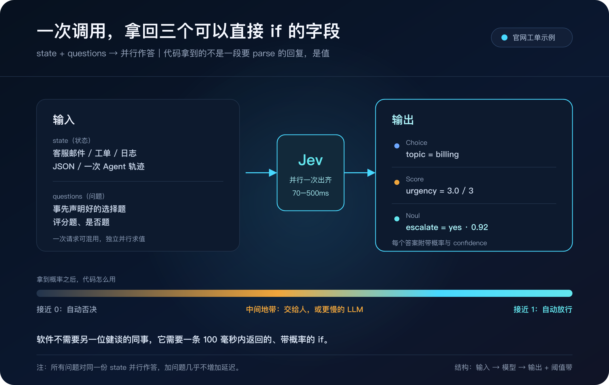
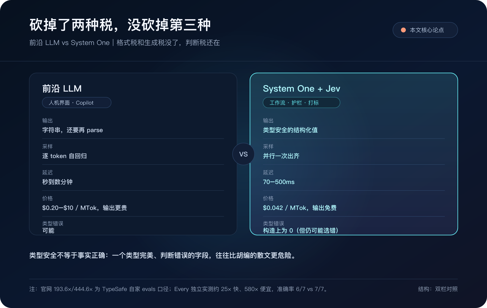

# Jev 来了：ChatGPT 背后的人，做出一台「不写字」的模型

软件不需要另一位健谈的同事。它需要一条 100 毫秒内返回的、带概率的 `if`。

---

2026 年 9 月 15 日，旧金山实验室 TypeSafe AI 结束约两年隐身期，同时放出两件事：第一款公开模型 Jev，以及由 DCVC 领投的 4000 万美元种子轮。

它几乎立刻冲上 Hacker News 头条，1915 分、501 条评论。24 小时内，Vercel AI Gateway、Cloudflare Workers AI、LiteLLM、Netlify、OpenRouter 陆续接上。

这不是又一个更会聊天的模型。Jev 的自我定位正好相反：**它不生成自然语言。**

创始人 Diogo Almeida 的原话是：

> Think of Jev as a frontier-intelligence function call: unstructured state in, typed probabilistic decisions out.
>
> 把它想成一次「前沿智能函数调用」：非结构化状态进去，带类型的概率决策出来。

Diogo 在 OpenAI 参与过 RLHF 和 InstructGPT，那条技术线通向 ChatGPT。他现在做的，是从「对人偏好对齐」走到「对校准决策对齐」。联合创始人包括 CTO Erik Gafni，以及 COO Sasha Sheng（Meta / FAIR）。公司 2024 年成立。Forbes 援引知情人士称此轮估值约 2 亿美元，公司未正式确认。

---

## 一句话定义

Jev 是 TypeSafe 发布的第一款 System One Model：给软件用的决策模型，不是给人看的聊天模型。

你提交两样东西：

- **state**：一封客服邮件、一张工单、一段日志、一个 JSON、一次 Agent 轨迹。文本或结构化数据都行。
- **questions**：事先声明好的选择题、评分题、是否题。

一次请求里，所有问题对同一份 state 并行作答。返回的是代码可以直接 `if` 的值：选项 key、分数、0–1 概率，外加置信度。没有段落，没有「当然可以帮你」，也没有要再 parse 一遍的伪 JSON。

公开口径（截至 2026 年 9 月文档）：

| 项 | 数字 |
|---|---|
| 输入 | $0.042 / 百万 token |
| 输出 | 免费（官方说法：「便宜到不必计量」） |
| 延迟 | 70–500ms 端到端 |
| 选择题上限 | 255 个选项（更高基数走两阶段） |
| 当前版本 | `jev-1.13.0`（别名 `jev-latest`） |
| 接口 | `POST https://api.typesafe.ai/v1/systemone` |
| 输入形态 | 纯文本 / JSON / 数组，无图像、音频、视频 |

官网客服工单示例，一次调用三个决定：

- Choice → `topic = billing`
- Score → `urgency = 3.0 / 3`
- Noul → `escalate = yes · 0.92`

代码拿到的就是这三个字段，不是一段需要正则提取的回复。

---

## 两个名字

**System One** 来自卡尼曼《思考，快与慢》。系统 1 快、直觉；系统 2 慢、要推理。TypeSafe 的论点是：今天的前沿 LLM 被 RLHF 训成了「对人说话的系统 2」；软件里大量真正被调用的判断——路由、打分、放行、验真——更像系统 1。他们想做的不是更会写长文的模型，而是能被软件当原语直接调用的判断。

宣言说得更直白：瓶颈已经不是模型够不够聪明，而是聪明能不能被组合着调用。口号是：

> We're building prod, not God.
>
> 我们在做生产系统，不是在造神。

**Jev** 来自经济学家 William Stanley Jevons。蒸汽机让煤更高效，结果煤的总消耗不降反升。TypeSafe 的隐喻是：当一次智能判断的成本和延迟掉两个数量级，原先不敢嵌进热路径的判断会爆发式出现。降价不是为了省钱，是为了把智能用到以前用不起的地方。

---

## 整个模型只回答三种题

| 原语 | 你问什么 | 你拿到什么 | 典型场景 |
|---|---|---|---|
| Choice | 从声明的集合里选一个 | 胜出 key + 各选项概率 + confidence | 工单分部门、下一步工具 |
| Score | 按有序量表打分 | score + 各档概率 + confidence | 紧急度、风险 |
| Noul | 这句话成不成立 | 0–1 的「为真」概率 | 要不要升级、过不过门禁 |

「Noul」这个名字来自伯努利（Bernoulli），创始人后来在 Hacker News 上自己解释的；本质是一个带校准的布尔门。高置信度自动放行，中间地带交给人或更慢的 LLM。它要做的不是替代人工审核，是先把明确的那一段自动化掉。

文档里有一条工程纪律：问题要短，要像「懂行的人看一眼就能判」，不要像「写一篇分析」。复杂任务拆成一串原子判断，再用代码组合。

这和 Agent 圈这两年的教训一致：把「想清楚」留给编排层，把「看一眼」留给模型。

---

## 和 LLM 差在哪

| | 现有前沿 LLM | System One + Jev |
|---|---|---|
| 训练 | RLHF / 人类偏好 | RLCD：校准过的可验证决策 |
| 输出 | 字符串（还要 parse） | 类型安全的结构化值 |
| 采样 | 逐 token 自回归 | 并行一次出齐 |
| 输入价 | $0.20–$10 / MTok 量级 | $0.042 / MTok |
| 输出价 | 常为输入数倍 | 免费 |
| 延迟 | 秒到数分钟 | 70–500ms |
| 类型错误 | 可能 | 构造上为 0 |
| 典型位置 | 人机界面、Copilot | 工作流、护栏、批量打标 |

架构上，他们宣称三件新东西叠在一起：新模型结构（论文未公开）、并行 sampler（候选事先枚举，schema 是保证的）、RLCD（奖励的不是「人爱看」，而是「概率和真实对错对齐」）。

Every 的 Mike Taylor 做过一次独立实测：37 篇文档 × 21 个问题 = 777 次判断，不到 0.7 秒，大约 0.25 美分。相对 Anthropic 的 Fable 约 25 倍快、约 580 倍便宜——但准确率是 6/7 对 7/7。这组数字比官网的「193 倍」更好懂：**判断可以被做成热路径上的基础设施，而不只是偶尔点一次的 Copilot。**

---

## 「零幻觉」是真的吗？

TypeSafe 写：Jev 不能幻觉、不能出类型错误，数学上由 schema 保证。

这句话在字面上成立，在传播上容易被听成另一句：**它不会错。**

Hacker News 的争论几乎都卡在这条缝上。有人说：这不就是广义的零样本分类器吗？创始人 Diogo 亲自回复：exactly right。他也承认，机器学习模型当然仍可能「自信地错」——「你不会说随机森林在幻觉」。

更准确的翻译是：

- Jev 不会吐出 schema 之外的字符串，不会把 JSON 写坏，不会发明一个你没声明的选项。
- Jev 会在你声明的选项里选错，会给错误答案打上 0.93 的概率。
- 类型安全不等于事实正确。一个类型完美、判断错误的字段，往往比一段明显在胡编的散文更危险，因为下游代码会当真去执行。

Every 的测试里，Jev 漏掉了 7 个植入缺陷中的 1 个。WotAI 在 16 个模型的对比里写：亚秒档里 Jev 的校准不错，但相对 Haiku / Sonnet 的加速大约只有 1.4 到 3.7 倍，没有找到 20 到 200 倍的工况。

所以官网首页的 193.6 倍更快、444.6 倍更便宜，要连同评测方法一起读：那是 TypeSafe 自家 workflow evals，对照是两个顶模的平均概率，公司自己也说这可能偏真实增益的高端。诚实的读法是：

> Jev 把「格式税」和「生成税」砍掉了。
> 它没有把「判断税」砍掉。

---

## 适合什么，不适合什么

**适合**

- 客服 / 工单路由、紧急度、是否升级
- Agent 循环里的「下一步工具 / 继续或停 / 问不问人」
- 输出护栏、越狱检测、引用是否支撑结论
- 批量打标、map-reduce 式语义过滤
- 「明确的自动过，模糊的人工看」——Noul + 阈值是它很顺手的一种用法

**不适合**

- 写邮件、写代码、写分析
- 开放域问答、长链推理
- 多模态（当前纯文本）
- 把 Jev 当唯一决策者，不设阈值、不留人审
- 问题本身定义含糊：「这个客户值不值得认真对待」这类题，类型再安全也救不了题面

一句话：Jev 是智能 `if` 语句，不是智能同事。LLM 继续当系统 2：解释、生成、艰难推理。Jev 当系统 1：看一眼，给概率，让代码分支。

Vercel 在发布第二天就把它接进了 AI Gateway。对 Agent 开发者，这意味着路由层和生成层可以第一次用不同的计费、不同的 SLA 拆开。

---

## 该怎么看

把情绪从发布稿里抽掉，Jev 留下的是一个清楚的产业判断：

**2026 年的生产 AI，最大浪费可能不是模型不够强，而是大量「其实只需要一个带概率的枚举」的调用，被拿去跑完整套自回归生成。**

如果这个判断成立，后果很具体：

1. **Agent 架构会分层。** 规划、写作仍用大模型；路由、验真、门禁、打分会沉到 System One。账单结构会变。
2. **「结构化输出」从 prompting 技巧变成模型类别。** JSON mode 是给生成模型戴口罩；Jev 是一开始就不长嘴。
3. **幻觉话术会被迫精确化。** 业界不能再把「格式合法」说成「内容真实」。第二句要问：概率校准过吗？错了谁兜？
4. **杰文斯悖论可能真的发生。** 单次判断便宜两个数量级之后，调用次数不是线性下降，而是上升——每条日志、每封邮件、每步工具调用都配一个门。
5. **竞争会非常快。** 接口一旦被看懂，开源侧会用分类头 + 校准 + 并行打分去追。TypeSafe 要守住的是质量、校准、延迟 SLA，以及嵌进网关的默认位置。

它不是 AGI 路线图上的下一座山。它更像软件史里 SQL 相对「把数据存在文件系统里」的那一步：把一种已经存在的能力，收成可调用、可组合、可计费的原语。

对国内团队，立刻能做的不是 all-in 换掉 GPT，而是盘一次自己的 LLM 账单：有多少调用其实是分类、路由、打分、是否。那一截，才是 Jev 这类模型的战场。

---

**资料**

- TypeSafe，2026-09-15，[Introducing System One Models & Jev](https://typesafe.ai/blog/introducing-system-one-models-and-jev)
- 文档：[Models](https://docs.typesafe.ai/models.md) / [API](https://docs.typesafe.ai/api.md)
- DCVC，2026-09-15，[$40M seed](https://www.dcvc.com/news-insights/typesafe-emerges-from-stealth-with-a-new-way-of-doing-ai)
- Hacker News：[item 49717558](https://news.ycombinator.com/item?id=49717558)（1915 分 / 501 评）
- Mike Taylor / Every：[777 judgments in 0.7s](https://every.to/also-true-for-humans/mini-vibe-check-typesafe-s-jev-judged-everything-i-ve-written-in-0-7-seconds)
- WotAI：[Jev vs Claude Haiku](https://wotai.co/blog/typesafe-jev-vs-claude-haiku-tested)
- Vercel：[Jev on AI Gateway](https://vercel.com/changelog/typesafe-ai-jev-now-available-on-ai-gateway)

---

软件不需要另一位健谈的同事。它需要一条 100 毫秒内返回的、带概率的 `if`。
