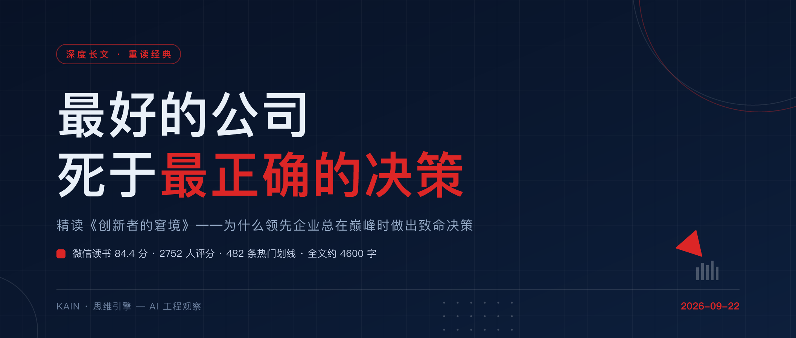
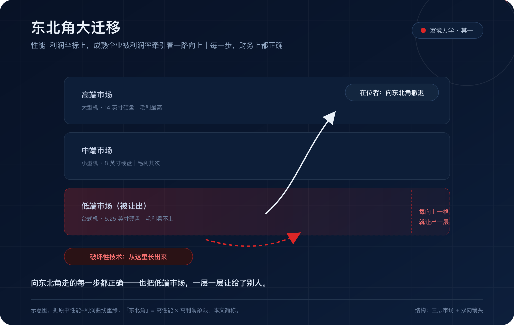
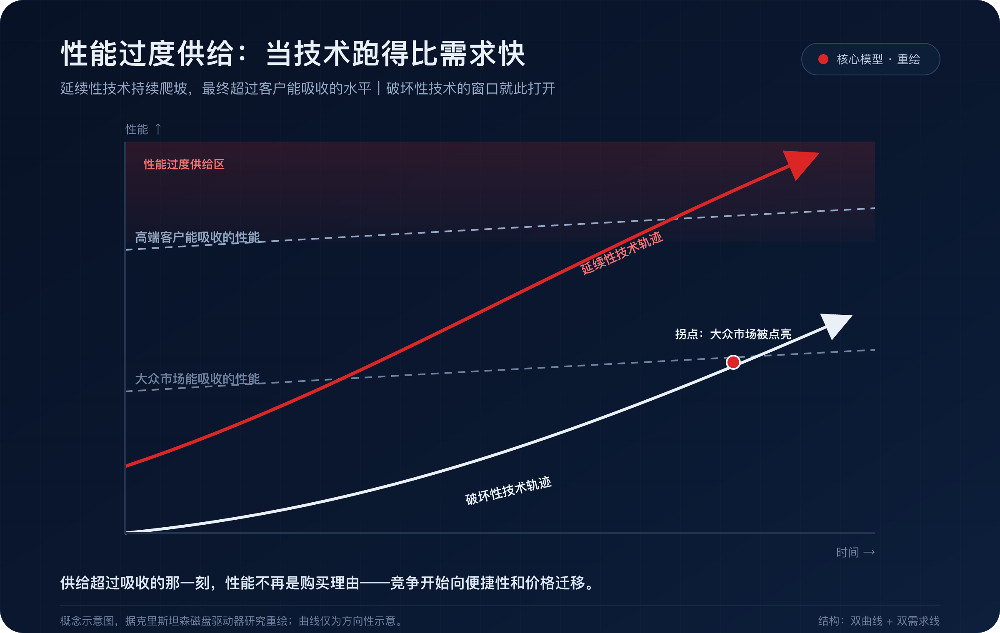
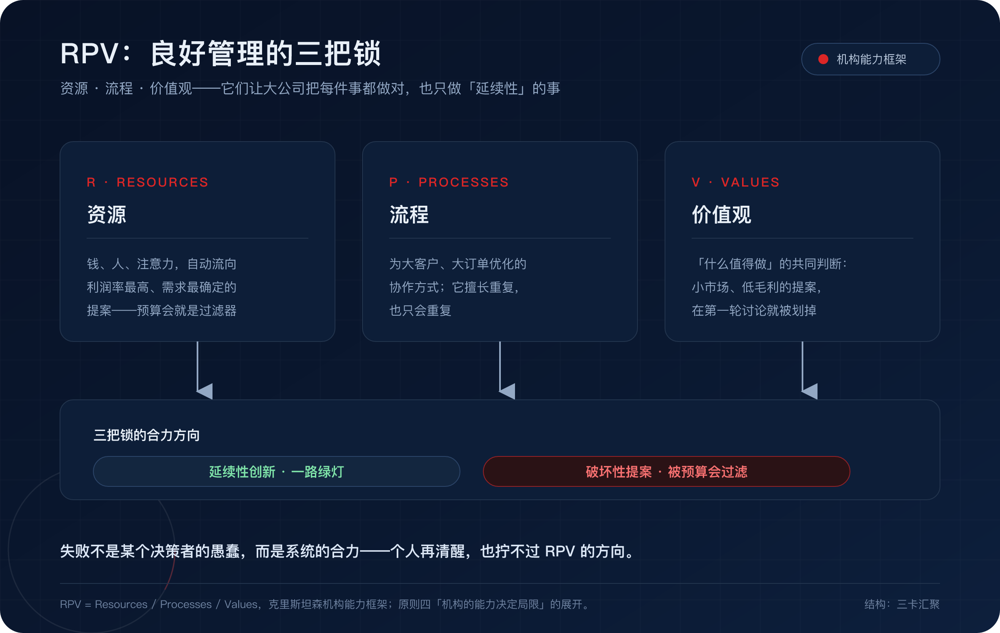

# 最好的公司，死于最正确的决策

## ——重读《创新者的窘境》

2013 年 9 月，微软宣布收购诺基亚手机业务。那场发布会之后，流传最广的一句话是：

「我们并没有做错什么，但不知道为什么，我们输了。」

这句话的悲凉在于它是真的。诺基亚的管理在当时堪称标杆，供应链、成本控制、对运营商客户需求的响应，样样是行业最佳实践。它没有傲慢，没有懒惰，没有犯任何商学院案例里那种「错误」——然后它输了。

为什么会这样？其实早在 1997 年，一本书就给出了完整答案。克莱顿·克里斯坦森的《创新者的窘境》，2011 年被《经济学人》评为有史以来最重要的六本商业著作之一，乔布斯生前对它推崇备至，英特尔的安迪·格鲁夫读完后推动了赛扬处理器的诞生。在微信读书上，它拿下 84.4 分、2752 人评分，全书 482 条热门划线里被标记最多的一句是：

> 但所有失败案例都具有一个共同点，那就是导致企业失败的决策，恰好是在领先企业被广泛誉为世界上最好的企业时做出的。

**问题从来不在于做错了什么，而在于每一步都做对了。**这才是「窘境」真正的含义——它不是一个关于失败的故事，而是一个关于「成功如何孕育失败」的故事。这篇长文把这本书的核心逻辑完整拆一遍。你会发现，书里的每一章，今天几乎都有对应的新闻。

---

## 01 从硬盘的坟场开始

这本书的可信度，是方法给的。先看它是怎么写出来的。

克里斯坦森写这本书时还是哈佛商学院的助理教授。他没有像大多数商业畅销书那样挑几个「成功企业」倒推经验——那种方法注定得到鸡汤。他挑了一个技术迭代极快、每家公司的生死都有据可查的行业：**磁盘驱动器（硬盘）**。从 1976 年到 1995 年，这个行业的技术变革、进入者、退出者、每一次代际更替，全部有案可查。

他挖出来的是一个坟场。

硬盘行业的尺寸一代代缩小：14 英寸、8 英寸、5.25 英寸、3.5 英寸、2.5 英寸、1.8 英寸。每一次尺寸切换，都是一场洗牌——**几乎没有任何一代的领导者，能在下一代继续领先。**做 14 英寸的王者错过了 8 英寸，做 8 英寸的王者错过了 5.25 英寸，做 5.25 英寸的王者错过了 3.5 英寸。每一代新尺寸刚出现时都更慢、更贵（按容量算）、容量更小，主流客户——大型机厂商——明确表示不要。于是领先企业听客户的话，继续把主流产品做得更好，然后把市场让给名不见经传的新公司。等新尺寸的性价比曲线爬上来，一切已经来不及。

克里斯坦森后来发现，同样的剧本在挖掘机（液压取代钢索）、钢铁（小钢厂蚕食综合钢厂）、零售（折扣店取代百货公司）里反复上演。行业不同，结构完全一致。

这不是成功学，是拿全量数据做的归纳。所有公司的生死都摊在桌面上，结论先扛过了反例的检验。

---

## 02 核心概念：两种技术，两条曲线

全书的地基，是区分两种性质完全不同的技术变革。

**延续性技术**：沿着现有性能轨道持续改进——更大、更快、更强。它服务主流客户，主流客户看得见、也付得起。在这种变革里，领先企业几乎总是赢家，因为它们资源最多、动力最足。

**破坏性技术**：刚出现时性能更差、利润更低、市场更小，主流客户根本看不上。但它便宜、简单、方便，服务于一个此前「不存在」的边缘市场。然后它的性能曲线持续爬坡，在某个拐点调转头，吞噬主流市场。

书里那些性能-利润曲线图上，右上角代表高性能、高利润——下文就叫它「东北角」。所有成熟企业都被利润率牵引着，一路向东北角走。这无可厚非：向东北角走的每一步，财务上都正确。但每向上一格，它们就把低端市场让出一层——破坏性技术，正是从被让出的地方长出来的。

更反直觉的是书里接下来的推论：**这不是管理失误，而是良好管理的必然结果。**一家运转良好的公司，资源分配会自动把钱、人才、注意力导向利润率最高、需求最确定的方向。这个机制越精密、越「职业」，公司就越无法投资那些「看起来不值得投资」的东西。

书里还有一句被近两千人划线的判断：**盲目遵循「好的管理者应与客户保持密切联系」的箴言，有时可能会是一个致命的错误。**你的客户活在你的价值网络里，他们说出口的需求，永远是他们已经理解的东西。8 英寸硬盘出现时，大型机客户说不要——他们说的是真话。只是真话的适用期，比他们以为的短得多。

东北角大迁移、价值网络的引力、客户导向的致命性——「窘境」的完整力学，就这三条。

---

## 03 竞争的终点是价格：过度供给定律

书里第九章藏着一个经常被忽略、却在今天格外应景的判断。

当技术的性能爬升超过客户实际能吸收的水平，就出现**性能过度供给**。此时竞争的基础会按固定顺序迁移：从**功能性**（能不能用），到**可靠性**（稳不稳），再到**便捷性**（顺不顺手），最后到**价格**（便不便宜）。

一旦竞争打到价格层，原来靠性能溢价建立的一切优势——品牌、技术壁垒、利润率——都会快速蒸发。这就是破坏性技术最终反杀主流市场的时刻：不是它的性能追平了你，而是**你引以为傲的性能，客户已经不需要了**。

判断一个行业是否逼近这个时刻，有一个简单的信号：当厂商发布会上的参数越来越惊人，而用户的实际体验差异越来越小，过度供给就已经开始了。

---

## 04 解法：五条原则，和一家「反公司」

如果失败是良好管理的必然结果，那出路是什么？书的第二部分，克里斯坦森把研究结论提炼成五条原则，每一条都指向同一个动作：**不要试图在母体内部解决破坏性创新。**

**一，资源分配取决于客户和投资者，而非管理者的意志。**所以破坏性技术得交给一个真正有客户需求的小机构——让它去服务边缘市场，而不是在总部的预算会上被主业杀死。

**二，小市场无法解决大公司的增长需求。**年入百亿的公司，不会为一千万的机会立项——这不是态度问题，是数学问题。所以破坏性业务必须交给规模匹配的小机构，让它「利用小机遇」。

**三，无法分析尚不存在的市场。**这一章可能是全书最好的一章。面对破坏性技术，传统的市场调研、财务测算全部失灵，因为市场根本还不存在。所以计划应该是「有关学习和发现的计划，而不是事关执行的计划」——翻译过来：最快的试错者赢，最完整的 PPT 输。

**四，机构的能力决定了它的局限。**这就是著名的 RPV 框架：资源（Resource）、流程（Process）、价值观（Value）共同决定了机构能做什么。同样的能力，换个环境就变成局限——大公司的流程是为延续性创新打磨的，你没法用同一套流程长出破坏性的产品。组织结构最终会反向决定你能设计出什么。

**五，技术供给可能不等于市场需求。**当供给超过需求，破坏性技术的窗口就打开了——这正好和前面的过度供给定律合上。

五条原则合起来，答案其实只有一个：承认母体的引力无法对抗，然后在引力之外，养一个不受保护、也不被期待的孩子。

---

## 05 诚实一点：这本书也有它自己的窘境

只讲封神的一面，是对这本书的不诚实。出版近三十年，它挨过的板子也不少。

最著名的一次来自 2014 年《纽约客》上历史学家 Jill Lepore 的长文批评：她重查了书中的案例，认为克里斯坦森的选择性叙事经不起检验——比如硬盘行业的希捷并没有死，反而活成了巨头；被他树为「听客户话而死」的反例，不少也活得好好的。更尴尬的一次公开预测是 2007 年：iPhone 发布时，克里斯坦森依据自己的框架判断它只是延续性创新，成不了大气候——后来的事我们都知道了。批评者说，「颠覆」这个词后来被硅谷用成了自我美化的口头禅，恰恰背离了理论本意。

这些质疑成立吗？部分成立。它说明《创新者的窘境》不是水晶球：**它是一个结构分析工具，不是个股预测模型。**它解释的是「为什么领先企业在结构性变革面前，系统性地吃亏」，但不保证某一次冲击一定致命——希捷没死，诺基亚死了，区别在冲击够不够深、企业换价值网络的速度够不够快。而这，恰恰是理论管不到的地方。

但换个角度，这些争议反而证明了框架的生命力：一个理论能被反复拿来检验、争论、修正近三十年，说明它抓住的是真问题。被颠覆的不是这本书，是那些把它当成算命书来用的人。

---

## 06 一面 2026 年的镜子

这本书出版时，例子还都是硬盘、挖掘机和钢铁厂。三十年后重读，最难的不是理解它，而是摆脱它——随手点开一条今天的科技新闻，几乎都能在书里找到对应的章节。有两处对照，我是翻着原书逐段核对过的。

**第一处对照是谷歌。**2017 年它的 8 位研究员发明了 Transformer（[论文原文](https://arxiv.org/abs/1706.03762)），五年后，没有广告包袱的 OpenAI 用这个架构做出 ChatGPT。谷歌不是没有牌：对话模型 LaMDA 在 2021 年 5 月就公开演示过，产品化却被按了将近两年。台面上的理由是声誉风险——皮查伊和 Jeff Dean 在全员会上解释，机器人胡说八道的代价，谷歌比创业公司更付不起；台面下是媒体复盘出的真正死结：AI 直接给答案，每年超过 1500 亿美元的搜索收入怎么办？2023 年一份泄露的内部备忘录《[We Have No Moat](https://simonwillison.net/2023/May/4/no-moat/)》写道：开源社区「用 100 美元和 130 亿参数，做到了我们用 1000 万美元和 5400 亿参数 struggle 的事」。技术上有余粮，商业模式上有枷锁——书里那句「技术供给不等于市场需求」，几乎是为它写的。

**第二处对照是 AI 编程。**GitHub Copilot 背靠微软和 OpenAI，用户数千万，但 AI 只是插在旧流程上的外挂——保护存量产品，把新技术做成增量功能，每一步都正确。然后四个 MIT 辍学生把微软自己的开源 VS Code fork 过来，从第一行代码围绕 AI 重构了编辑器：Cursor，2025 年 1 月 ARR 破 1 亿美元，2026 年年中约 40 亿美元年化收入，8 月被 SpaceX 以 600 亿美元收入麾下。微软拥有 VS Code、GitHub、全世界最深的开发者渠道，却看着外来者用自己的底座重构了自己的主场。这不是能力问题，是 RPV 问题——「AI 原生 IDE」这个提案，在微软内部的资源分配里永远排不上号。

还有一幕，我犹豫了很久要不要写，因为它的结局还没写完：当年的破坏者 OpenAI，如今也站上了东北角。ChatGPT 周活超 9 亿、付费订阅超 5000 万，企业收入今年首次超过消费端；而用 MIT 协议开源、预训练只花了几百万美元的 DeepSeek，就出现在它价值网络的正下方。这一幕里的每个元素，书里都出现过。它接下来是像希捷一样活下来，还是像诺基亚一样退场，克里斯坦森不会回答——他只留下那个判断标准：看它敢不敢把「看起来不值得」的方向，交给一个不受总部预算管的小团队。

至于「万卡集群会不会被专用芯片从低端吃掉」「MCP 这些协议被捐给基金会是不是在位者的新防御姿势」——这些问题书里同样给不了答案，但它给了你提问的姿势：别问今天的份额，问竞争的基础正在向哪一层迁移。

---

## 结语：你正沿着东北角走向哪里

这本书对我个人最大的冲击，是它把「成功」从褒义词变成了风险敞口。

你现有的技能、现有的读者、现有的商业模式，越精密、越高效、越被验证，你越难投资那个「看起来不值得」的方向。克里斯坦森 2020 年去世前一直在扩展这个框架——从企业到行业，到教育，最后到个人的人生（他晚年那本《你要如何衡量你的人生》，本质是同一套逻辑）。个人和公司一样，都可能死于太正确。

所以留三个问题给你，也是留给我自己的：

你此刻的价值网络是什么？它给你付钱的同时，阻止了你看见什么？你上一次认真对待一个「看起来不值得做」的方向，是什么时候？

如果答案让人不舒服——那就对了。窘境之所以叫窘境，就是因为它没有舒服的解法。

你们最近在哪件事上，感受到过「每一步都对，却隐隐不安」的时刻？评论区聊聊。

---

## 附：微信读书热门划线 TOP 10

2752 人评分、482 条热门划线里，读者用手投票选出的十句（标注了出处章节）。它们恰好覆盖了这篇文章讲到的每一个概念。

1. 但所有失败案例都具有一个共同点，那就是导致企业失败的决策，恰好是在领先企业被广泛誉为世界上最好的企业时做出的。（引言）
2. 这也成为创新者面临的一大困境：盲目地遵循「好的管理者应与客户保持密切联系」的箴言，有时可能会是一个致命的错误。（第一部分）
3. 一般来说，破坏性技术首先会得到市场上不能给企业带来利润的那部分客户的认可。因此，大多数已经习惯于听取最优质顾客的意见，判断哪些新产品能带来更大利润率的企业，很少能及时投资研发破坏性技术。（为什么良好的管理可能会导致失败）
4. 有时，不采纳客户的意见，投资研发利润率较低、性能较差的产品，并且大举进军小型新兴市场（而不是主流市场）反倒是正确之举。（引言）
5. 选择产品的基础通常是从功能性演变至可靠性，然后再发展到便捷性，最后发展到价格。（利用破坏性创新的原则）
6. 在成熟企业中，预期回报反过来将推动资源流向延续性创新，而不是流向破坏性创新。这种资源分配模式也解释了为什么成熟企业在延续性创新中总能保持领先地位，而在破坏性创新中却总是表现不佳这样一个问题。（价值网络）
7. 由于企业可以通过建立组织结构和确立团队合作的方式，来推动优势产品的设计，结果可能会最终发生逆转：组织结构及其团队合作方式可能会反过来影响到企业能否设计出新产品。（从组织和管理上解释企业遭遇失败的原因）
8. 从历史上看，破坏性技术一直不涉及新技术；相反，构成破坏性技术的各个组件所采用的都是经过验证的技术，破坏性技术只是将这些组件组合成一种全新的产品结构，并且为客户提供了一些他们之前从未体验过的新属性。（我们应采取什么样的产品技术和经销策略）
9. 更努力地工作，更聪明地管理，更积极地投资，更认真地听取客户的建议，这些都是应对新型延续性技术所带来的问题的解决之道。但这些经营原则在应对破坏性技术时却完全失效，而且在很多情况下甚至还会造成反效果。（液压技术的崛起）
10. 一般来说，破坏性创新并不涉及特别复杂的技术变革，其主要表现形式就是将成品元件组装在一起，但相比之前的产品，产品结构通常会变得更加简单。（在破坏性技术创新来临时遭遇失败）

顺带说明这篇文章的读法——它本身就是 RIA 三段法的一次实践：482 条热门划线，是几千位读者的集体触动点（R · Reading）；第 01-05 章，是用自己的话重述框架（I · Interpretation）；结语的三个问题，是拆为己用（A · Appropriation）。读书不闭环到 A，就是一次性消费。

---

**参考资料**

- 克莱顿·克里斯坦森《创新者的窘境》，[微信读书](https://weread.qq.com/book-detail?type=1&v=7d532f107193a88f7d5ffeb)
- Attention Is All You Need：[arxiv.org/abs/1706.03762](https://arxiv.org/abs/1706.03762)
- We Have No Moat, And Neither Does OpenAI：[simonwillison.net](https://simonwillison.net/2023/May/4/no-moat/)
- DeepSeek-R1：[github.com/deepseek-ai/DeepSeek-R1](https://github.com/deepseek-ai/DeepSeek-R1)
- Jill Lepore 的批评（The New Yorker, 2014）：[The Disruption Machine](https://www.newyorker.com/magazine/2014/06/23/the-disruption-machine)
