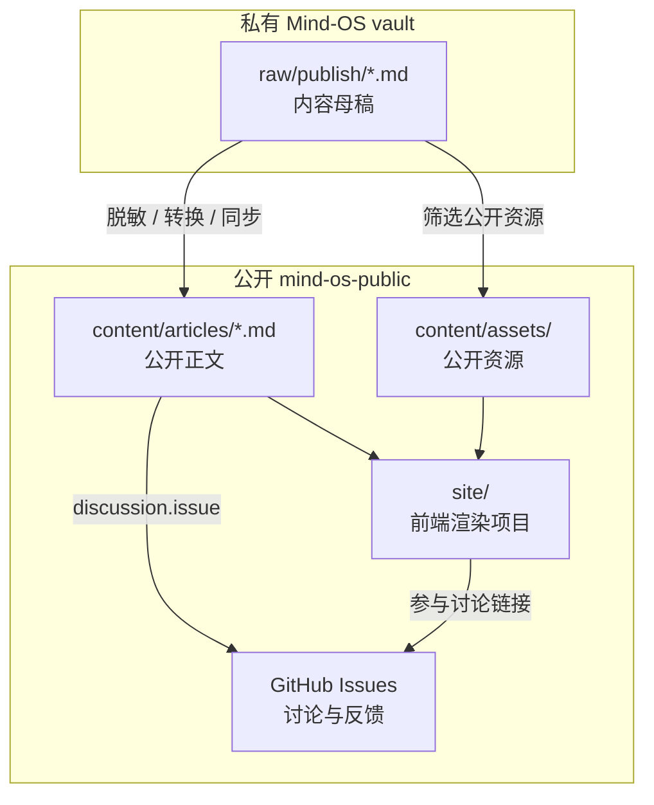

# 系统架构

Mind-OS Public 使用“内容源、讨论、渲染”三层架构。

## 架构图



## 核心边界

| 层 | 责任 | 不负责 |
| --- | --- | --- |
| `raw/publish/` | 私有内容母稿 | 公开分发、评论、网页体验 |
| `content/` | 公开正文与资源 | 私人素材留存、未脱敏草稿 |
| GitHub Issues | 讨论、反馈、勘误、实践报告 | 正文版本管理 |
| `site/` | 阅读体验、多形态渲染 | 讨论系统、私有内容访问 |

## 为什么不直接读取 Issues 作为正文

Issue 适合讨论，不适合作为正文唯一来源：

- 正文难以像文件一样 review 和 diff。
- Issue body 与评论混在同一产品语义里。
- 未来导出 HTML、PPT、视频脚本时缺少稳定内容协议。
- GitHub API 限流和缓存会影响前端体验。

因此正文放在 `content/`，Issue 只承载讨论。

## 前端站点的职责

第一阶段前端只需要：

- 读取 `content/articles/`。
- 展示文章列表。
- 展示文章详情。
- 渲染 Markdown 和 Mermaid。
- 展示标签、日期、摘要。
- 提供“参与讨论”链接。

后续可扩展：

- RSS。
- 全文搜索。
- 文章系列页。
- 幻灯片渲染。
- 视频脚本导出。
- 图文卡片导出。

## 发布安全原则

公开链路必须是单向的：

```text
private raw/publish → public content
```

公开项目不应反向依赖私人 vault，也不应在构建时读取私人目录。

