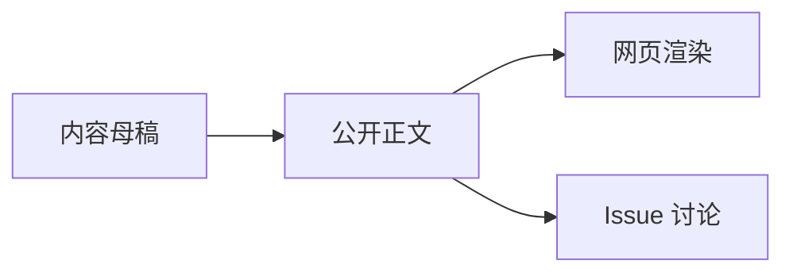

# 内容协议

本文定义 `content/` 中公开内容的格式约定。

## 目录约定

```text
content/
├── articles/    # 公开长文
└── assets/      # 图片、Mermaid 源文件、下载附件等公开资源
```

`content/` 中的内容必须是已经确认可以公开的版本。它不是私人 `raw/publish/` 的无脑复制。

## 文章文件命名

文章文件名使用英文 kebab-case：

```text
content/articles/2026-05-19-from-llm-wiki-to-personal-harness.md
```

推荐格式：

```text
YYYY-MM-DD-slug.md
```

## 必需 frontmatter

每篇文章必须包含：

```yaml
---
title: 从 LLM Wiki 到个人 Harness
slug: from-llm-wiki-to-personal-harness
date: 2026-05-19
status: published
summary: 一句话说明文章内容。
tags: [llm-wiki, knowledge-management, mind-os]
origin:
  private_path: raw/publish/2026-05-19-from-llm-wiki-to-personal-harness.md
discussion:
  issue: 1
  url: https://github.com/<owner>/mind-os-public/issues/1
formats:
  html: /articles/from-llm-wiki-to-personal-harness
  slides:
  video:
---
```

## 字段说明

| 字段 | 必填 | 说明 |
| --- | --- | --- |
| `title` | 是 | 对外展示标题 |
| `slug` | 是 | 稳定 URL 和 Issue 绑定键 |
| `date` | 是 | 首次公开日期 |
| `status` | 是 | `draft`、`ready`、`published`、`archived` |
| `summary` | 是 | 列表页摘要 |
| `tags` | 是 | 公开标签，建议 3-8 个 |
| `origin.private_path` | 是 | 私有 vault 中的母稿相对路径，只记录相对路径 |
| `discussion.issue` | 发布后必填 | 绑定 GitHub Issue 编号 |
| `discussion.url` | 发布后必填 | 绑定 GitHub Issue 链接 |
| `formats.html` | 发布后必填 | 前端文章 URL |
| `formats.slides` | 否 | 幻灯片版本链接 |
| `formats.video` | 否 | 视频版本链接 |

## 状态语义

- `draft`：公开仓库内草稿，不进入正式列表。
- `ready`：内容已脱敏，等待创建 Issue 或部署。
- `published`：已上线，并绑定讨论 Issue。
- `archived`：保留历史，不再主动展示。

## Markdown 约定

- 正文使用标准 Markdown。
- Obsidian `[[wikilinks]]` 必须转换成普通文本或公开链接。
- 私人路径可以出现在“延伸阅读”中，但不能让读者误以为可直接访问。
- Mermaid 图使用 fenced code block：

````markdown

````

## 脱敏检查

发布到 `content/` 前必须确认：

- 没有私人日记、情绪记录和个人身份敏感信息。
- 没有未授权转载内容全文。
- 没有私有仓库绝对路径。
- 没有 API key、token、邮箱、手机号等敏感字段。
- 没有 `wiki/insights/` 的人类独占洞察全文外泄，除非作者主动改写为公开表达。

